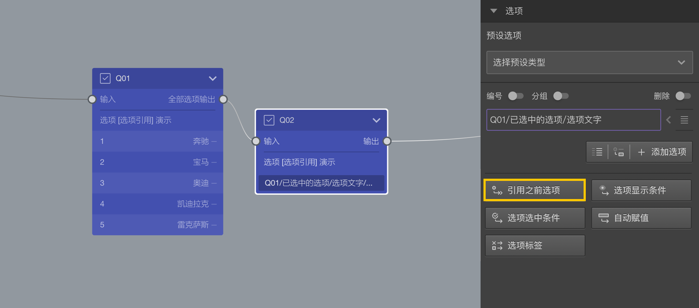
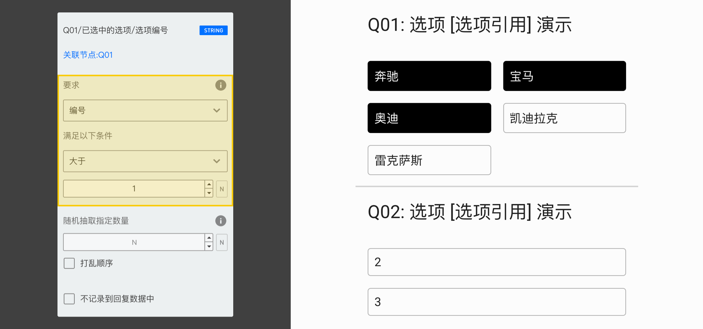

# 选项引用

题目除了可以自己添加指定选项之外，还能引用之前其他节点的指定选项。

`选项引用`通过`变量引擎`来实现，下面我们用案例来说明选项引用的使用方法。

首先，按下面图示，创建2个选择题节点，并设定Q01的选项。

随后，设置Q02的选项。

点击后打开`变量选择器`配置选项引用，下图是选择"Q01/已选中的选项/选项文字"后的效果，Q02的选项引用Q01中已选中选项的文字内容：

## 引用不同的属性

选项引用时，可以选择引用选项的不同属性，以满足不同的需求。

下图是Q02的选项引用Q01中已选中选项的选项编号：

使用`选项引用过滤器`对可被引用的选项进行进过滤筛选。

## 叠加过滤条件

可以对引用过来的选项再叠加判断条件。点击Q02的引用选项，弹出过滤设置面板。

按下图设置，我们可以在Q02中仅仅引用Q01中选项编号大于1的选项的文字。

其实，除了编号外，还可以判断一切其他的属性，有以下可判断属性：

## 从符合条件的选项中随机抽取引用

可以从符合条件的所有选项中，抽取一部分引用到当前题目。

下图是Q02的选项从Q01中已选中选项抽取2个，并引用抽取到的选项的编号。

再进一步，还能对抽取到的选项进行随机排序。

