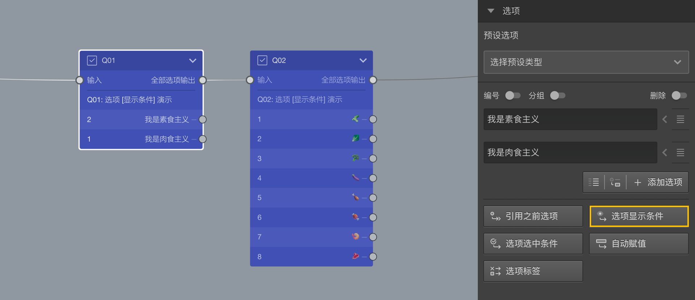

```index
1
```
```tag

```
```summary

```
# 显示条件
对选项的显示逻辑进行控制。


点击后弹出`选项显示逻辑设置`窗口，在其中进行设置。

下图中，Q01是一道选择题，被访者可从素食或肉食中选择一个，Q02是在Q01基础上进一步呢询问具体吃一些什么，很明显，素食和肉食者看到的内容是完全不同的。



为了实现Q02根据Q01的选择显示部分选项的功能，打开`选项显示逻辑设置`窗口。


随后，按以下步骤设置：
+ 在`当前选项`列表中，选择编号1-4的4款素食；
+ 在`可判断的内容`列表中，选择Q01，`可判断的选项`列表会显示Q01的所有选项；
+ 在`可判断的选项`列表中，选择“我是素食主义”；
+ 在`如果`列表中，设定判断条件，这里设定为`选中`;
+ 点击`>`按钮，在`逻辑运算选项`中加入该判断；

设定完毕后，当被访者在Q01中选择素食时，Q02的选项就只会显示属于素食食材的选项了。反之亦然。