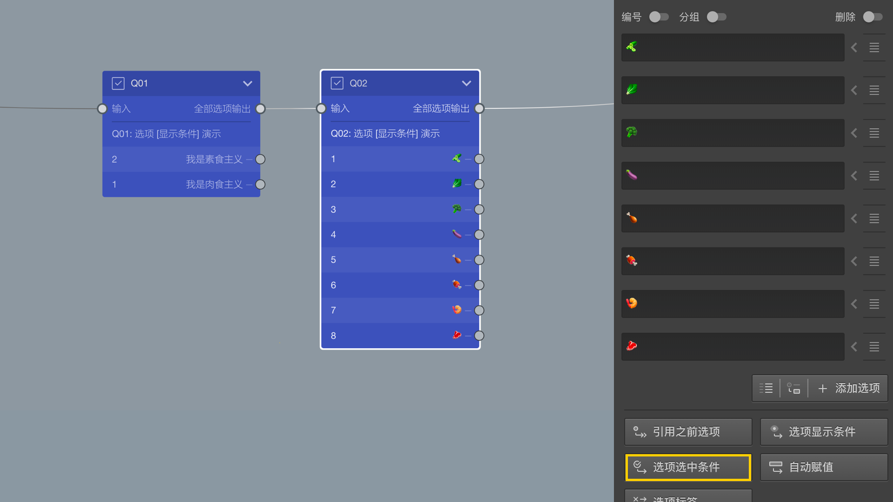

```index
3
```
```tag
选中条件 高级设置 节点设置
```
```summary
选中条件按设定的逻辑自动勾选题目选项。
```
# 选中条件
对选项的自动选中进行控制。符合条件时，题目出现时就会按条件勾选选项。

> 仅对选择类型题目有效。

下图中，Q01是一道选择题，被访者可从素食或肉食中选择一个，Q02是在Q01基础上进一步呢询问具体吃一些什么。


点击`高级设置`按钮后，弹出`选项选中逻辑设置`窗口，在其中进行设置。



现在，我们希望当Q01选择肉食时，Q02能自动勾选所有肉食食材选项，打开`选项选中逻辑设置`窗口。


随后，按以下步骤设置：
+ 在`当前选项`列表中，选择编号5-8的4款素食；
+ 在`可判断的内容`列表中，选择Q01，`可判断的选项`列表会显示Q01的所有选项；
+ 在`可判断的选项`列表中，选择“我是肉食主义”；
+ 在`如果`列表中，设定判断条件，这里设定为`选中`;
+ 点击`>`按钮，在`逻辑运算选项`中加入该判断；

设定完毕后，当被访者在Q01中选择肉食时，Q02的肉食食材选项就只会被自动勾选。在这个基础上，被访者可以选择更多选项，或者去掉自动勾选项。