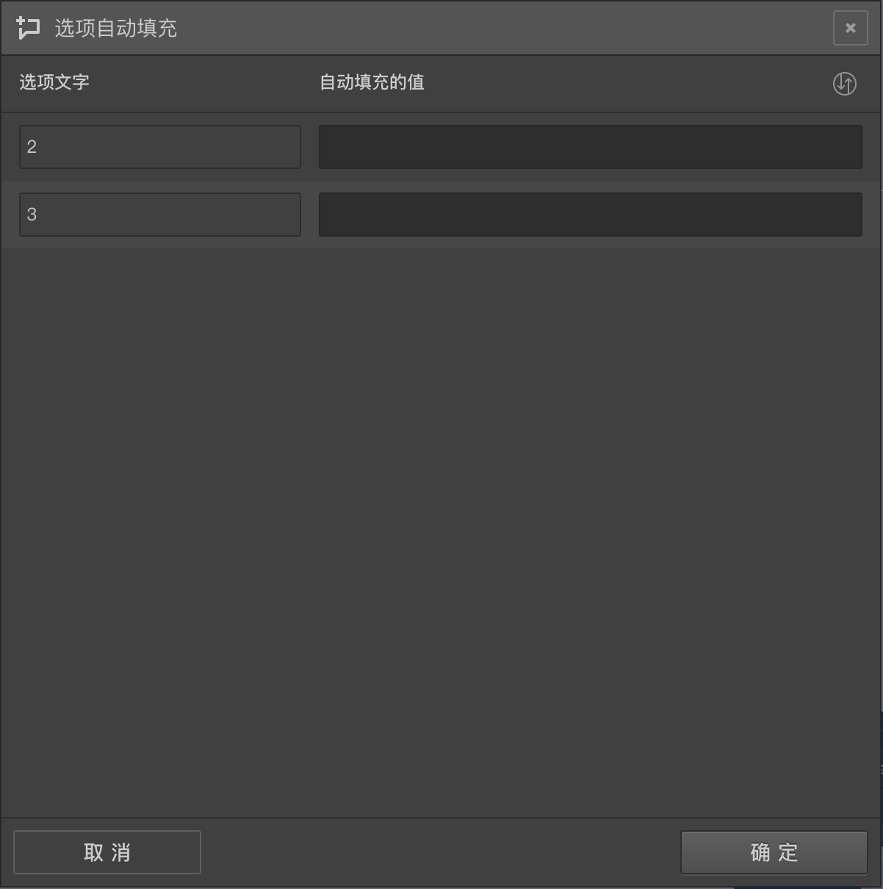

# 自动赋值

仅针对输入类型的题目有效，点击`自动赋值`按钮后弹出==选项自动填充==窗口，在其中进行设置。

## 选项自动赋值逻辑控制

问卷会有一些题型期待被访者给予打分，或输入文字，这些打分和填空操作可以通过设置==自动赋值==功能，让某些选项一开始就被赋予指定的内容，使问卷更具灵活性。

在选项的==高级控制==中点击==自动赋值==，打开==选项自动赋值==面板。面板中，每个选项对应一个输入框，在输入框中输入内容，答题时该选项就会自动被填上这个值。如果输入的是变量，则会解析出该变量的真实内容填充到这个选项。

> 点击输入框右上的==批量应用==按钮，就能将第一个选项的值应用到全部选项上面。

## 数据埋点

在问卷设计中，自动赋值功能常用于==数据埋点==，常见是一个填空题，为其选项设置自动赋值的内容，一般情况下这个内容是个变量，变量的内容是在之前题目的回复内容上结合某些算法计算后得出。随后，设置为[隐藏题](../../11nodeSettings/07advancedSetting/01hideQuestion.md)模式，这样就完成了数据埋点。

答题过程中该题不会显示，但是它的选项会被自动赋值，并且当作答案提交。数据埋点有多种灵活的运用，比如对数据进行标签化处理，埋点后的数据在分析时候更为便捷。

> ==数据埋点==过程中被自动赋值的内容，在后续问题题目中也可以通过变量被继续使用。

> 自动赋值经常和[隐藏题](../../11nodeSettings/07advancedSetting/01hideQuestion.md)一起使用