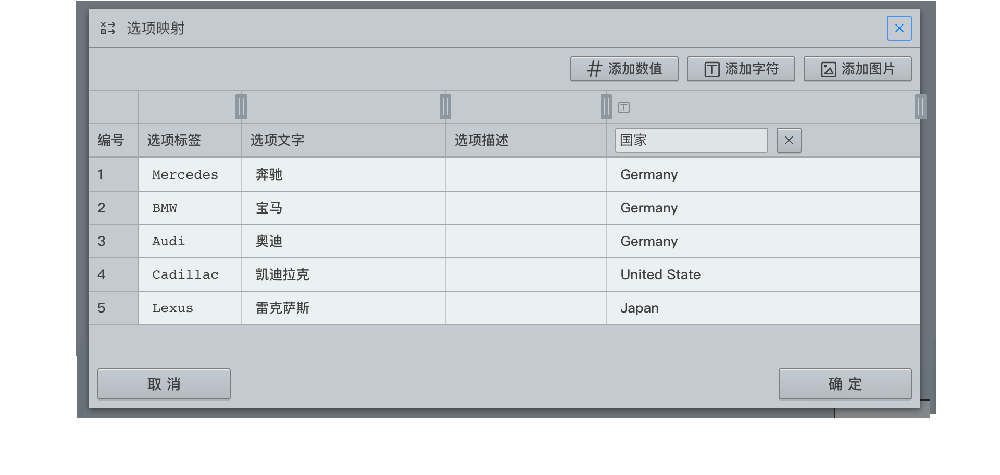

```index
5
```
```tag

```
```summary

```
# 映射属性
设定选项的映射数据，点击后弹出`选项映射`窗口，在其中进行设置。



## 选项标签
对当前`选项`设定标签，被访者看到的是`选项文字`，而数据结果里会记录`选项标签`，便于数据整理。

## 映射数据
为`选项`设定`映射数据`，`映射数据`可以通过变量引用的方式在后续问卷题目中使用。

## 重置编号
重新设置`选项编号`。

## 添加和删除字段
添加或删除映射数据字段。