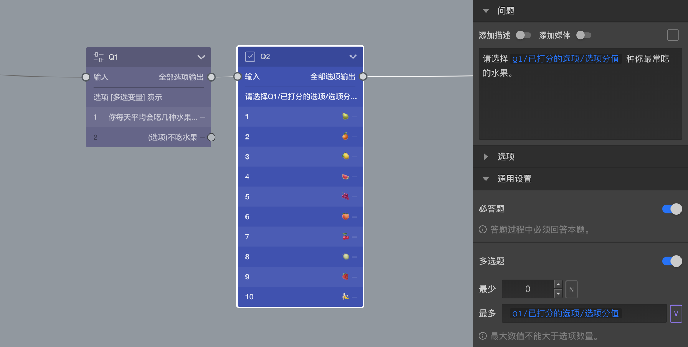
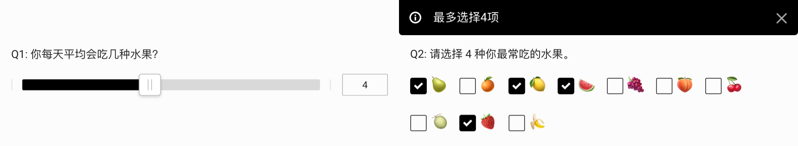

\```index

2

\```

\```tag

多选题 通用设置 节点设置

\```

\```summary

选择类型的题目可以设定为多选题，也可设定选择的数量范围。

\```

# 多选题

对于选择类型的题目，默认为单选题。开启==多选题==后，将该题设定为多选题。可以控制必须选中选项的总数量范围，如果选中选项的总数量不在设定范围值内，无法进入下一题。



例：从下图中，可以看到选择题Q2被设定为多选题，同时设定了多选题的数量范围最多为Q1打分题的分值，意味着受到Q1打分分值的控制。

被访者答题时，在Q1打4分的分值，随后可以看到Q2最多只能选择4个选项。


