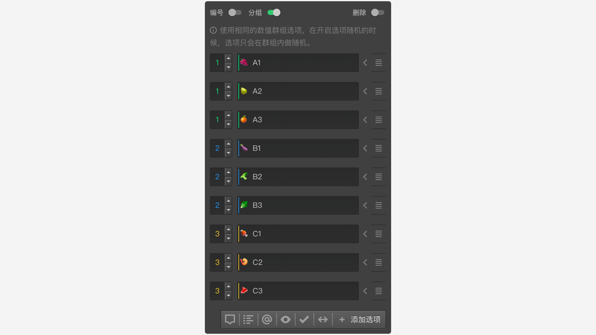
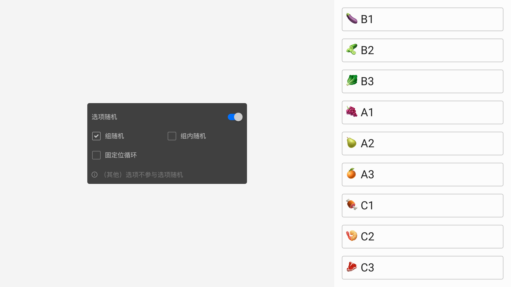
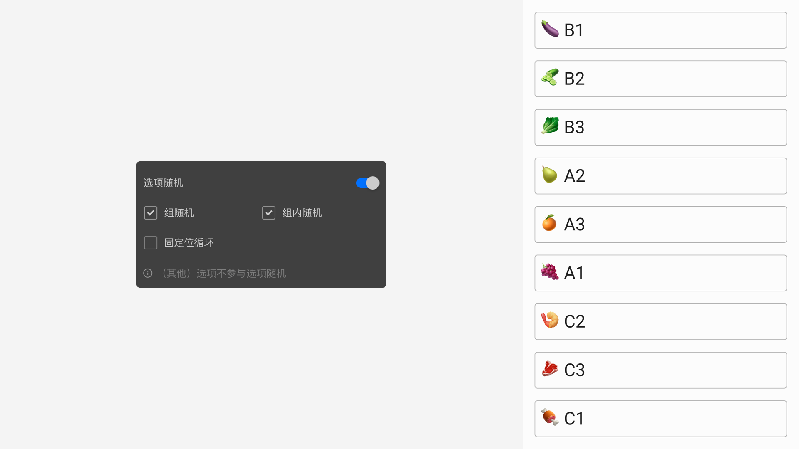
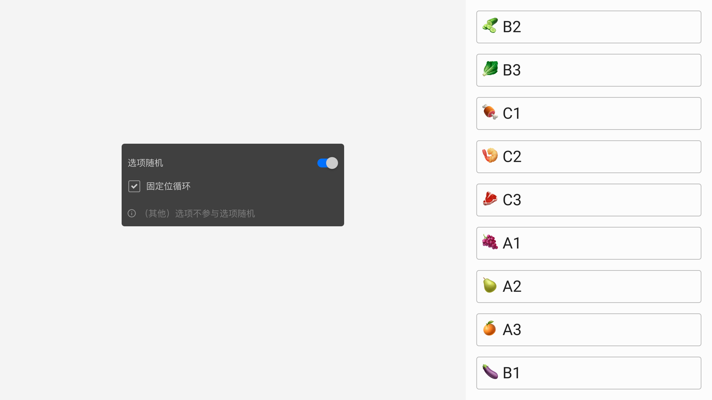
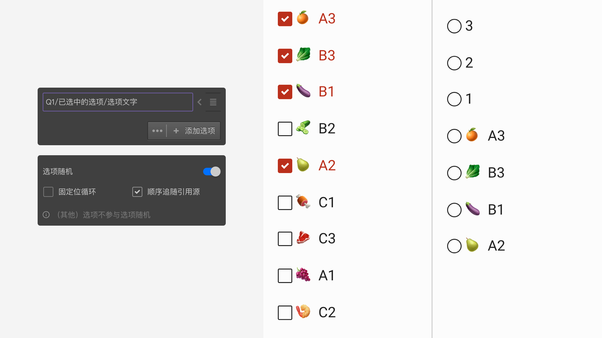

```index
5
```
```tag

```
```summary

```
# 选项随机

默认情况下，答题页面中选项的展示顺序就是其在编辑时设定的顺序，所有被访者看到的是相同的顺序。然而，有时候希望被访者看到选项时的顺序是随机出现的，以避免选项的显示顺序对被访者的选择行为造成潜在影响，这时需要开启`选项随机`功能。题目的所有选项会随机打乱后出现，不同被访者看到的选项顺序是完全随机的。


开启`选项随机`后，会出现四个勾选项，可指定随机策略：
+ 组随机
+ 组内随机
+ 固定位循环
+ 顺序追随引用源
> `顺序追随引用源`这项只有当题目使用了选项引用功能时才会出现。

使用`组随机`、`组内随机`前，需要在选项设置的[选项分组](../../11nodeSettings/03optionSetting/02optionGroupAndExclude.md#选项分组)里将选项分为多个小组，分组编号相同的选项会被分到同一小组。

小组的概念是为了避免随机的时候各个小组之间的选项被随机算法穿插混合在一起。`组随机`就是对这些小组进行随机，而同一个小组内的选项出现顺序完全不变。小组可以理解为一个盒子，一组选项被装在一个盒子里面。如下图所示，开启`分组`后，选项被编为3组，编号分别为1、2、3。



## 组随机

启用`组随机`后，这些盒子的顺序被打乱，但保证了盒子里选项永远挨在一起并保持顺序。如下图所示，1、2、3组被打乱随机显示，但小组内的选项没有被随机打乱。



## 组内随机

组内随机是对组内的选项进行随机。如下图，3个组的顺序没有变，但是组内选项的顺序发生了随机变化。


`组随机`和`组内随机`可以同时开启。此时，组的位置会进行随机，而且组内的选项也会进行随机，但是仍然能保证同一个小组内的选项永远紧挨在一起。如下图，3个组的顺序和小组内选项的顺序都发生了随机变化。



如果没有为选项设定分组，而开启了组随机和组内随机，那么每个选项将都被视为一个只有一个选项的组。

> 从不同的来源引用过来的[选项引用](../../11nodeSettings/04optionAdvancedSetting/01optionReference.md)，默认会各自按来源分配到不同的组中。

## 固定位循环
`固定位循环`和`组随机`、`组内随机`选项不能同时开启。开启固定位循环后，就好比一个循环的队列，排在第一的人会排到最后一位，其他人的排位会往前提前一位，如此像链条一样循环往复转动。初始时，随机决定由某个选项作为起始，后面的选项会按照现有的顺序跟进，而最前面的选项会按跟在最后一个选项之后。如下图，经过几次固定为循环后，可以看到`A1`到`B1`部分，从选项队列的头部依次添加到队列尾部的效果。



## 顺序追随引用源
该设置只对引用选项有效，开启后，被引用过来的选项永远以引用源头展示的顺序为准。如下图，左题是一道多选题，右题选项除了`1`、`2`、`3`外，还引用了左题选项。当左题选中`A3`、`B3`、`B1`、`A2`时，右题选项就引用了来自左题的选项并自动归为一组。



> [其他选项](../../13otherOption/01otherOption.md)不会参与随机，永远位于选项队列的最后。

