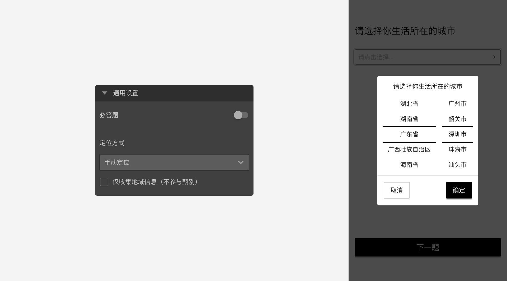
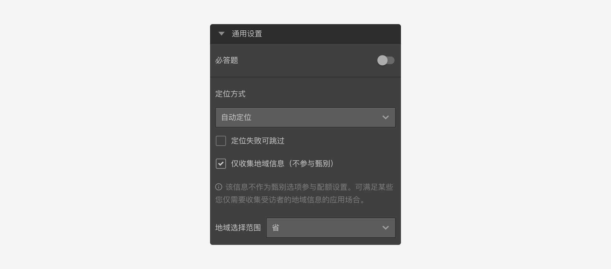

```index
6
```

```tag

```

```summary

```
# 定位方式

`定位题`支持`手动定位`和`自动定位`。

## 手动定位
弹出列表让被访者选择自己所在位置；


## 自动定位
页面显示一个定位图标按钮，被访者点击后，会使用被访者硬件系统的定位功能确定用户所在的位置。


> 如果因网络状况或用户终端权限设置的问题，可能会导致自动定位失败。

考虑到自动定位可能失败的情况，自动定位下面有一个`定位失败可跳过`的勾选项。勾选后，定位失败时会解除该题的必答限制，被访者可以继续后续问卷。


## 仅收集地域信息
开启后，定位题仅用于记录被访者的定位结果。

可以设置定位信息的不同精确度。
