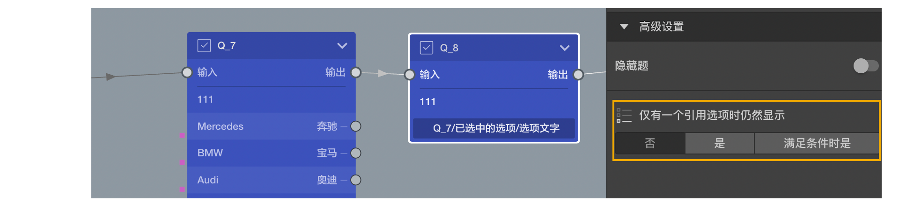

# 仅有一个引用选项是仍然显示

引用之前的题目的选项后，因为[引用过滤条件](../../16variable/11variableFilter.md)和[选项显示条件](../04optionAdvancedSetting/02displayCondition.md)等原因，可能只会有一部分选项能够被引用过来。

当选择类型的题目只从之前的题目中引用到一个选项时，系统默认会自动帮选中这个唯一的选项并自动跳过这个题目。

如果希望只有一个选项也需要展示出来，则可以在这类进行控制，这里默认选中的是`否`，也就是系统的默认设置。
可以改成`是`，那么这道题即使只有一个选项时也会显示。
可与改成`满足条件时是`，并设置逻辑条件，那么这道题只有一个选项，但逻辑条件运算结果为`真`时，这个题目也会显示。

