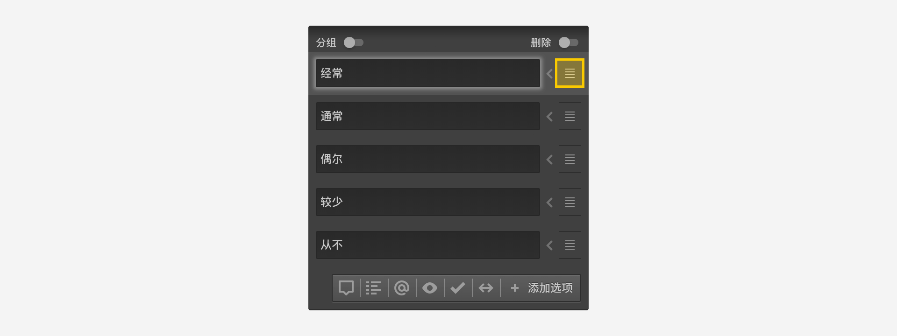
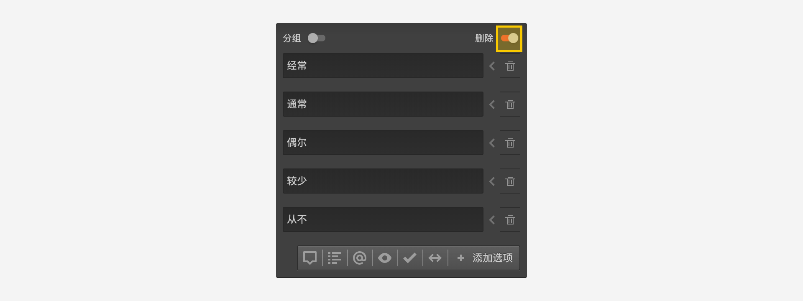
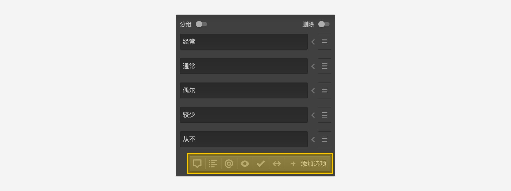

```index
1
```
```tag

```
```summary

```
# 节点设置

`巧思系统`内置多种题型，每种题型都可以通过属性设置实现个性化的需求。主要有：

## 题目选项基本操作

### 选项排序
每个选项的右边都有一个拖拽图标，按住图标上下拖动对选项排序。
  


### 删除选项
开启选项列表右上方的`删除`开关，所有选项右侧的拖拽图标会变成删除图标，点击删除图标删除该选项。关闭`删除`开关，变回排序图标。
  


## 问卷题目设置
+ [题型切换和题目编号](./01questionSetting/01questionTypeAndNumber.md)
+ [题目内容和描述](./01questionSetting/02questionContentsAndDescription.md)
+ [题目图片和视频](./01questionSetting/03questionPictureAndVideo.md)
+ [题目标签](./01questionSetting/04questionLabel.md)

## 媒体资源
+ [媒体](./02mediaResource/01mediaResource.md)
+ [图片资源](./02mediaResource/02pictureMedia.md)
+ [视频资源](./02mediaResource/03videoResource.md)

## 题目选项设置
+ [选项编号](./03optionSetting/01optionNumber.md)
+ [选项分组和排他](./03optionSetting/02optionGroupAndExclude.md)
+ [选项备注](./03optionSetting/03optionComment.md)
+ [输入验证](./03optionSetting/04inputValidation.md)
+ [预设选项](./03optionSetting/05presetingOption.md)

## 选项高级设定



+ [选项引用](./04optionAdvancedSetting/01optionReference.md)
+ [显示条件](./04optionAdvancedSetting/02displayCondition.md)
+ [选中条件](./04optionAdvancedSetting/03selectedCondition.md)
+ [自动赋值](./04optionAdvancedSetting/04autoAssignment.md)
+ [映射属性](./04optionAdvancedSetting/05propertyMap.md)

## 题目通用设置
+ [必答题](./05questionGeneralSetting/01required.md)
+ [多选题](./05questionGeneralSetting/02multiChoice.md)
+ [最小输入限制](./05questionGeneralSetting/03inputLimits.md)
+ [设置排序数量](./05questionGeneralSetting/04sortAmout.md)
+ [选项随机](./05questionGeneralSetting/05randomOption.md)
+ [定位方式](./05questionGeneralSetting/06locationMode.md)
+ [选项展示方式](./05questionGeneralSetting/07selectMode.md)

在题型节点的具体介绍中也会涉及上述内容。