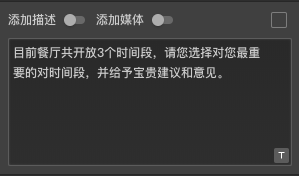
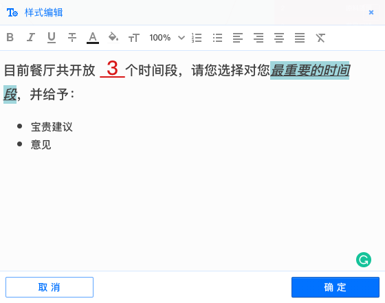
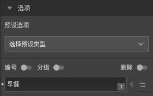
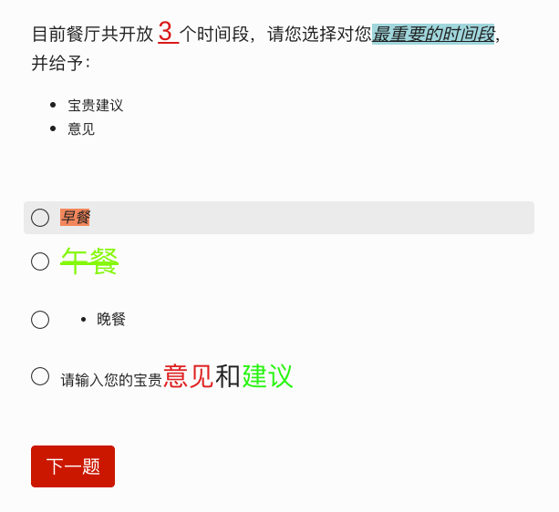

# 题目和选项文本样式设置

系统可以对每道题目和每个选项的文字样式进行单独设置，展示个性化的问卷文本。

## 设置题目和描述的文本样式

鼠标移入问卷题目文本输入框，此时输入框的右下角会显示一个==文本样式设定==小图标。

点击图标弹出==文本样式编辑器==，可以像使用Word软件那样调整样式文本：

主要功能有:

+ 粗体
+ 斜体
+ 下划线
+ 删除线
+ 文字颜色
+ 文字背景颜色
+ 字体尺寸
+ 编号列表
+ 符号列表
+ 左对齐
+ 右对齐
+ 两端对齐
+ 清除样式

除了问题内容、问卷描述也可以通过文本样式编辑器生成美观整洁文本样式。

## 设置选项的文本样式

同样，选项文本也可以进行样式调整，当鼠标移入选项输入框时，右下角显示==文本样式设定==小图标。

点击后打开==文本样式编辑器==调整选项文本。每个选项都可以单独调整。

