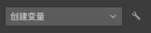
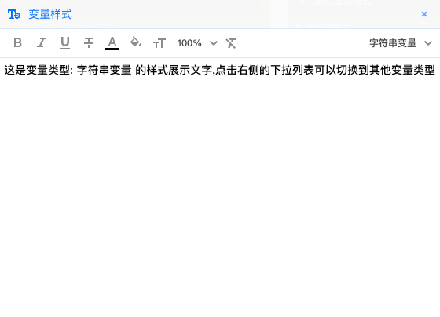

# 问卷变量的样式控制

变量是问卷的重要特性，具有极强的动态性，很多情况下，变量的内容是希望得到被访者关注、仔细判断的内容。系统可以对变量进行全局的样式控制，这样问卷的所有变量都会以指定的样式渲染呈现，通过样式上的强调，以引起被访者的注意。

## 变量样式全局设置

打开变量设置面板，点击创建变量下拉菜单右侧的变量样式全局设置按钮。

随后，打开变量样式编辑器。

变量样式编辑器与文本样式编辑器略有不同。编辑器右上角设有变量类型切换下拉菜单，用于切换当前设置的变量类型，这里的设置会对问卷里所有该类型变量的样式产生影响。变量样式编辑器内的文本无法编辑修改，仅用于对样式设置的效果进行预览。

变量样式编辑器的主要功能有：

主要功能有:

+ 粗体
+ 斜体
+ 下划线
+ 删除线
+ 文字颜色
+ 文字背景颜色
+ 字体尺寸
+ 清除样式