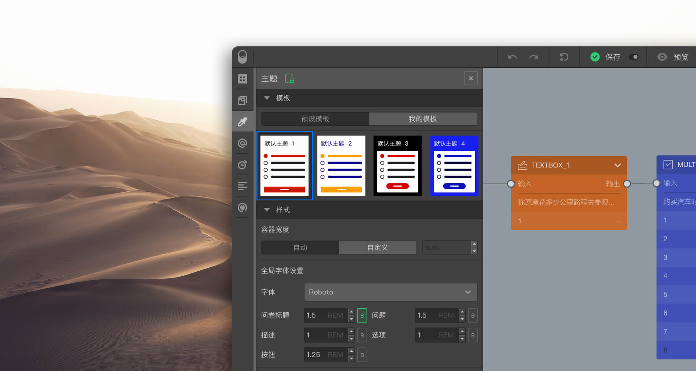
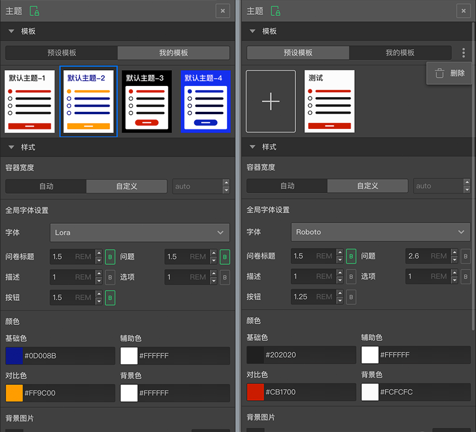
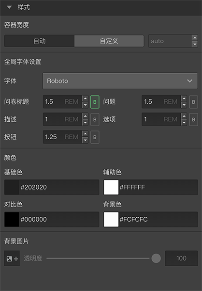
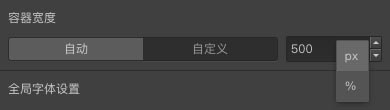

# 全局样式布局和主题

精美的问卷样式布局能带来愉悦的阅读和交互体验，提高问卷信息传达的效率。通过全局样式和主题设置，为您的问卷创建个性化的视觉体验。

## 设置全局样式布局和主题

打开==问卷组建工具栏==的[主题](../04layoutOfEditor/03components/03theme.md)面板。

## 模版

系统预设了一些模板配色方案，点选模板直接应用当当前问卷。

点击==我的模板==，用户也可以创建并保存自己个性化的配色模板方案。

需要使用时，在==我的模板==选中保存的自定义目标即可。

## 样式

用于设定问卷标题、问题、选项等主要内容类型的颜色、字体等样式。

+ 容器宽度
设置问卷页面容器的宽度，页面容器是指除背景图之外的问卷内容，这些问卷内容会被限制在一个不可见的方块容器范围内。默认为==自动==，系统会自动适配终端类型。

也可以选择==自定义==，并设置期望的容器宽度。可选单位有：
+ px：以像素值设定。
+ %：以问卷容器宽度占问卷窗口宽度的百分比设定；

### 全局字体设置

设置问卷内容的字体相关属性。

+ 字体  
设定问卷文字内容字体。
+ 问卷标题
设定问卷标题文字大小。
+ 问题
设定问题文字大小。
+ 描述
设定描述文字大小。
+ 选项
设定选项文字大小。
+ 按钮
设定按钮文字大小。

### 颜色

问卷模板预设了==基础色==、==辅助色==、==对比色==、==背景色==4种颜色属性标签，点击颜色方块打开颜色拾取面板设定颜色。

> 在题型节点的属性控制中，还可以[自定义字体尺寸](../12layoutAndTheme/questionLayoutSetting/02userdefinedFontSize.md)。

