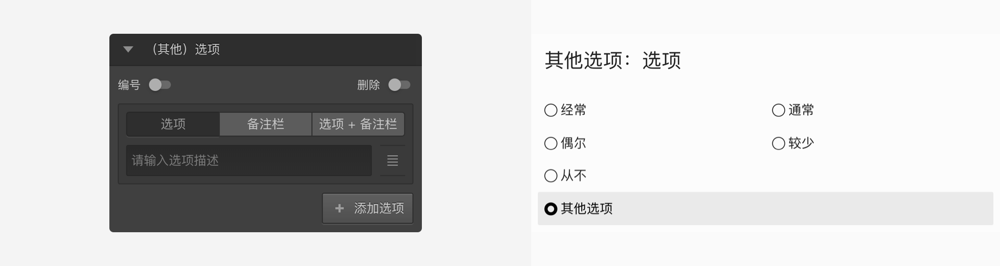
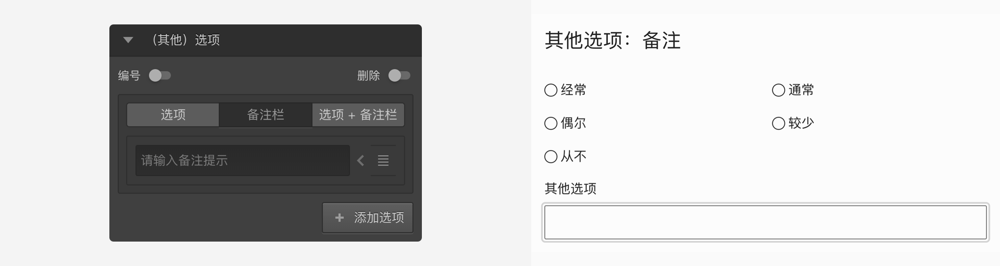
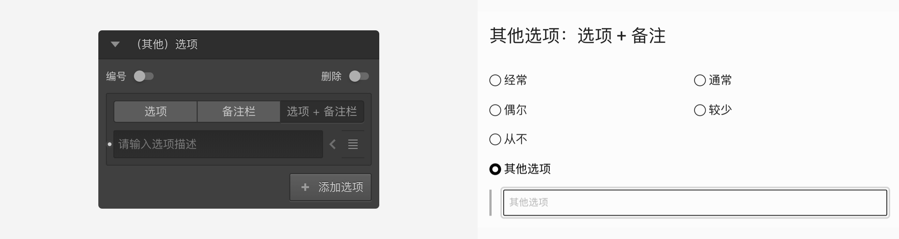
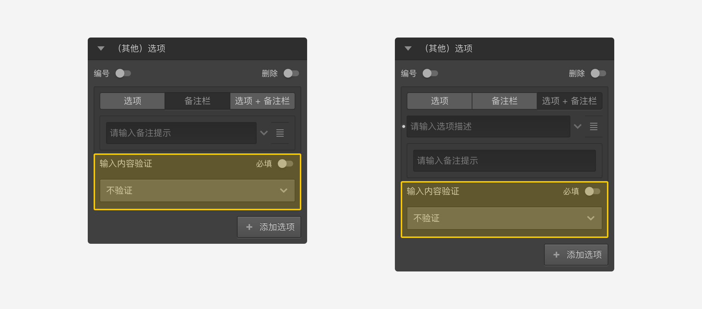

```index
1
```
```tag
选项 备注栏 选项+备注栏 特殊行为 其他选项
```
```summary
与众不同的其他选项。
```
# 其他选项

系统大多数题型都可以添加`其他`选项，`其他`选项相关设置在节点`属性编辑栏`的`设置`面板中。

打开`设置`面板并添加一个`其他`选项，可以看到`其他`选项有3种不同选项类型，分别是：`选项`、`备注栏`、`选项+备注栏`。

## 选项
显示为可选择的选项，与一般的选择题选项相同。



## 备注栏
显示为输入框，与一般的填空题选项相同。



## 选项+备注栏
显示为选项，但选中该选项后，选项下方显示输入框。



> 当设置为`备注栏`或`选项+备注栏`时，点击选项输入框右侧的`附加设置`小箭头按钮，可以设置验证备注栏中输入的内容，具体参见[输入验证](../11nodeSettings/03optionSetting/04inputValidation.md)。



## 特殊行为
和普通选项相比，其他选项有些特殊行为：
+ 永远显示在普通选项的后面，而且不会参与随机；
+ `其他`选项不属于[变量引用](../16variable/12useVariable.md)中的`全部选项`变量；
