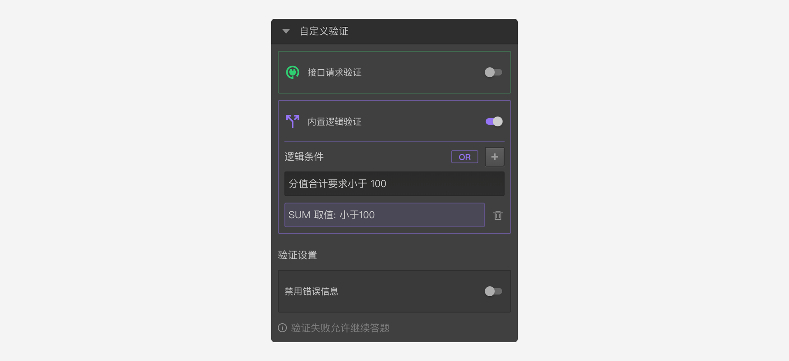

```index
3
```
```tag
内置逻辑验证 必答题 单选题 多选题 排他设置 最小输入项限制 填空内容 自定义验证
```
```summary
相对于接口请求验证来说，内置逻辑验证不需要开发外部接口，使用内置逻辑验证功能，实现接口请求验证的功能。
```
# 内置逻辑验证
虽然`接口请求验证`很强大，但是要在外部开发一个接口。而开启`内置逻辑验证`可以在不需要开发外部接口的情况下，使用`内置逻辑验证编辑器`的逻辑运算功能，实现接口请求验证的功能，优点是实现起来比较简单。



> 内置逻辑运算的规则参见[逻辑编辑器](../17advancedFunction/advancedLogicSetting/01logicSetting.md)。

此外，系统还提供了一些列使用简便的验证机制提高问卷数据质量，主要有：
+ 必答题：必须输入一些答案，不能直接跳过。[参考](../11nodeSettings/05questionGeneralSetting/01required.md)
+ 单选题：永远只能选择一项。
+ 多选题：只能选中指定数量范围内的选项数目。[参考](../11nodeSettings/05questionGeneralSetting/02multiChoice.md)
+ 排他设置：设置过排他的选项，互相排斥的两个选项不能同时被选中。[参考](../11nodeSettings/03optionSetting/02optionGroupAndExclude.md)
+ 最小输入项限制：对于打分题，填空题，可以限制最小输入项限制。[参考](../11nodeSettings/05questionGeneralSetting/03inputLimits.md)
+ 填空内容：对于填空题和其他选项的备注栏，可以验证输入内容。[参考](../11nodeSettings/03optionSetting/04inputValidation.md)
