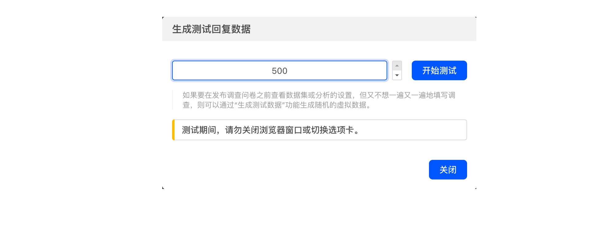
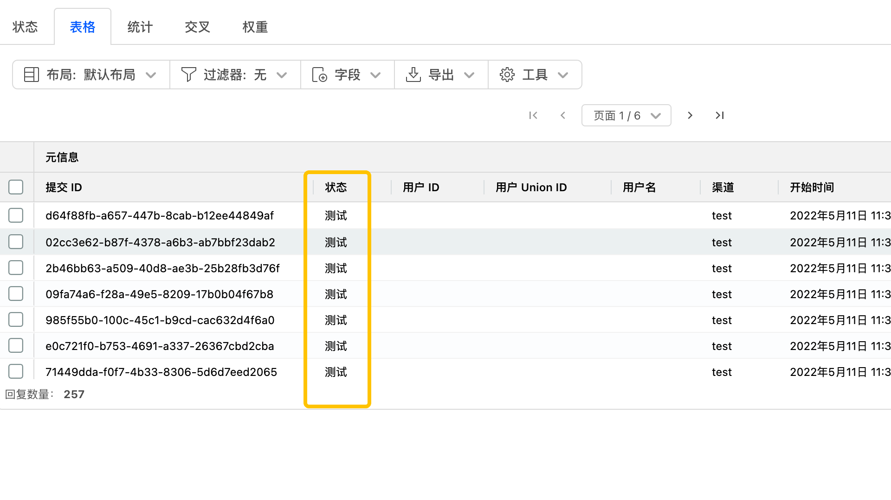
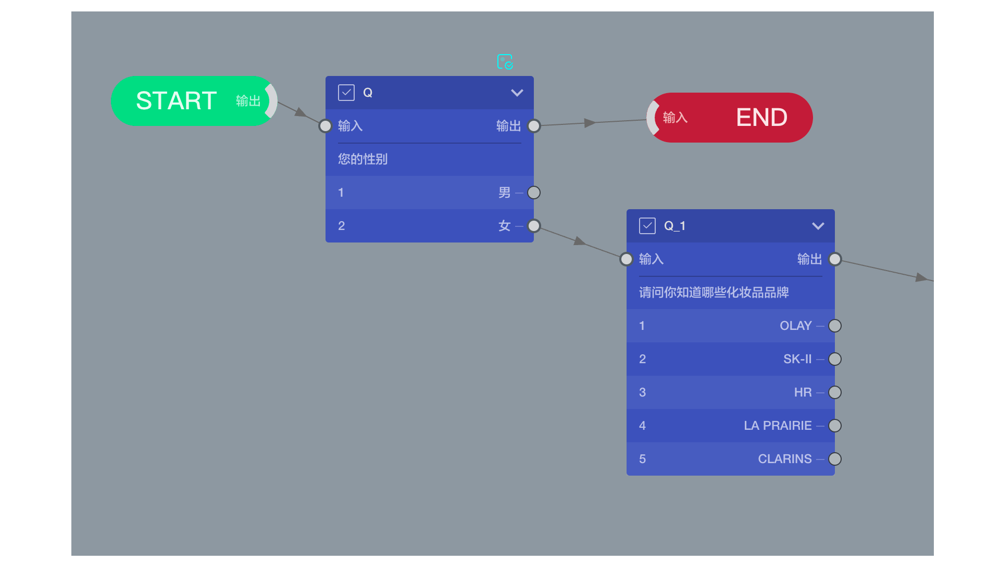
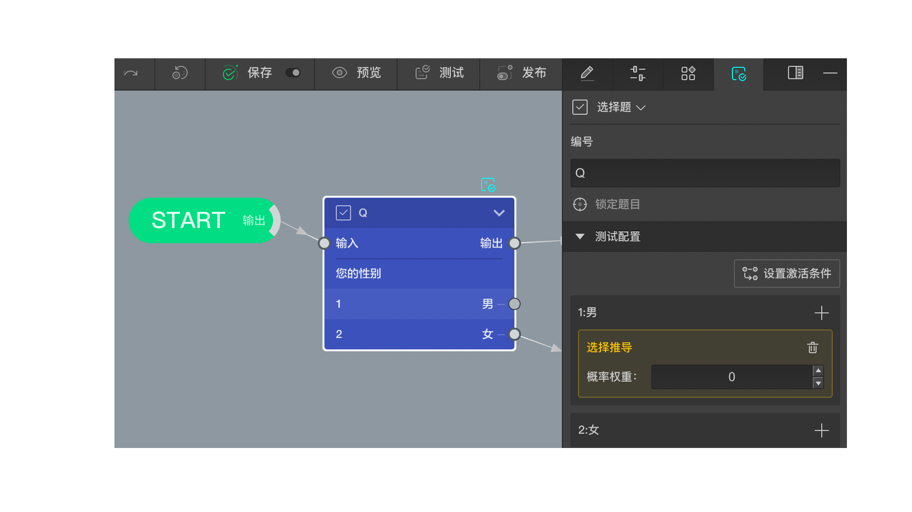

# 生成测试数据

## 基本操作

当问卷设置好后，还未正式发布前，可能想要先预览一下数据结果表，数据统计，数据交差分析等功能的效果，但是这时候还没有收集数据，无法查看，自己手动作答提交数据又太慢。

这时，可以使用系统提供的生成测试数据工具，选择自动生成大量的数据，然后再数据结果中去查看效果。

在还无数据的表格中点击`生成测试`，如果表格中已经有数据，则点击表格上方的`工具`=>`生成数据`

然后选择生成测试数据条数，点击生成测试，生成测试的过程中不要关闭弹窗，也不要离开当前页面，一段时间后测试数据就会生成成功。

生成好测试数据后，数据表格中就能查看了，其中状态栏是`测试`，可以和真正收集的数据作区分。

## 测试配置

### 简单案例
对于简单的问卷，直接上述操作即可得到想要的模型数据，但是对于复杂的问卷，里面用到了复杂的逻辑设置，则生成测试数据的工具不知道如何才能生成一个比较好的数据模型，这时候就需要通过`测试配置`功能来进行引导。

假设有一份关于女相化妆品的调研问卷，其中一部分题目如图所示。

当受访者是男性的时候，直接终止问卷。

当使用测试数据工具生成测试数据时，在性别这道题这里，测试工具默认会随机选择男或者女，但是我们希望只对女性生成数据，因为男性的数据是不需要的，对我们预览数据模型没有帮助。

这时，我们可以给性别这道题加上测试配置，将男性选项的选中概率权重设置为0.

之后生成测试数据是，这道题永远不会对男性生成数据。

### 复杂配置
以上只是简单的案例，事实上，测试配置中可以进行非常复杂和专业性的配置，下面一一讲述。

对于选择类型的选项，可以添加选择推导配置，对于输入类型的选项，可以添加输入推导配置，对于既可以选择，又可以输入的选项，则两种配置都可添加。

#### 选择推导
用于控制某个选项在推导数据时被选中的概率，默认所有选项都没有配置，则所有选项的概率是一致的。

如果给某个选项添加了配置，把概率权重设置为0，则代表该选项永远不会被选中

如果把某些选项设置了非0的概率权重，则这些选项的选中概率为 自己的概率权重/总概率权重。

一旦有某个选项设置了非0的权重，其他未配置的选项都默认不会被选中，除非他们也跟着开启配置。

一个选项可以添加多个配置，最终的概率权重等于这写配置的概率权重之和。

#### 输入配置
用于控制某个选项推导数据时被输入的内容。

当没有任何配置时，可能会有一下两种可能：
1. 这个输入项是完全开放的，则会随机输入一些无意义的字符。
2. 这些输入项是配置了输入验证功能的，如整数，小数，日期，自动填充等，则会随机生成满足这些要求的 内容。

使用输入配置，可以在此基础上更定制化地进行控制，

在输入项的配置中输入你想要在生成测试数据中得到的所有可能的候选数据内容，每个内容用英文逗号分隔。如：`宝马,奔驰,奥迪`，则生成数据时，这个选项只会被输入这三个品牌中的一个，且概率是一样的。

如果想控制某些候选输入内容的权重要比另外的候选输入内容的权重更高一些，则可可以用半角括号在后面标注权重，如`宝马(2),奔驰(1),奥迪(1)`，则生成测试数据的时候宝马别输入的概率为50%，奔驰和奥迪被输入的概率分别为25%

#### 激活条件
每个推导配置只要添加了，默认都是激活的，可以设置激活条件(逻辑条件)来动态控制某个推导配置是否被激活。

比如根据前面某道题的答案来决定某个推导配置是否被激活，当推导配置未激活时，不会影响测试数据的生成。

