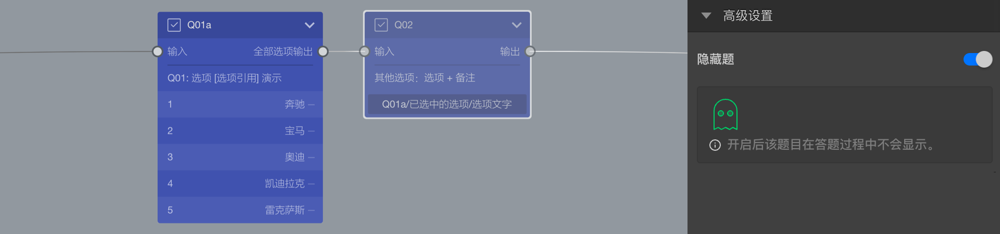

```index
2
```
```tag

```
```summary

```
# 替身节点

`替身节点`功能只针对题型节点有效，也就是说只能把某一道题目设置成替身节点。



开启`替身节点`模式后，该节点只用于承载数据而不会被展示给被访者，其所有属性可以通过[变量](../16variable/01concept.md)使用。

开启`替身节点`后，画布上，该节点会以半透明形式显示，与其他节点明显区分。
