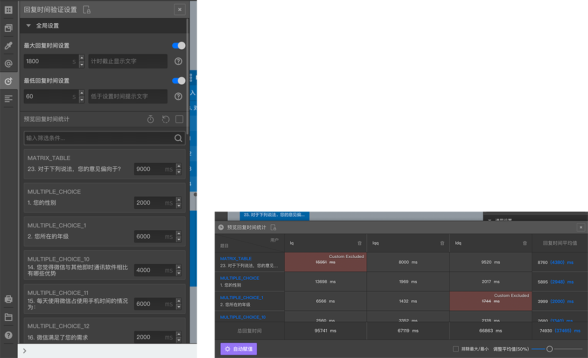
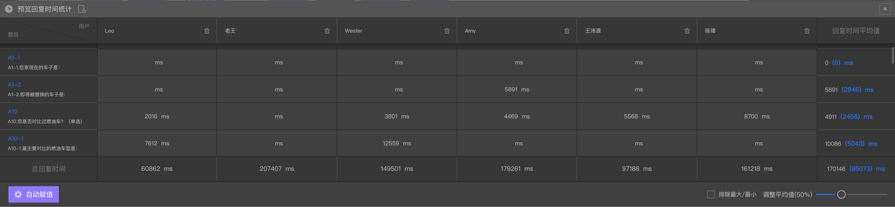
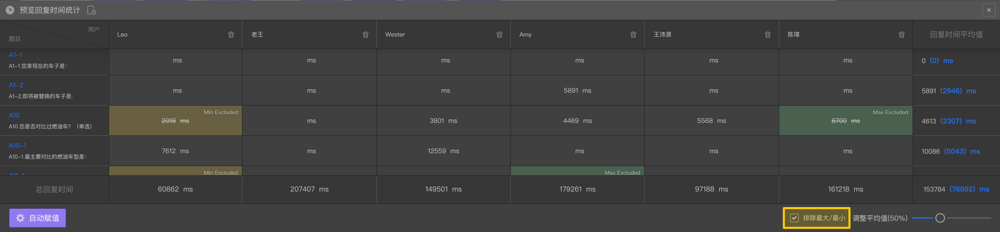

```index
1
```
```tag

```
```summary
计时设置可以设定问卷、题目的时长限制，在测试问卷时还可以记录问卷每道题目上的用时数据，并提供优化建议。
```
# 计时设置



用于设置问卷的最大答题时间和最小答题时间，还可以精准控制问卷每道题目的答题时间。

点击`问卷编辑器`左侧`问卷组件工具栏`的`计时设置`，打开`计时设置`面板。

## 全局设置


+ 最大回复时间设置：设置问卷回复时长上限、时长超过上限时的提示文字，超过上限后问卷将被终止。
+ 最低回复时间设置：设置问卷回复时长下限、时长低于下限时的提示文字，低于下限的问卷能提交数据并记录在数据结果里，但不会发放奖励。
  
## 预览回复时间统计
`预览回复时间统计`区域下方是问卷的题目列表，每道题目右侧都设有一个用于设定答题时间下限的时间设定组件。当被访者在一道设定了时间下限的题目的停留时间过短时，答题页面会弹出提示。

`预览回复时间统计`区域的头部右侧，还有以下操作按钮。


### 预览回复时间统计
如果问卷测试时提交了测试时间记录，那么点击后弹出`预览回复时间统计`面板，以表格形式呈现所有预览者提交的回复时间样本，并自动计算平均值。
  


+ 排除最大最小：计算每道题目的平均时间值时，排除最大和最小值，使平均值计算更为准确。
  


+ 手动排除：点击表格单元，计算平均值时手动排除指定单元值。


+ 自动赋值：把每道题目平均用时自动赋值到对应题目的时间设置上。

### 清除数据
清除收到的测试时间记录。

### 仅显示设置项
隐藏没有设置时间的题目。

> 一般只有对时间非常敏感的问卷或题目才需要使用时间设置。

> 如何在预览时记录时间并提交给系统，参见[保存问卷测试用时](../06preview/05saveTestTotalTime.md#保存问卷测试用时)

> 当问卷页面上一次显示多道题目时，计时设置可能由于被访者操作的不同而产生判断偏差。

