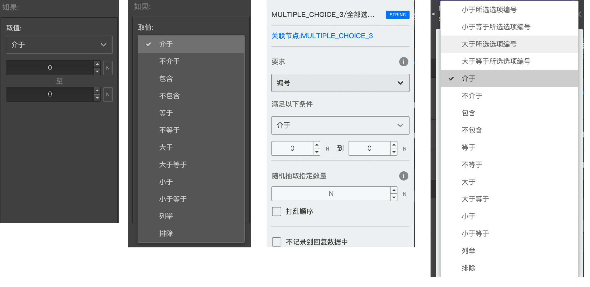

```index
2
```
```tag
逻辑判断规则 通用规则 变量过滤的独有规则 高级逻辑设置 高级功能
```
```summary
逻辑判断规则一览。
```
# 逻辑判断规则

问卷编辑过程中，经常会需要对问卷逻辑进行判断，比如判断打分题选项的分值是否满足`大于5且小于10`，又或者需要引用某个题目中`选项编号大于等于5`的所有选项等等，这时需要在[逻辑编辑器](./01logicSetting.md)和[变量过滤面板](../../16variable/11variableFilter.md)中对问卷内容进行逻辑判断，判断他们是否满足条件，这些条件也称为`逻辑判断规则`。



`逻辑编辑面板`和`变量过滤面板`的编辑面板中的条件下拉列表中，能看到所有可用的逻辑判断规则。其中一部分是`逻辑编辑面板`和`变量过滤面板`共有的，还有一部分是`变量编辑面板`独有的。

## 通用规则

+ 介于：用来比较数值，要求数值在指定的两个值之间,但不包含这两个值。
    > `5，6，7`满足`介于4到8之间`，而`1，4，8，9`不满足。

+ 不介于：用来比较数值，要求数值不在指定的两个值之间,包含这两个值，和`介于`相反。
    > `1，4，8，9`满足`不介于4到8之间`，而`5，6，7`不满足。

+ 模糊包含：用来比较数值或字符组，是一个宽泛、模糊的比较方式，判断后一组内容中是否有任意一个内容，等于前一组中的任意一个内容或任意一个内容的一部分。组中每一项内容之间必须用`半角`逗号进行分隔。
    > `aaa`满足模糊包含`a`。
    
    > `aaa`满足模糊包含`aaa`。
    
    > `aaa`不满足模糊包含`aaaa`。
    
    > `2222，aa`满足模糊包含`aaa,22`，因为后一组的`22`是前一组的`2222`的一部分。
    
    > `b，33`不满足模糊包含`bb,333`。

+ 不模糊包含：与`模糊包含`相反。

+ 等于： 用于比较数值或字符，判断两者是否相等。
    > `1`满足等于`1`，`abc`满足等于`abc`。

+ 不等于：和`等于`相反。

+ 大于：用于比较数值，判断前者是否大于后者。
    > `2`满足大于`1`。

+ 大于等于：用于比较数值，判断前者是否大于或等于后者。
    > `2`满足大于`1`, `1`满足大于等于`1`。

+ 小于：一般用于比较数值，判断前者是否小于后者。
    > `2`满足小于`3`。

+ 小于等于：一般用于比较数值，判断前者是否小于或等于后者。
    > `2`满足小于`3`, `3`满足小于等于`3`。

+ 列举：一般用来比较数值或字符组，判断后一组内容中是否有任意一个内容等于前一组中的任意一个内容。组中每一项内容之间是半角逗号分隔好的。
    > `aaa`不满足列举`a`。
    
    > `aaa`满足列举`aaa`。
    
    > `2222，aaa`满足列举`aaa,22`，因为后一组的`aaa`和前一组的`aaa`相等。
    
    > `b，33`不满足列举`bb,333`
    
> `列举`和`模糊包含`都是从组中拿出逗号分隔的单个内容进行逐一对比，区别是`列举`规则在单个对比时只能等于，不能是一部分。

+ 排除：和`列举`相反。

## 变量过滤的独有规则
变量过滤面板中如果使用了选项的编号，还会多出以下4种`变量过滤`的独有逻辑判断规则：

+ 小于所选选项编号
+ 小于等于所选选项编号
+ 大于所选选项编号
+ 大于等于所选选项编号