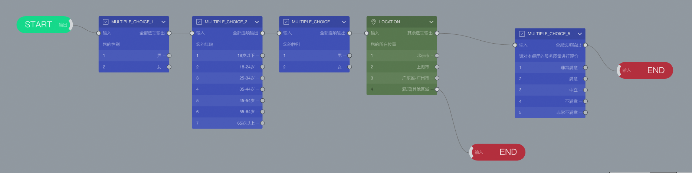

# 甄别

==甄别==用于判定被访者是否符合目标被访者的要求，==甄别==与==配额==密切相关。在巧思问卷系统中，通过一个==甄别==节点标识出甄别题目，甄别题目的选项就是甄别选项。系统可以针对甄别选项进行配额设定，当问卷中没有甄别选项时，不能对问卷设定配额。

==甄别节点==是一种特殊的节点，甄别节点插入问卷后，会将其之前和之后的问卷分为2个模式：
+ 甄别节点==前==的节点切换为==甄别模式==，可以被配额引擎识别进行配额设定，画布里节点颜色变为灰色。
+ 甄别节点==后==的节点保持不变，也称为==普通模式==，无法被配额引擎识别。

对被访者来说，==甄别模式==节点和==普通模式==节点没有任何区别。

## 在问卷中加入甄别

虽然通过常规题目跳转分支设定也可以实现区别对待部同被访者的效果，但是只有甄别节点才能在配额设置页面中设定的配额。因此，在需要设定问卷配额数量时，必须使用甄别节点。

在问卷里新增一个甄别节点，并连接到合适的位置，随后按问卷要求，将不符合要求的选项输出连接到结束节点，就完成了问卷甄别设定。

下图所示是一份普通的问卷：

增加甄别节点后，从下图可以看到甄别节点前的题目变成了灰色，代表这些题目处于甄别模式，可进行配额设置：

其中，可以看到==LOCATION==题目的==其他区域==选项输出直接连接到了结束节点，代表位置不在北上广的被访者都未通过甄别，不满足问卷要求而直接结束问卷，不记录答案。北上广的被访者会继续问卷答题。

把甄别模式的节点直接输出到结束节点，代表做出这样回答的被访者未通过甄别，不满足问卷要求。这种被访者提交的数据会被系统丢弃，不会被系统收集。但因为==其他区域==选项是==LOCATION==题目的一部分，这个代表未通过甄别的选项会也出现在配额表中，通常这个选项可以留空。如果设定为其他数量，会由于这个实际上被甄别的配额无法被使用，而导致问卷无法收集到设定的总数量。
