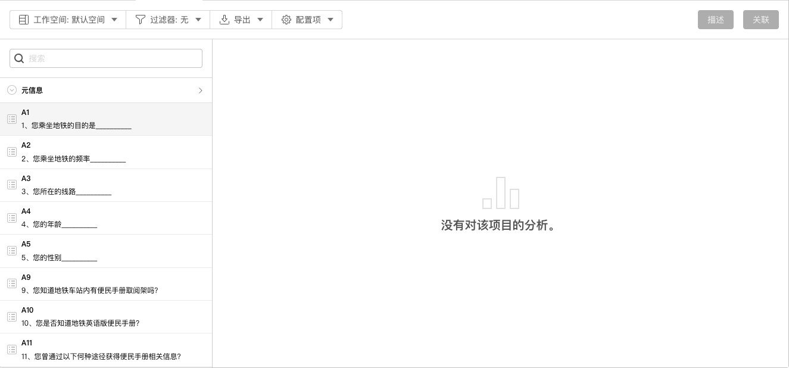
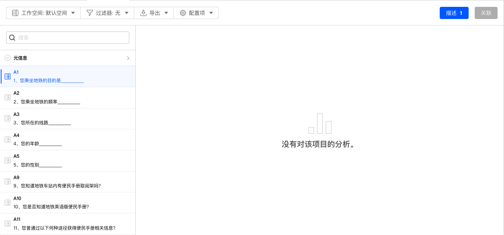
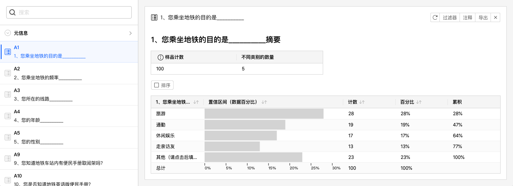

# 生成数据分析图表

数据分析页面主要分为左右2个区域，默认情况下进入页面时么有任何分析图表，如下图所示：

左侧是当前问卷题目列表，问卷题目列表上方搜索框中输入内容，可以快速搜索符合的问卷题目。

在问卷题目列表中选择一道问卷题目，例如A1，右上方描述按钮将被激活，代表当前可以生成数据分析卡片。

点击描述按钮，生成如下数据分析卡片。

描述按钮中会显示数字“1”，代表当前可以生成1张数据分析卡片。按下Shift同时点选多道问卷题目时，数字会随之变化，点击后可以一次性生成多张数据分析卡片。
