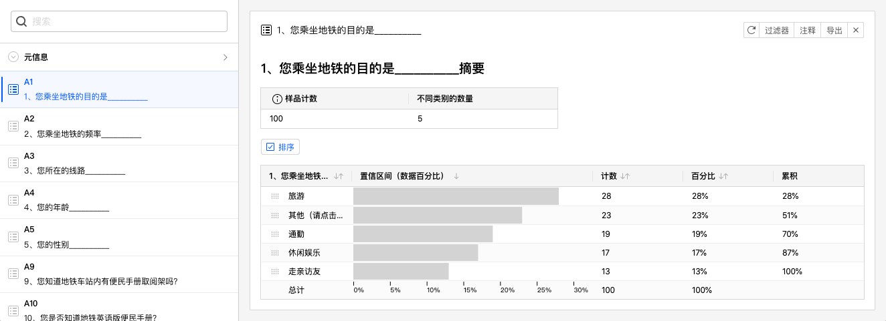
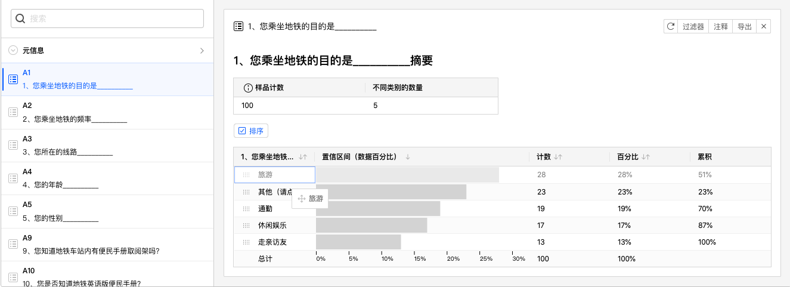
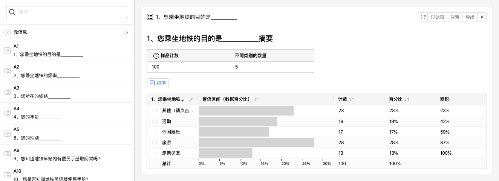

# 数据分析图表

生成数据分析图表后，系统会为选中的题目生成1张数据分析卡片。

## 数据分析表格

数据分析卡片最重要的是数据表格，表格列从左到右依次为：

+ 题目选项：表格每行代表该题目每个选项的统计分析数据。
+ 置信区间（数据百分比）：选择该选项的被访者的占比，以柱状图形式表现。占比计算分母为在问卷答复过程中做到这道题目的被访者总数，不包含由于跳转设定而没有做到这道题目的被访者。
+ 计数：数量统计。
+ 百分比：占比统计，同置信区间（数据百分比）。
+ 累计：从上往下的百分比累计数值。

## 样本统计表格
数据表格上方的小表格是样本统计表格，展示了当前题目的概览，表格列从左到右依次为：

+ 样品计数：问卷答复过程中做到这道题目的被访者总数。 
+ 不同类别的数量：做到这道题目的被访者总共选择了多少不同的选项类别。

## 对数据分析表格进行排序
点击数据表格列名可以设定数据表格排序规则，下图为点击置信区间列后，数据分析表格按置信区间列降序排列后的效果。

> 点击数据表格列名可以循环切换升序、降序排列规则。

## 自定义排序规则

勾选数据分析表格上方的排序按钮，数据表格最左边的题目选项列变为可拖动的形式，如下图所示选项名称左边显示了拖动手柄。

点击拖动手柄并移动到期望的目标位置。

数据分析图表随即以自定义的排列顺序显示。

