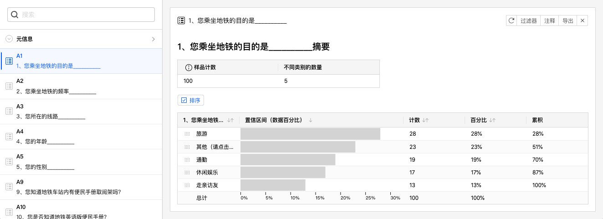
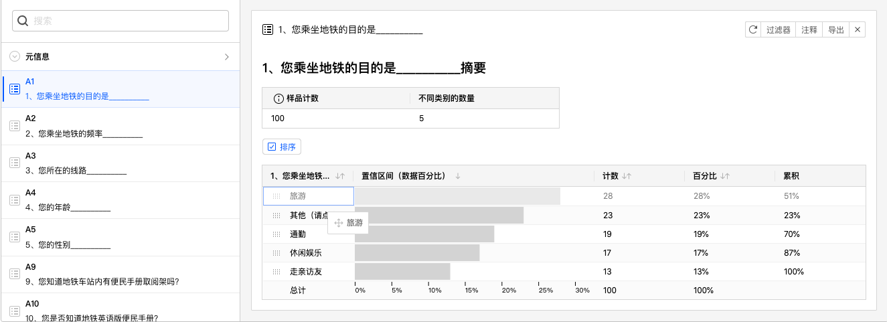
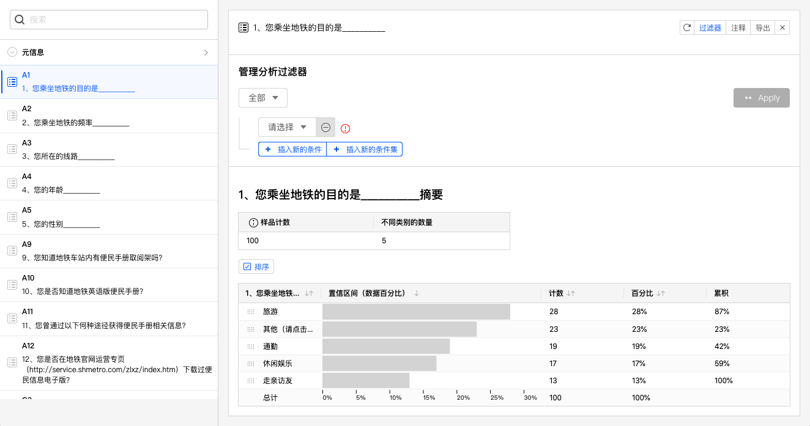
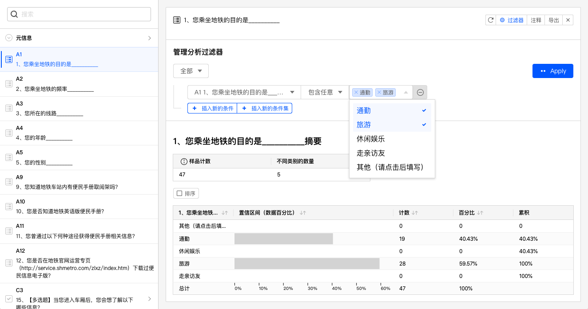
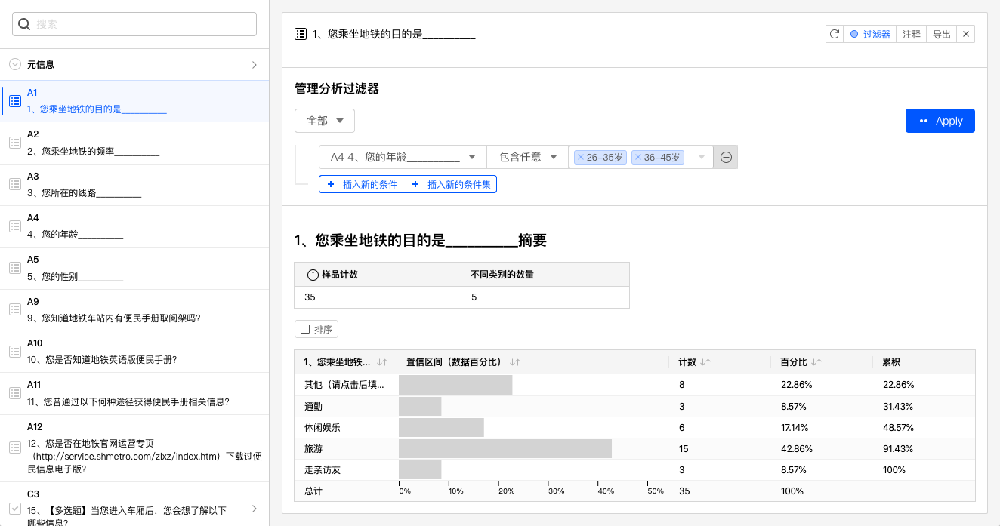
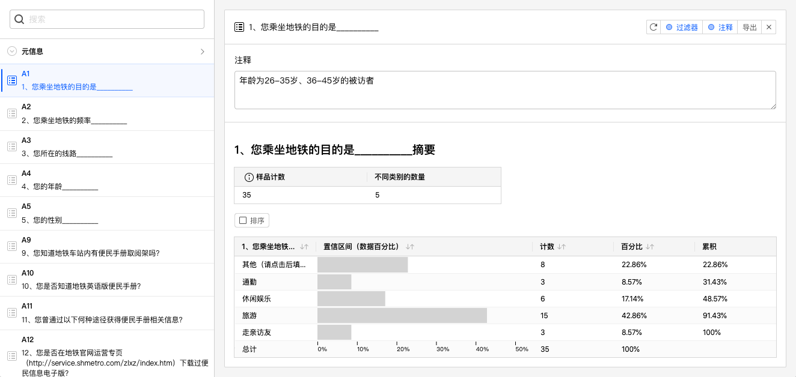
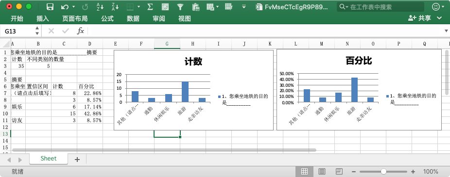

# 数据分析图表卡片

生成数据分析图表后，系统会为选中的题目生成1张数据分析图表卡片。

## 数据分析表格

数据分析卡片最重要的是数据表格，表格列从左到右依次为：

+ 题目选项：表格每行代表该题目每个选项的统计分析数据。
+ 置信区间（数据百分比）：选择该选项的被访者的占比，以进度条形式表现。占比计算分母为在问卷答复过程中做到这道题目的被访者总数，不包含由于跳转设定而没有做到这道题目的被访者。
+ 计数：数量统计。
+ 百分比：占比统计，同置信区间（数据百分比）。
+ 累计：从上往下的百分比累计数值。

## 样本统计表格

数据表格上方的小表格是样本统计表格，展示了当前题目的概览，表格列从左到右依次为：

+ 样品计数：问卷答复过程中做到这道题目的被访者总数。 
+ 不同类别的数量：做到这道题目的被访者总共选择了多少不同的选项类别。

## 对数据分析表格进行排序

点击数据表格列名可以设定数据表格排序规则，下图为点击置信区间列后，数据分析表格按置信区间列降序排列后的效果。

> 点击数据表格列名可以循环切换升序、降序排列规则。

## 自定义排序规则

勾选数据分析表格上方的排序按钮，数据表格最左边的题目选项列变为可拖动的形式，如下图所示选项名称左边显示了拖动手柄。

点击拖动手柄并移动到期望的目标位置。

数据分析图表随即以自定义的排列顺序显示。

## 筛选数据并生成分析图表

数据分析图表对当前题目数据进行统计分析，并且支持数据进行筛选后生成统计分析。点击数据分析图表卡片右上角的过滤器按钮，在当前数据分析卡片中增加过滤器控制。

过滤器详细介绍参见[过滤器](../09dataResult/02dataTable/05dataFilter.md).

> 数据分析卡片的过滤器功能与数据表格的过滤器功能完全相同。

如下图，对当前数据设定过滤条件，设定为：题目A1中包含任意通勤、旅游选项的数据，系统随后更新数据分析图表，可以看到数据分析图表、样本统计表格都已经更新为最新的筛选数据。此时，样本统计表格中的样品计数就是筛选后得到的总数量。

目前我们都是对A1进行筛选，并显示A1对数据分析图表。其实，对数据进行筛选时，可以对其他题目进行筛选，并不限于仅能对当前题目数据进行筛选操作。如下图，将数据过滤条件设定为：题目A4中包含任意26-35岁、36-45岁的数据，系统随后更新数据分析图表。

根据分析的需求，还可以为数据分析卡片添加多组不同条件组合的过滤条件，方便、快速地得到更为个性化的数据分析图表。

## 添加注释

点击注释按钮，数据分析图表上方会显示注释文本输入框，可以为数据分析图表添加注释说明，便于解读数据图表。

## 导出数据分析图表

点击导出按钮，可以输出当前数据分析图表的Excel文件。

输出到Excel文件中的图表采用原生的Excel组件，可以在Excel软件中进行二次编辑调整。
