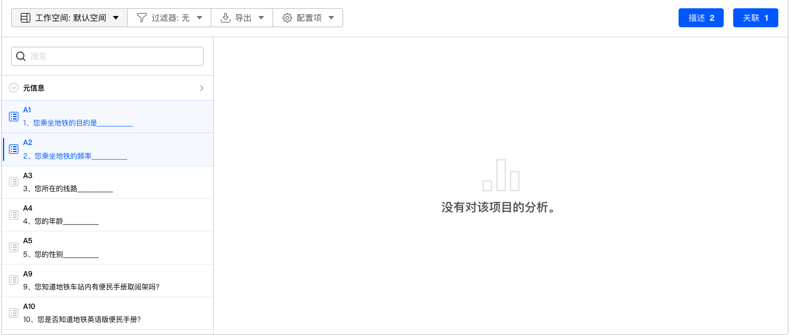
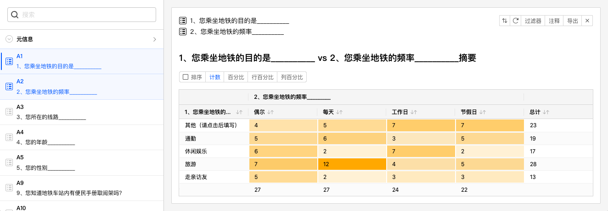
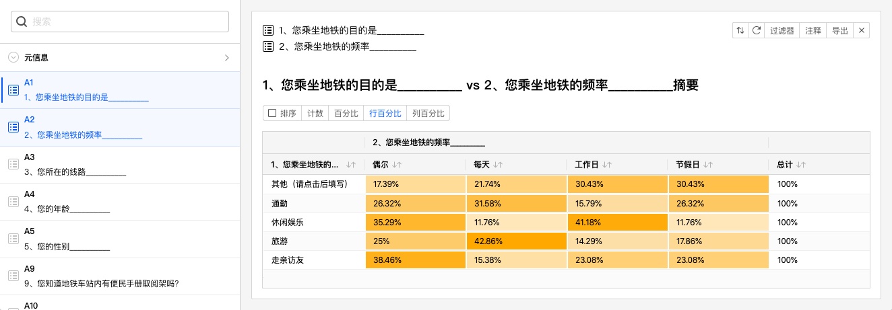
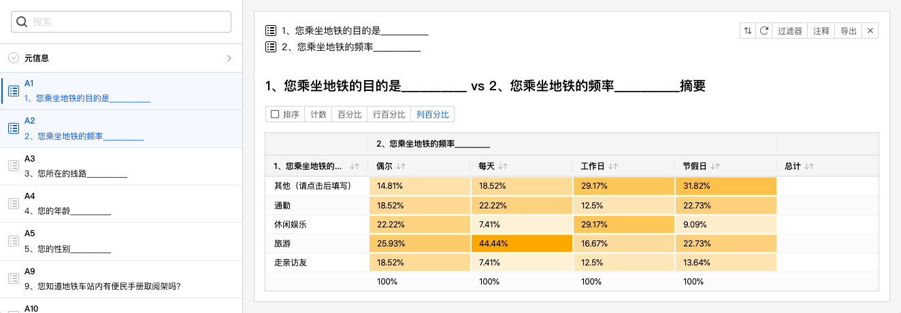
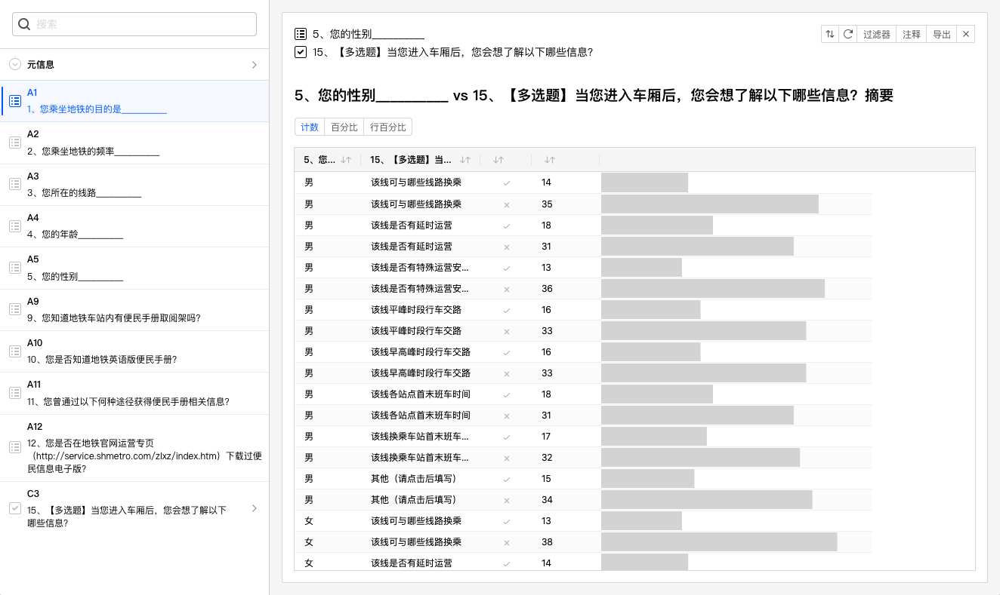
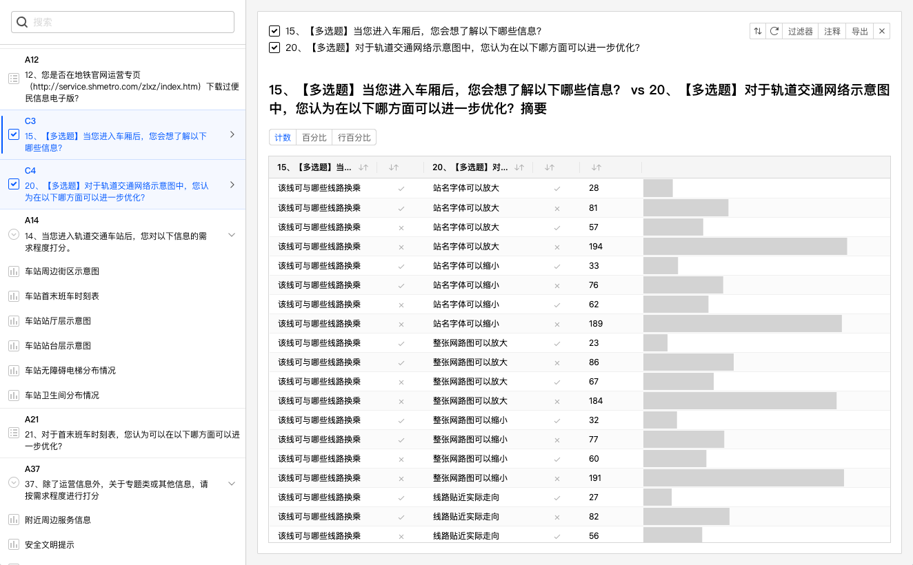

# 交叉数据分析图表

数据分析模块可以对2组数据进行交叉计算后统计分析结果，并输出图表。

## 生成交叉数据分析图表

==交叉数据图表==需要2个不同的数据源，按下==Shift==后选择2道问卷题目，==关联==按钮被激活。如果选择了2道题目，但==关联==按钮没有激活则代表这2道题目无法生成交叉数据。

### 单选与单选交叉

如下图，选择A1、A2后，点击关联按钮，生成如下交叉数据分析图表。

交叉数据分析图表行、列分别为A1、A2的题目选项，行列交叉位置的数值就是同时选中这2个选项的被访者的数量。

> 为便于数据解读，较大数值的单元格以深色显示，较小数值的单元格以浅色显示。

### 切换交叉数据分析图表统计方式

交叉数据分析图表支持多种数据统计方式：

+ 计数：计算数量，是默认的统计方式。
+ 百分比：计算总体的百分比。
  

+ 行百分比：按行计算百分比。
  

+ 列百分比：按列计算百分比。
  

### 单选与多选的数据交叉

在题目列表中选择一道单选题和一道多选题，生成如下交叉分析图表。

单选与多选交叉是将2道题目的所有选项进行==两两匹配==，并统计数据。上图表格中，最左边2列是单选题和多选题所有选项，并进行两两匹配，每种匹配规则占据一行。剩余数据列从左到右边各列分别为：

+ 是否选中：代表选中，或者没有选中当前交叉规则。
+ 数量：当前交叉规则的数量。
+ 数据百分比：以进度条方式显示的百分比。

### 多选与多选的数据交叉

在题目列表中选择一道多选题和一道多选题，生成如下交叉分析图表。

与单选与多选数据交叉类似，多选与多选的数据较长也是将2道题目的所有选项进行两两匹配，并统计数据。上图表格中，最左边4列分别是2道多选题所有选项，并根据是否选中该选项来进行两两匹配，每种匹配规则占据一行。剩余数据列从左到右边各列分别为：

+ 数量：当前交叉规则的数量。
+ 数据百分比：以进度条方式显示的百分比。