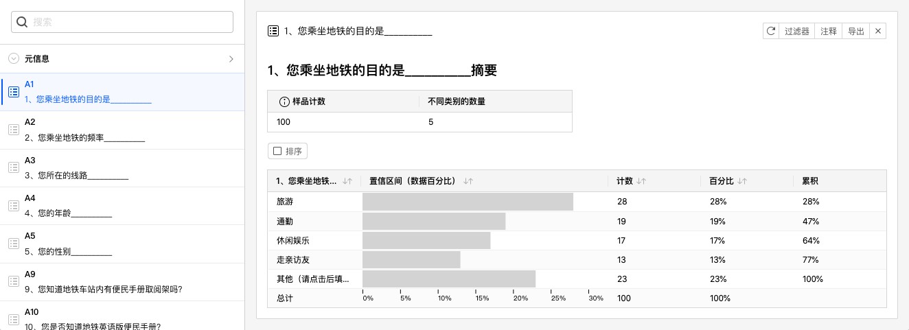
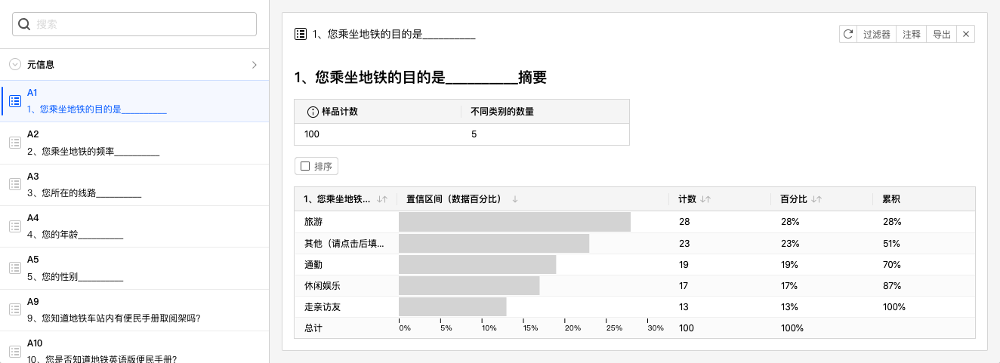
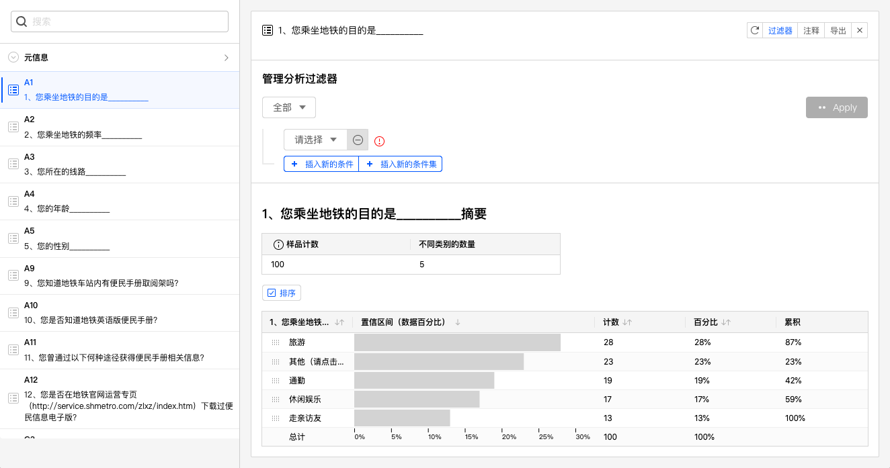
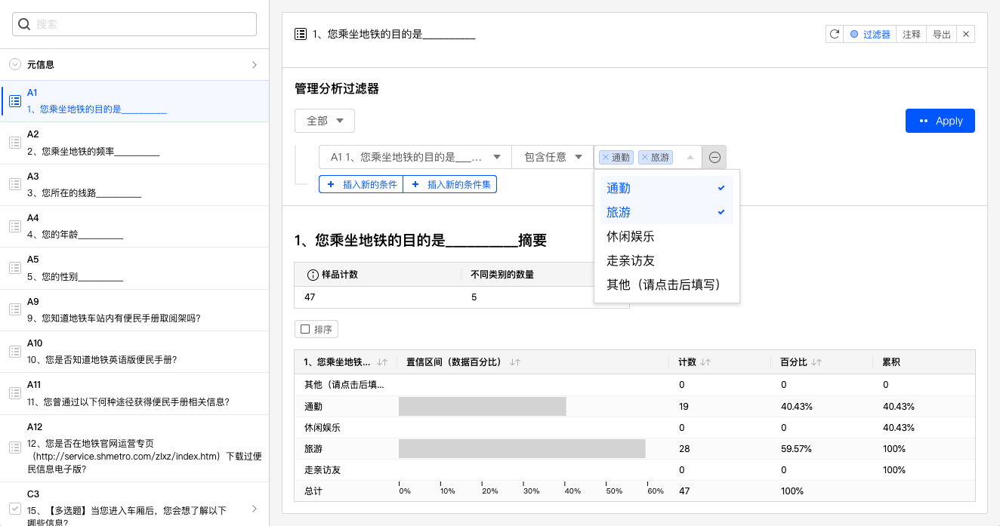
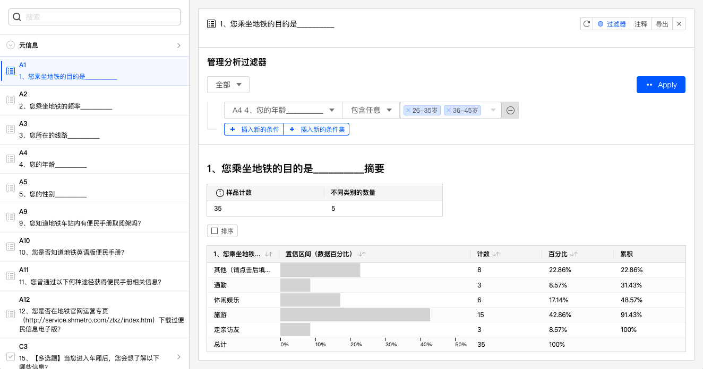
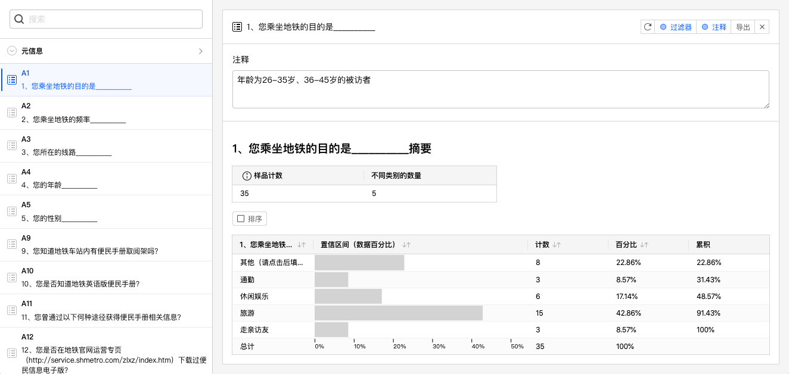
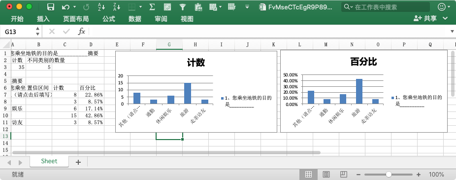
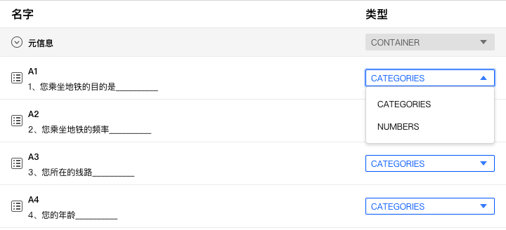

# 数据分析设定和操作

## 对数据分析图表卡片设定和操作

生成数据分析图表后，系统会为选中的题目生成1张==数据分析图表卡片==。

### 数据分析表格

数据分析卡片最重要的是==数据分析表格==，表格列从左到右依次为：

+ 题目选项：表格每行代表该题目每个选项的统计分析数据。
+ 置信区间（数据百分比）：选择该选项的被访者的占比，以进度条形式表现。占比计算分母为在问卷答复过程中做到这道题目的被访者总数，不包含由于跳转设定而没有做到这道题目的被访者。
+ 计数：数量统计。
+ 百分比：占比统计，同置信区间（数据百分比）。
+ 累计：从上往下的百分比累计数值。

### 样本统计表格

数据表格上方的小表格是==样本统计表格==，展示了当前题目的概览，表格列从左到右依次为：

+ 样品计数：问卷答复过程中做到这道题目的被访者总数。 
+ 不同类别的数量：做到这道题目的被访者总共选择了多少不同的选项类别。

### 对数据分析表格进行排序

点击数据表格列名可以设定数据表格排序规则，下图为点击置信区间列后，数据分析表格按置信区间列降序排列后的效果。

> 点击数据表格列名可以循环切换升序、降序排列规则。

### 自定义排序规则

勾选数据分析表格上方的==排序==按钮，数据表格最左边的题目选项列变为可拖动的形式，如下图所示选项名称左边显示了拖动手柄。

点击拖动手柄并移动到期望的目标位置。

数据分析图表随即以自定义的排列顺序显示。

### 筛选数据并生成分析图表

数据分析图表对当前题目数据进行统计分析，并且支持数据进行筛选后生成统计分析。点击数据分析图表卡片右上角的==过滤器==按钮，在当前数据分析卡片中增加过滤器控制。数据分析卡片的过滤器功能与数据表格的过滤器功能完全相同。

> 过滤器详细介绍参见[过滤器](../09dataResult/02dataTable/06dataFilter.md)。

如下图，对当前数据设定过滤条件，设定为：题目A1中包含任意通勤、旅游选项的数据，系统随后更新数据分析图表，可以看到数据分析图表、样本统计表格都已经更新为最新的筛选数据。此时，样本统计表格中的样品计数就是筛选后得到的总数量。

目前我们都是对A1进行筛选，并显示A1对数据分析图表。其实，对数据进行筛选时，可以对其他题目进行筛选，并不限于仅能对当前题目数据进行筛选操作。如下图，将数据过滤条件设定为：题目A4中包含任意26-35岁、36-45岁的数据，系统随后更新数据分析图表。

根据分析的需求，还可以为数据分析卡片添加多组不同条件组合的过滤条件，方便、快速地得到更为个性化的数据分析图表。

### 添加注释

点击==注释==按钮，数据分析图表上方会显示注释文本输入框，可以为数据分析图表添加注释说明，便于解读数据图表。

### 导出数据分析图表

点击==导出==按钮，可以输出当前数据分析图表的Excel文件。

输出到Excel文件中的图表采用原生的Excel组件，可以在Excel软件中进行二次编辑调整。

## 数据分析基本操作

数据分析页面上方除了描述和关联按钮外，还设有==数据分析基本操作工具栏==。

数据分析基本操作工具栏中的操作设定==会影响所有数据==，主要有以下功能：

### 工作空间

工作空间用于对数据分析图表进行归类，例如可以对一份餐厅满意度调研问卷数据分成服务满意度数据、环境满意度、餐饮满意度工作空间，每个工作空间仅包含对应题目的数据分析图表，便于快速定位聚焦所需的数据图表。

+ 创建工作空间：点击==创建工作空间==，输入名称后点击确定，创建新的工作空间，在工作空间内保存了当前数据分析卡片。
+ 切换工作空间：在工作空间下拉菜单中点选名称后切换工作空间。
+ 管理工作空间：点击后，弹窗显示当前所有工作空间名称。
    + 重命名：点击==编辑==按钮，输入新的名称并确认。
    + 删除：点击==删除==按钮删除未使用的工作空间，当前正在使用的工作空间无法删除。

### 过滤器

数据分析卡片中的过滤器仅对该卡片数据有效，而数据分析工具栏中过滤器会对所有数据生效，是全局的数据过滤器，优先级高于卡片中的过滤器。全局数据过滤器功能与数据表格的过滤器功能完全相同。

> 过滤器详细介绍参见[过滤器](../09dataResult/02dataTable/06dataFilter.md)。

### 导出

数据分析卡片中的导出仅导出该卡片的数据，工具栏中的导出则会导出当前工作空间的所有数据分析卡片，导出文件为Excel文件，每张卡片数据为Excel文件里的一个Sheet。

+ 管理导出数据：导出数据会在云端生成文件，点击管理导出数据后，在弹出对话框里显示了所有的导出文件，选中文件并点击下载从云端下载数据文件。或者，点击删除从云端删除文件。

### 配置项

大部分题型的选项都同时具有文本和编号，分别对应与数据分析变量类型里的==类目（Category）==和==数值（Numbers）==，不同的变量类型会得出不同的统计分析结果。在需要时，可以变更数据分析是采用的变量类型。

点击变量配置，弹出对话框中列出了问卷所有题目和当前参与数据分析统计所采用的变量类型。点击==类型==下拉菜单切换变量类型。

如上图所示，A1题可选择==类目（Category）==和==数值（Numbers）==，默认采用类目（Category），选额数值（Numbers）后，将采用数值对A1题进行数据统计分析。

