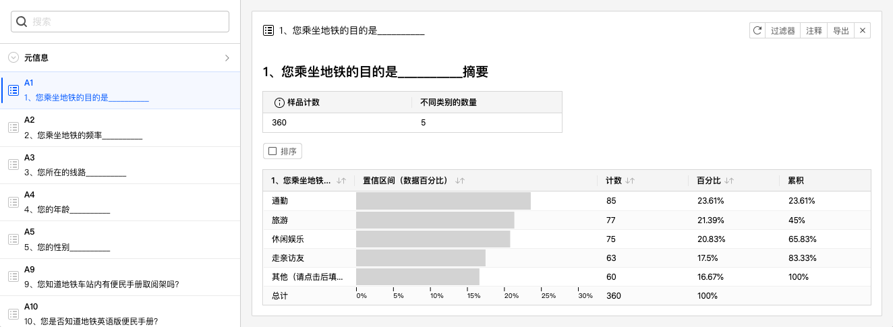
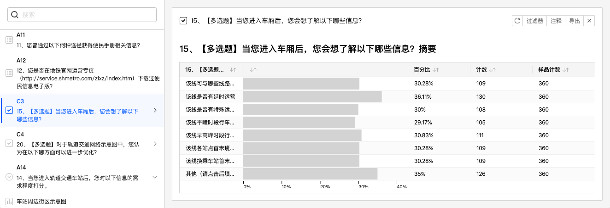
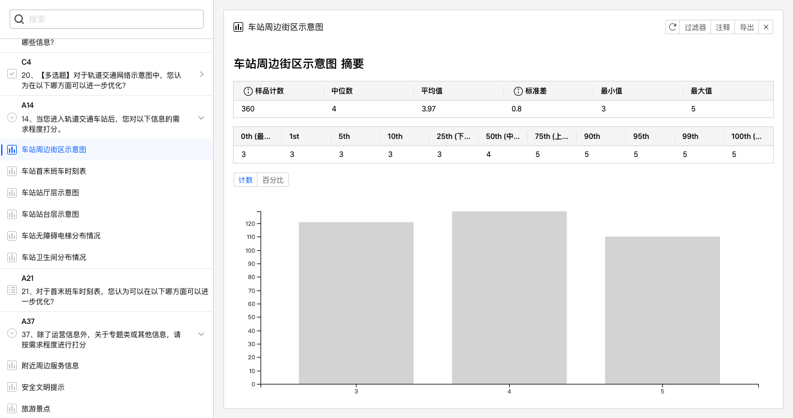
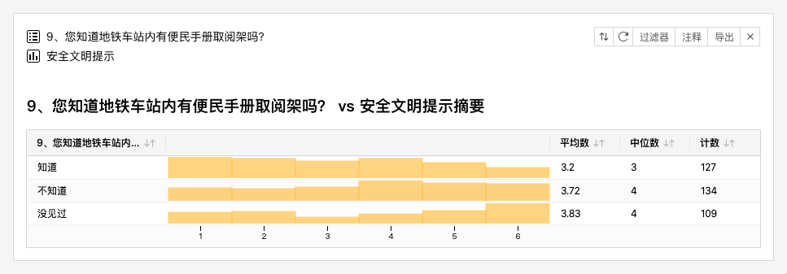
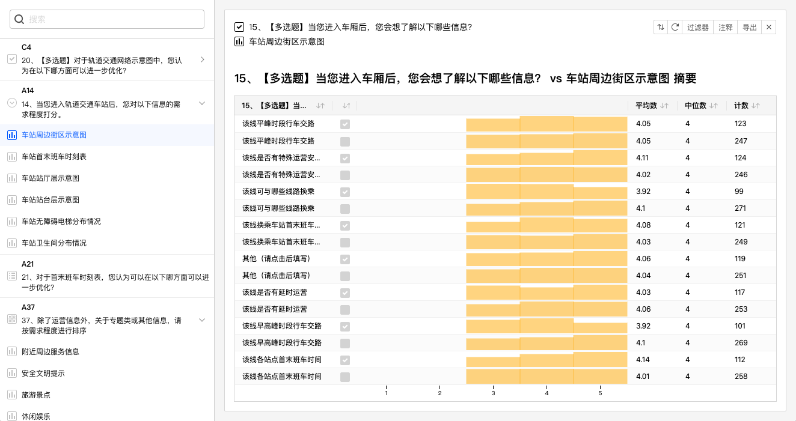
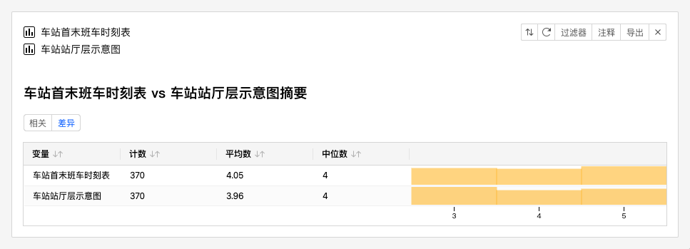
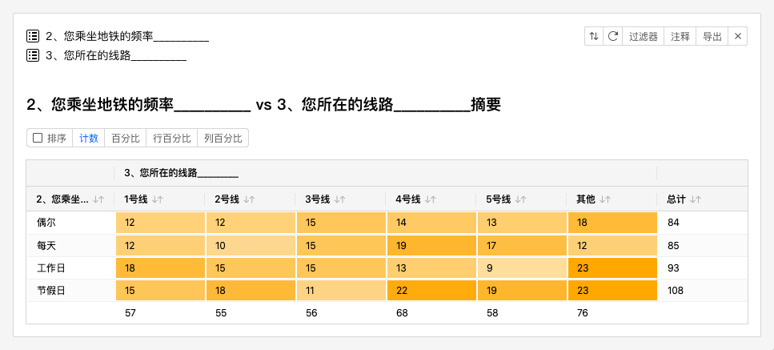
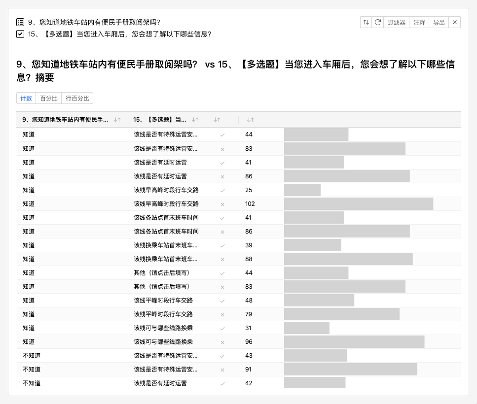
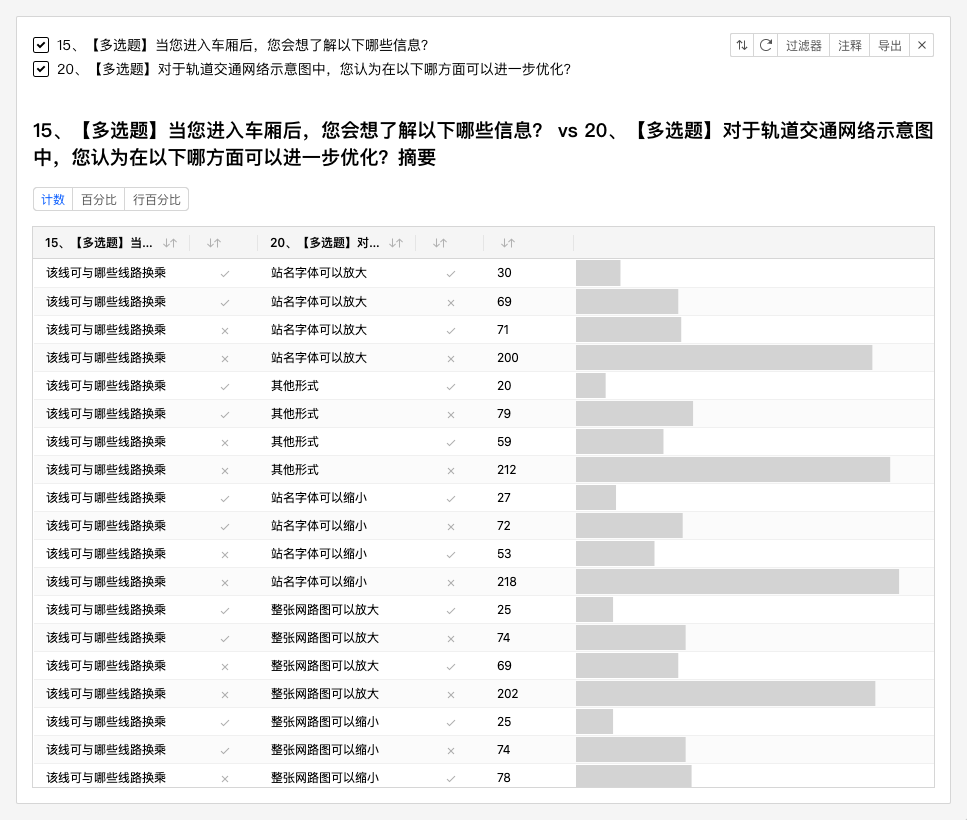

# 数据分析综述

在问卷数据收集后，或收集过程中，用户往往有对数据进行简单分析的需求，==数据分析==功能用来对问卷数据进程统计和分析，在不借助专业工具的情况下，快速生成每道题目的统计图表，并可以进行==数据交叉分析统计==。

## 分析变量

数据分析基于==变量==进行数据分析。问卷的==元信息==和==问卷题目均==会转换为==分析变量==。变量分为以下类型：

+ 元信息变量
+ 题目变量

### 元信息变量

==元信息==是在问卷收集过程中系统自动添加的标记信息，包括：==渠道==、==收集器==、==耗时==、==提交时间==。

### 题目变量

问卷内的题目或选项转换为对应的变量类型，包括：==多选类型（Checkboxes）==、==类目（Category）==、==数值（Numbers）==、==矩阵类目（Matrix Category）==、==矩阵数值（Matrix Numbers）==。不同的题型对应不同的题目变量。规则如下：

1. 选择题、菜单题（非级联题）、图标题、图片选择题、图片热点题

  + 为单选时：题目可对应类目（Category）、数值（Numbers）变量，进行数量分析或数值分析。数值分析时采用对应的选项编号作为具体数值参与统计。

  

  + 为多选时：题目对应多选类型（Checkboxes）变量，进行数量分析。选项对应类目（Category）变量，针对单一选项是否选中进行数量分析。

  

2. 打分题、权重题、演示评价题

    选项可对应类目（Category）、数值（Numbers）变量进行数量分析或数值分析。数量分析基于结果中出现的可能分值进行分析，例如打了某个分值的人数有多少等。

    

3. 排序题

    题目对应矩阵类目（Matrix Category）、矩阵数值（Matrix Numbers）变量，可对所有选项进行数量分析或数值分析。选项根据题目变量类型对应类目（Category）、数值（Numbers）变量，分析类型同打分题。

4. 矩阵题

    选项对应类目（Category）变量，可基于选中与否，进行数量分析。

5. 级联题

    由于级联题是通过菜单题进行构造而成的，第一级的菜单题作为级联题的一级菜单无对应变量，作为二级菜单使用的位于第二级的菜单题等同于多选题。•	题目对应 多选类型（Checkboxes）变量，进行数量分析。选项对应类目（Category），针对单一选项是否选中进行数量分析。

## 数据分析类型

数据分析基于变量进行数据分析，可对数据进行==描述==、或==关联==。

+ 描述：对单个变量进行统计分析。
+ 关联：对2个变量进行交叉分析。
  

总体上，分析可以分为2类：

+ 数量分析：围绕==样本数量==产生的基于类别的分析，可得到基于类别的数量、百分比等信息。绝大多数分析基于此类型分析。
+ 数值分析；围绕==数值==进行的分析。针对数值得到平均数、中位数、方差、最大值、最小值、百分比、数值分布柱状图等分析结果。

### 描述

1、 元信息变量

  + 渠道：统计不同渠道的回复数量，进度条形式呈现。
  + 收集器：统计不同收集器的回复数量，进度条形式呈现。
  + 耗时：统计不同耗时区间的回复数量，柱状图条形式呈现。
  + 提交时间：统计不同回复时间区间的回复数量，柱状图条形式呈现。

2、 题目变量

  + 多选类型（Checkboxes）：得出各选项的回复数量、百分比、数量柱状图。
  + 类目（Category）：得出各类目的回复数量、百分比、百分比累计值，进度条形式呈现。
  + 数值（Numbers）：得出样本总数量、平均数、中位数、最小值、最大值、方差，以及常规的百分比数值，以柱状图呈现分值分布情况。
  + 矩阵类目（Matrix Category）：得出对各子变量类目分别计算回复数量。
  + 矩阵数值（Matrix Numbers）：得出对各子变量分别计算回复数量、平均数、中位数、以柱状图呈现各子变量的分值分布情况。

### 关联

关联提供了2个变量之间的联合分析能力。矩阵类目（Matrix Category）和矩阵数值（Matrix Numbers）==不参与关联==，而是由其选项的类目（Category）、数值（Numbers）变量参与关联分析。

1、元信息与题目变量进行关联

  + 题目变量为多选类型（Checkboxes）：得出元信息与各选项（区分选中与未选中）的交叉计数及各百分比。
  + 题目变量为类目（Category）：得出元信息与各类目的交叉计数及各百分比。
  + 题目变量为数值（Numbers）：得出元信息与数值交叉后的分值分布(柱状图）、平均数、中位数、样本计数信息。

2、同一道题目的题目变量进行关联

  + 类目（Category）与数值（Numbers）关联：计算各类目（Category）与数值（Numbers）变量的交叉分布结果，得出分值分布(柱状图）、平均数、中位数、样本计数信息。

  

  + 多选类型（Checkboxes）与数值（Numbers）关联：基于各选项（区分选中与未选中）计算与数值（Numbers）变量的交叉分布结果。

  

  + 数值（Numbers）与数值（Numbers）关联：各个值（Numbers）的数值统计表及分值分布柱状图。

  

  + 类目（Category）与类目（Category）关联：计算各类目（Category）之间的交叉分布，包含样本计数及各百分比。

  

  + 类目（Category）与多选类型（Checkboxes）关联：基于各选项（区分选中与未选中）与类目（Category）进行交叉计算，得到数量、百分比分布结果。

  

  + 多选类型（Checkboxes）与多选类型（Checkboxes）关联：基于各选项（区分选中与未选中）进行交叉计算，得到数量、百分比分布结果。

  

## 数据分析时的限制

当通过2道题目进行关联分析时，并不是所有情况下都能得到交叉后的结果，例如填空题与选择题无法得到交叉结果。系统会自动判断用户所选择的题目将得到什么样的交叉分析结果，当无法得出结果时，相应按钮将失效，代表当前所选题目无法进行交叉分析。
