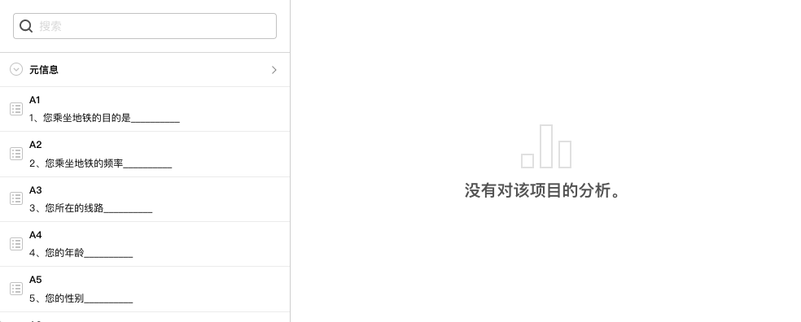

# 数据分析

在问卷数据收集后，或收集过程中，用户往往有对数据进行简单分析的需求，==数据分析==功能用来对问卷数据进程统计和分析，在不借助专业工具的情况下，快速生成每道题目的统计图表，并可以进行数据==交叉分析==统计。

## 数据分析类型

数据分析基于==变量==进行数据分析。问卷的==元信息==和==问卷题目==均会转换为==分析变量==，可对数据进行==描述==、或==关联==。

+ 描述：对单个变量进行统计分析。
+ 关联：对2个变量之间的交叉分析能力。
  

总体上，分析结果可以分为2类：

+ 数量分析：围绕样本数量产生的基于类别的分析，可得到基于类别的==计数==、==百分比==等信息。绝大多数分析基于此类型分析。
+ 数值分析；围绕数值进行的分析。针对数值得到==平均数==、==中位数==、==方差==、==最大值==、==最小值==、==百分比==、==数值分布==柱状图等分析结果。

> 数据分析详细说明参见[数据分析详细说明](./08dataAnalysisConcepts.md)

## 开始数据分析

当问卷发布后，并且收集到了回复数据后，就可以渐入数据分析板块，对问卷数据进行统计分析。默认情况下，系统不会自动为问卷题目生成统计分析。

接下来，我们就可以开始对数据生成统计图表，主要操作有：
+ [生成数据分析图表](./01buildDataAnalyse.md)
+ [数据分析图表卡片设定和操作](./02dataAnalysisChart.md)
+ [交叉数据分析图表](./03dataAnalysisChartCross.md)