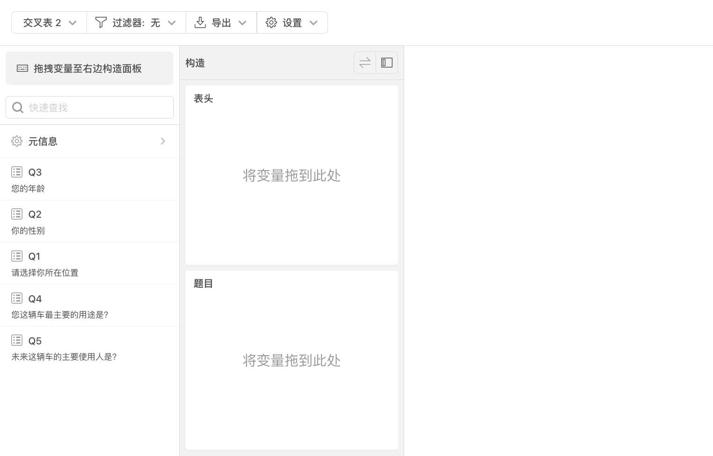
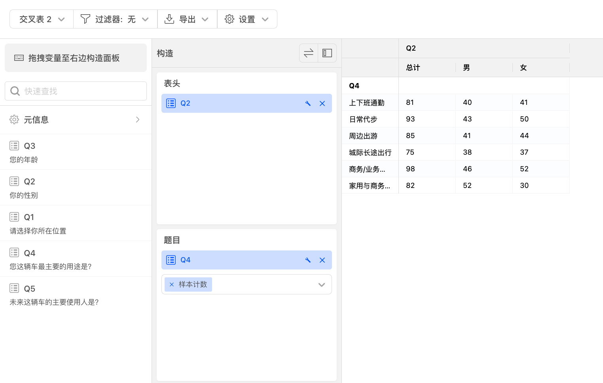
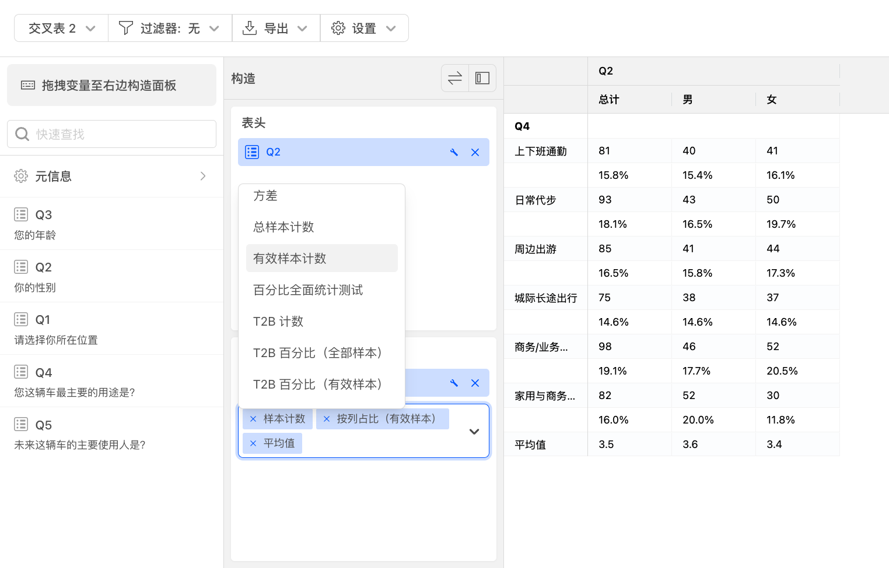
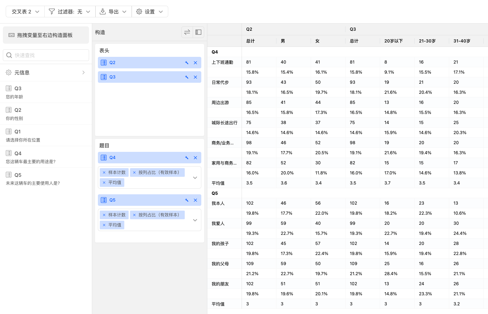
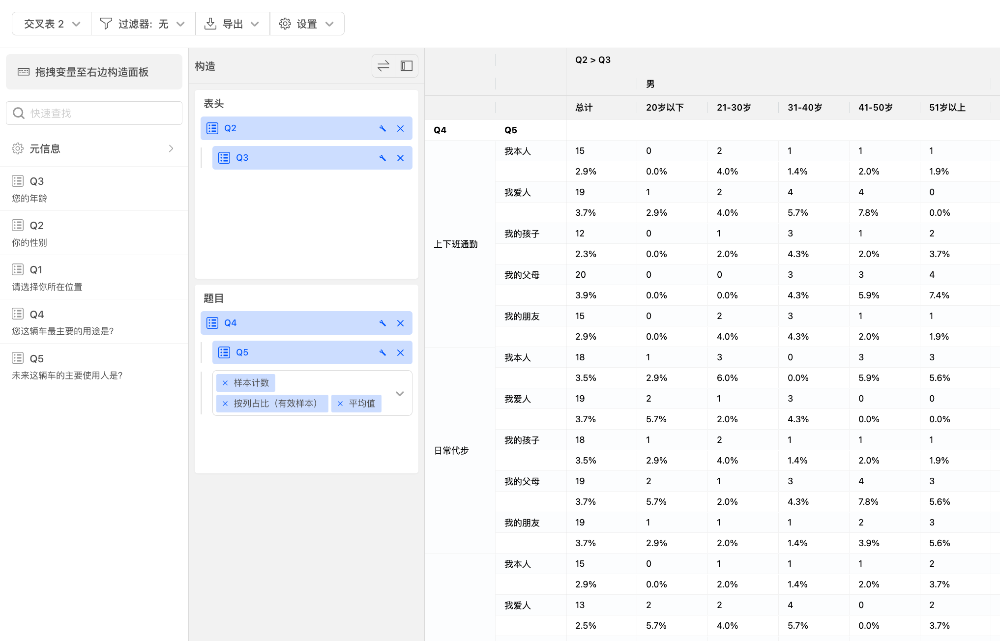
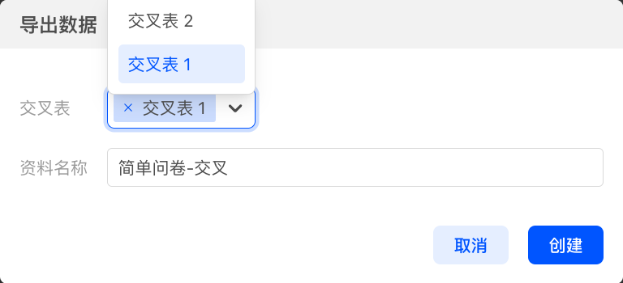

# 开始数据交叉

当问卷发布后，并且收集到了回复数据后，就可以进入数据交叉板块，对问卷数据进行交叉。默认情况下，系统不会自动为问卷题目生成交叉表。
接下来，我们就可以开始对数据生成交叉表，主要操作有：
+ 设定表头和题目
+ 选择统计指标

# 设定表头和题目

数据交叉页面主要分为左中右3个区域，默认情况下进入页面时没有任何交叉表，如下图所示：

左侧是当前问卷题目列表，问卷题目列表上方搜索框中输入内容，可以快速搜索符合的问卷题目。
在问卷题目列表中选择一道问卷题目，例如Q2，拖动到表头。
再从问卷题目列表中选择一道问卷题目，例如Q4，拖动到题目。
交叉指标默认为样本计数。

# 选择统计指标

选择多个指标，右侧表格会实时计算。

# 交叉表设定和操作

表头或题目可以放多道题目。

表头或题目内可以多题交叉。

# 导出交叉表

点击导出按钮，可以输出选择导出当前或者其他交叉表的Excel文件。

输出到Excel文件中的图表采用原生的Excel组件，可以在Excel软件中进行二次编辑调整。