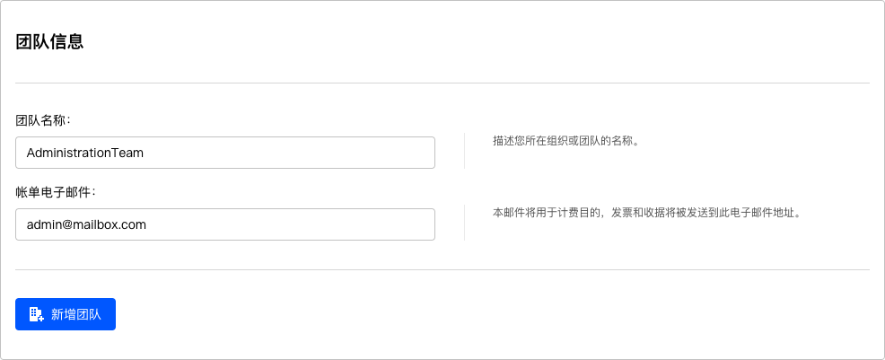
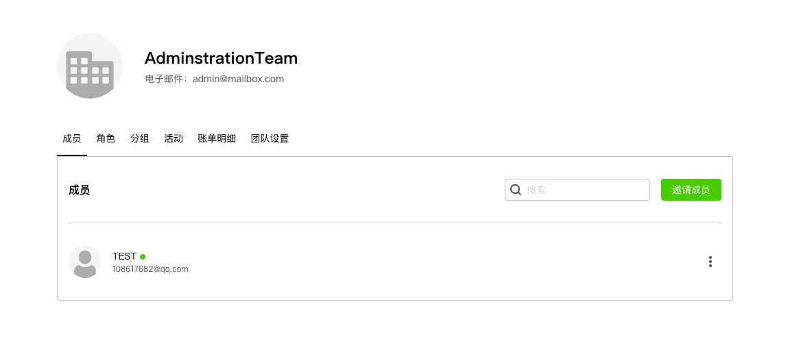

# 新增团队

在==用户中心==下拉菜单中点击==我的团队==进入团队列表页面，默认情况下，用户不属于任何团队。

用户可以创建自己的团队，创建团队需要以下信息：

+ 团队名称
+ 账单电子邮件，用于接受账单信息的邮箱。

点击右上角==新增团队==，输入以上信息后创建一个新的团队。

成功创建该团队后，当前用户账号自动获得团队的管理员权限。随后，系统将呈现==团队管理==页面，引导用户进行进一步设定。

