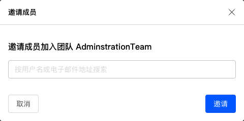
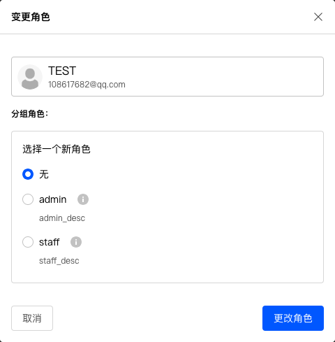
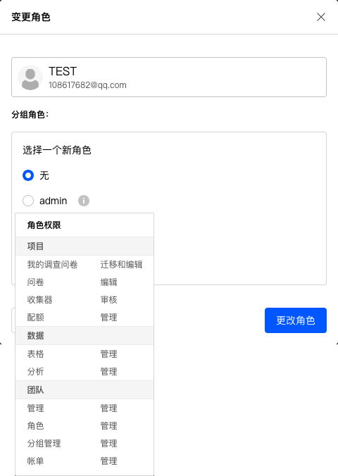
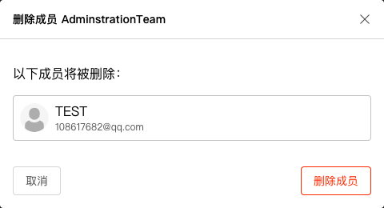

# 成员

对团队成员进行管理，可以邀请新成员加入团队，或者配置设定团队成员的角色。

## 邀请成员

点击邀请成员按钮，并输入对方邮箱地址，确认后将发送邀请该用户加入团队的邮件。

对方点击邮件中的确认邀请后，下次登录系统时就能访问团队所有的共享内容。

点击成员角色右边的下拉菜单，可以进行如下操作：

## 变更成员角色

弹出窗口中显示了该用户的角色，点选角色名称为该用户配置新的角色。

鼠标点击分组角色名称右侧图标，显示该角色的所有权限。

## 移除成员

从团队中删除该成员。删除后，该成员将无法访问团队中的共享内容。

> 必须拥有团队管理权限才能进行成员设置。
