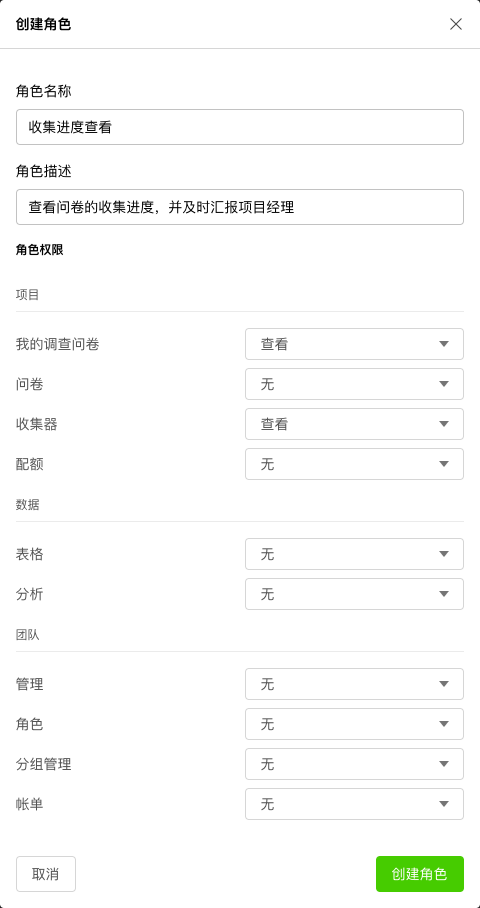

# 角色

一个角色可以获得多个不同权限，一个角色可以分配给多个不同成员，成员通过角色获得最终权限。

默认情况下，团队创建后会自动生成管理员和员工角色，并分配了默认权限。管理员可以结合自己需要，创建新的角色。

## 创建角色

点击创建角色，在对话框中设定角色名称和权限。权限分项目、数据和管理3个。

+ 项目权限

  | 项目 |可设定的权限|
  |:---:|:--------:|
  |我的调查问卷|迁移和编辑 / 迁移 / 查看|
  |问卷|迁移和编辑 / 编辑 / 无|
  |收集器|审核 / 发布和编辑 / 编辑 / 查看 / 无|

+ 团队权限

  | 项目 |可设定的权限|
  |:---:|:--------:|  
  |配额|管理 / 无|
  |表格|管理 / 无|
  |分析|管理 / 无|

+ 管理权限
  
  | 团队 |可设定的权限|
  |:---:|:--------:|
  |管理|管理 / 无|
  |角色|管理 / 无|
  |分组管理|管理 / 无|
  |账单|管理 / 无|

系统默认为每个组织创建了管理员和员工角色，结合实际业务需要，通过权限的不同组合，创建新的角色，赋予团队成员。

例如，希望设计一个可以查看问卷调研项目执行进度的角色，该角色可以查看所有问卷收集器的数据收集进度情况，但无法进行其他任何操作。此时，可以按如下步骤设定：

+ 创建一个名为“收集进度查看”的角色
+ 角色表述为“查看问卷的收集进度，并及时汇报项目经理”
+ 在我的调查问卷里设定查看权限，在收集器里设定查看权限
+ 点击创建角色生成新的成员角色

随后，在成员清单里把“收集进度查看”角色配置到指定成员后，该成员就被赋予该角色的所有权限。

> 每个成员只能属于一种角色。

## 更改角色权限

点击角色名称最右边按钮在弹出菜单中选择更改角色权限，在弹出对话框中进行设置并保存。

## 删除角色

点击角色名称最右边按钮在弹出菜单中选择删除，在弹出对话框中确认后删除该角色。

> 管理员和员工角色无法删除，他们是每个团队必须的最基础的角色。

> 必须拥有角色管理权限才能进行角色设置。
