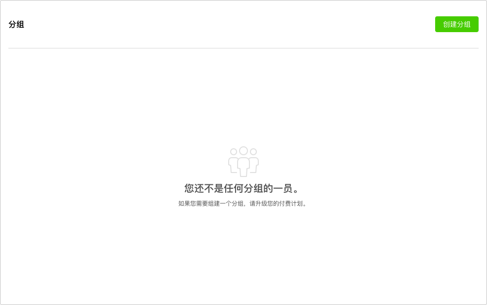
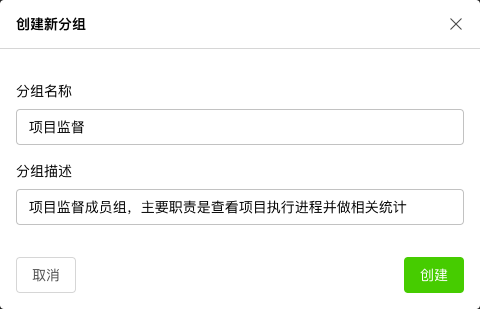

# 分组

分组用于对团队成员进行区分管理，当团队成员较多时，可以对成员进行分组管理。

分组仅用于规划团队成员结构，不能把权限分配给分组。可以把团队看做公司，而分组则相当于公司的部门。

## 创建分组

点击右上角==创建分组==按钮，并输入分组名称和描述信息后，在当前团队中创建一个分组。

创建完毕后，可以在团队的分组列表中看到所有分组信息。

## 分组设置

点击分组名称最右边按钮在弹出菜单中选择==分组设置==，在弹出对话框中进行设置并保存。

## 删除分组

点击分组名称最右边按钮在弹出菜单中选择==删除分组==，在弹出对话框中确认后删除当前分组。

## 添加分组成员

创建分组后，还需要为分组添加相关团队成员。点击分组名称右侧的==添加成员==按钮，弹出添加成员对话框。

在下拉列表中选中团队成员名称，随后指定该成员在分组中的权限。

完成添加后，可以看到分组名称后面已经包含了刚才加入的成员。

## 设置分组成员角色

点击成员角色头像，在下拉菜单中选择==更新角色==，随后在弹出对话框中为成员分配新的角色。成员在分组中的角色不同于该成员在团队中的角色，最终该成员将拥有其被设定的所有角色的权限。

同一个团队成员可以在团队、分组级别分别配置不同的角色，最终该成员的权限将是团队权限和分组权限的合集。

## 删除分组成员

点击成员角色头像，在下拉菜单中选择==从分组中移除==，在弹出对话框中确认从分组中删除该成员。

> 必须拥有分组管理权限才能进行分组设置。
