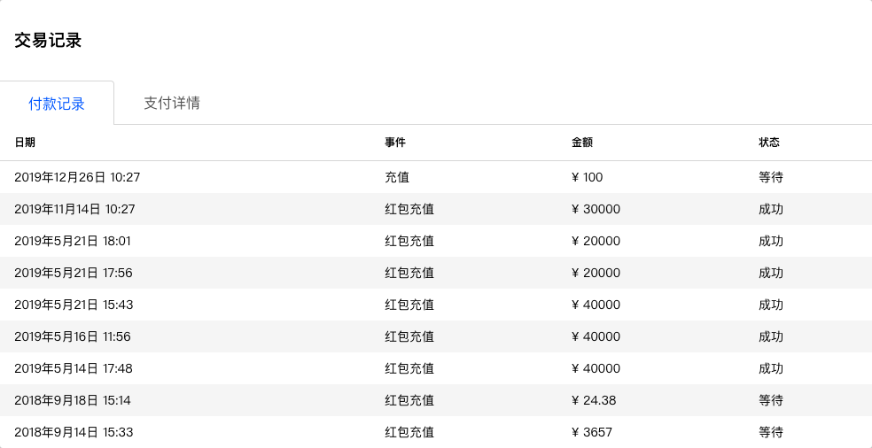
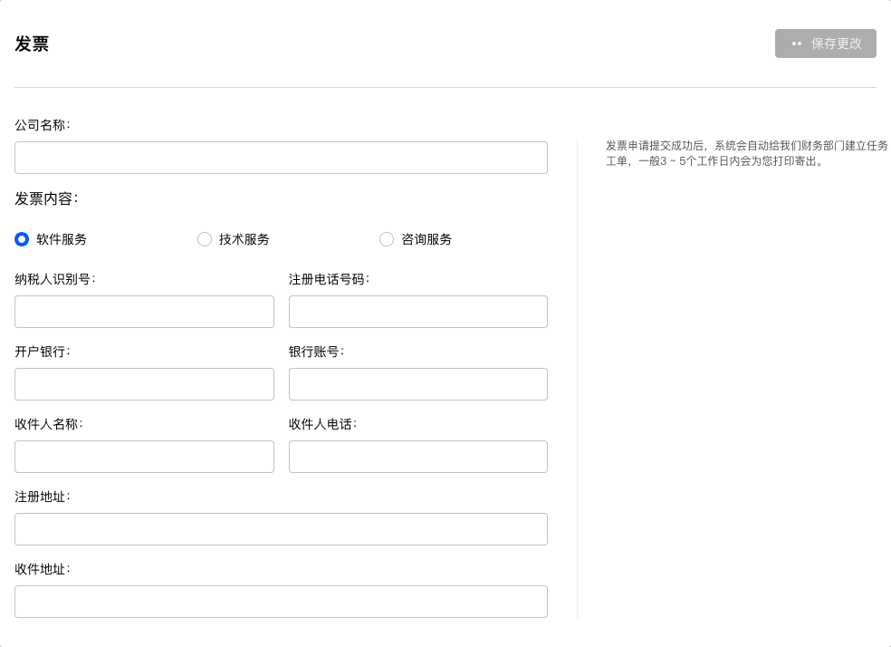

# 账单明细

账单明细统计了当前团队账户的资金余额、交易记录，并可设置发票信息。

## 财务

列有当前团队账户的==资金余额==和被锁定的==预估待结算金额==。

> 预估带结算金额是用户发布了带红包问卷后，为保证被访者能收到红包，系统按照问卷设定自动计算并预先锁定的金额，当问卷关闭收集器后，剩余资金会自动退回用户账号。

### 充值

点击==充值==按钮，目前支持==支付宝==、==微信==、==银行转账==方式打款充值。

## 交易记录

列有当前团队账户的付款记录和支付详情。

+ 付款记录：账户的充值记录。
+ 支付详情：问卷红包奖励的发放记录。

### 发票

填入并保存开票信息后，系统将按输入的内容开具发票。

