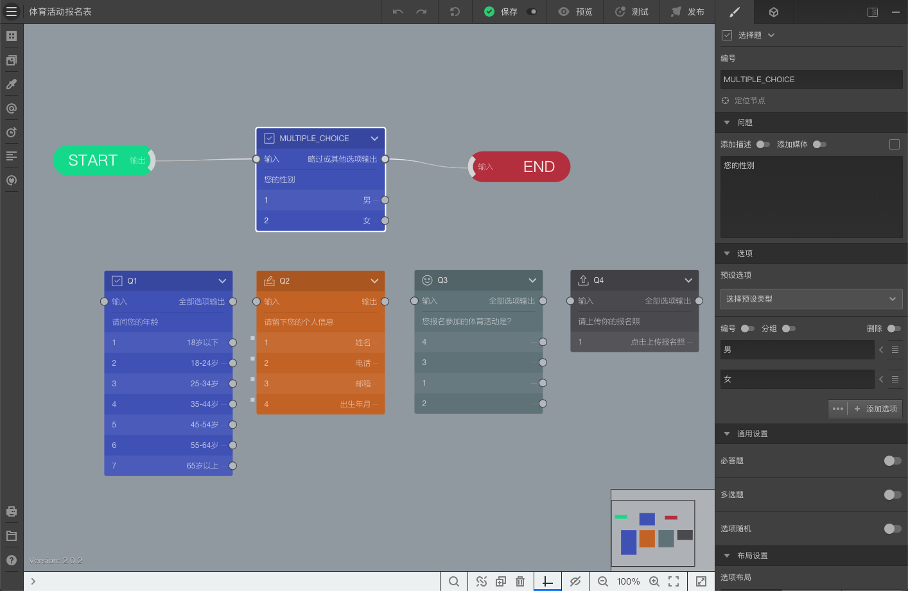
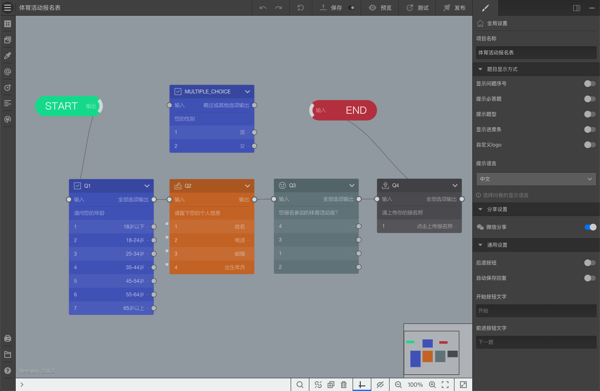

# Lesson1-创建报名表单

通过本案例，将学习到：

+ 设定预设选项；

+ 设定题目跳转；

+ 设定填空题的输入内容验证；

+ 设定图标题的图标；

+ 设定上传题；

+ 设定问卷单页显示；

+ 设定问卷开始按钮文字；

## 1. 创建空白问卷

进入==我的调查问卷==页面，点击==建立调查问卷==，创建空白调查项目，输入名称==体育活动报名表==，点击==建立调查问卷==，进入==问卷编辑器==。

## 2. 在问卷中添加题目并设置属性

### 设定问卷标题

选中画布中的==开始节点==，随后按如下设定：

+ 问卷标题：体育活动报名表
+ 问卷描述：请选择您报名参加的体育活动，并上传您的报名照片，我们会您进行报名登记。报名截止日期为本月15日。

### 添加题目1-年龄选择题

打开==节点==面板，点击==选择题==，随后按如下设定：

+ 编号：Q1
+ 问题：请问您的年龄
+ 预设选项：年龄

### 添加题目2-信息输入

在问卷中添加一道==填空题==，按如下设定：

+ 编号：Q2
+ 问题：请留下您的个人信息
+ 选项：
  + 姓名，点击选项右侧箭头，打开附加设置，并设置验证：限定输入10个文字以内；
  + 电话，设置验证：手机格式；
  + 邮箱，设置验证：邮件格式；
  + 出生年月，设置验证：日期；

### 添加题目3-体育活动选择

在问卷中添加一道==图标题==，按如下设定：

+ 编号：Q3
+ 问题：您报名参加的体育活动是？
+ 选项：羽毛球/篮球/乒乓球/棒球
+ 点击选项右侧的图标选择按钮，从图标库中选择选项的对应图标。

### 添加题目4-上传报名照

在问卷中添加一道==上传题==，按如下设定：

+ 编号：Q4
+ 问题：请上传你的报名照。
+ 选项：点击上传报名照

### 添加题目5-设置全局属性

点击画布空白区域，右侧编辑区设定问卷全局属性，按如下设定：

+ 题目显示方式：单页显示
+ 开始按钮文字：开始报名

现在，问卷效果应该如下图所示：

### 

### 连接题目

按如下步骤操作：

+ 新建问卷时，系统会自动创建一道选择题，编号为：MULTIPLE_CHOICE，在画布上选中这道题目，拖动输出端连线按并连接到Q1；

+ 依次连接Q2、Q3、Q4；

随后，点击==测试==，没有错误提示的话，至此活动报名表就完成了，点击==发布==按钮并快速发布问卷后，就可以开始收集数据了。

 最终的问卷效果如下图所示：

