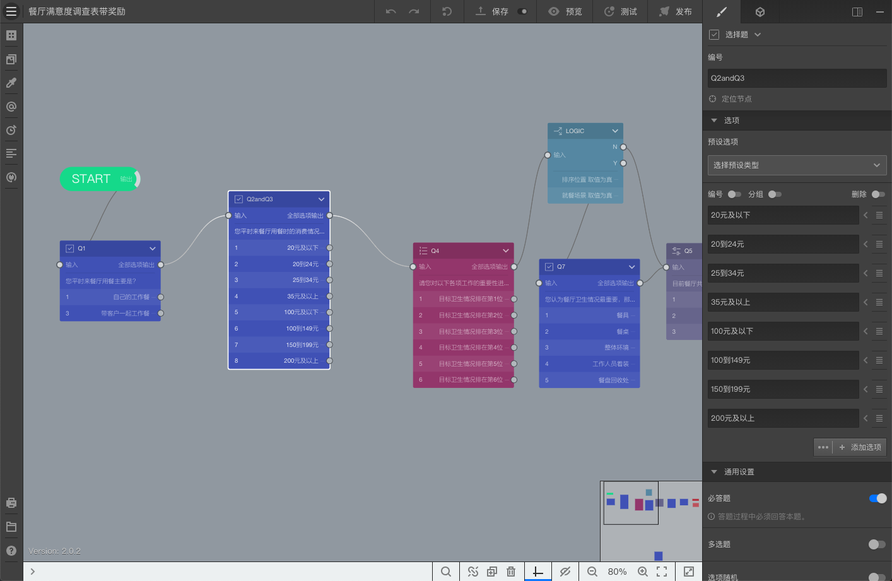
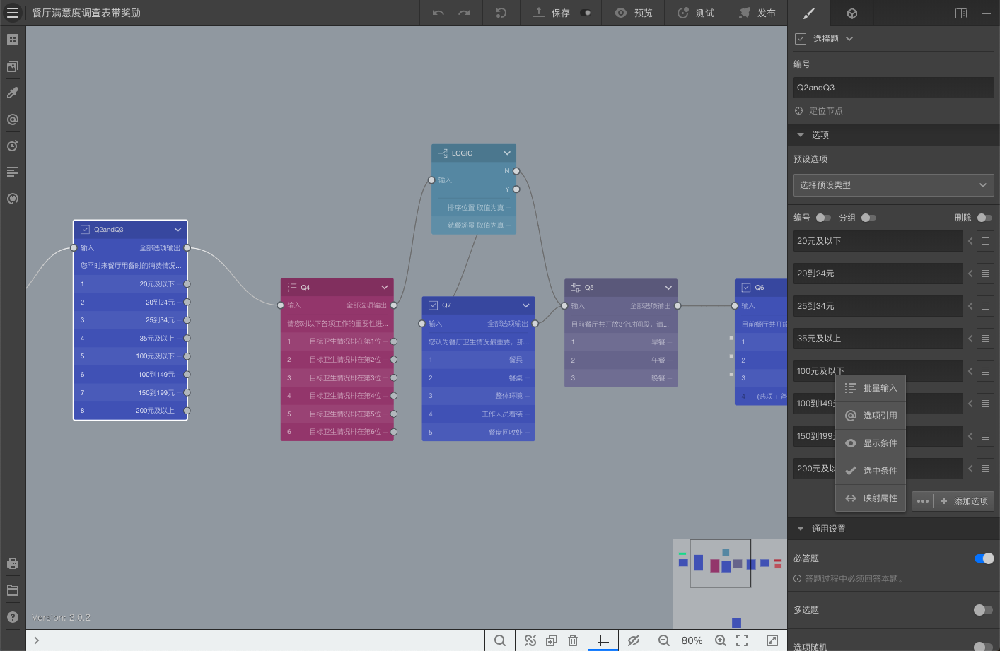
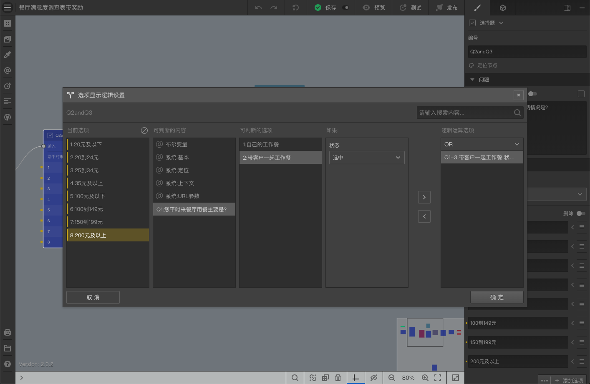
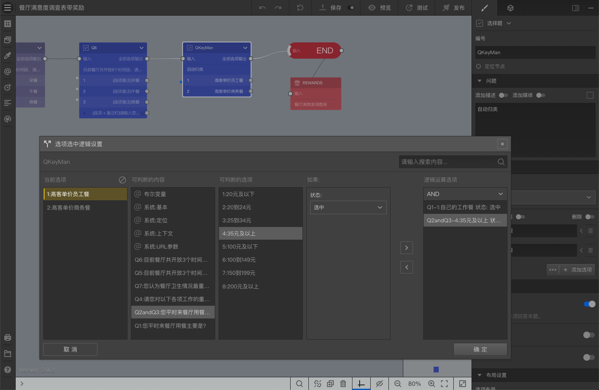
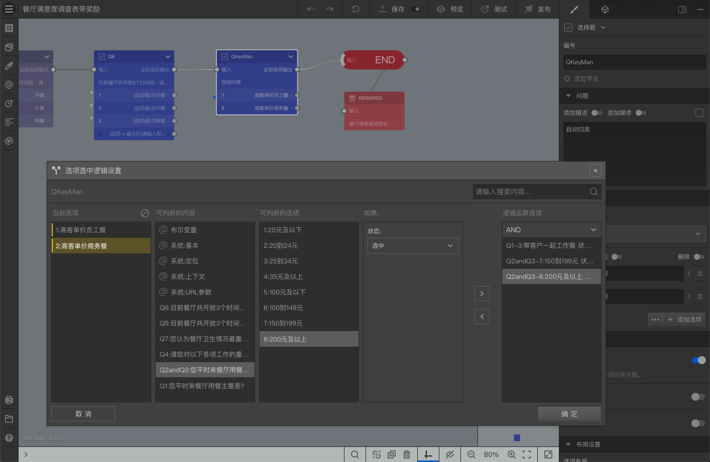

# Lesson6-使用高级设置实现按需显示和自动选中选项

通过本案例，将学习到：

+ 创建逻辑变量
+ 设定条件，过滤变量
+ 使用逻辑节点判断变量

## 1. 合并问卷题目

目前，问卷Q1选项==自己的工作餐==连接到Q2，Q1选项==带客户一起工作餐==连接到Q3，Q1和Q3的选项分别为：其实Q1和Q3

+ Q1：20元以下/20-24元/25-34元/35元及以上
+ Q3：100元以下/100-149元/150-199元/200元计以上

这2题都是关于价格的问题，现在分成2道题目，并通过连线决定不同的跳转。我们删除这2道题目，再增加一道==选择题==，按如下设定：

+ 编号：Q2andQ3
+ 问题：您平时来餐厅用餐时的消费情况是？
+ 选项：20元以下/20-24元/25-34元/35元及以上/100元以下/100-149元/150-199元/200元计以上

随后，把Q1连接到Q2andQ3，再连接到Q4。

如下图所示：

## 2. 设定显示条件

选择Q2andQ3，点击选项的==高级设置==，并选择==显示条件==，

按如下设定：

+ 当前选项：20元以下
+ 可判断的内容：Q1
+ 可判断的选项：自己的工作餐
+ 如果：状态：选中
+ 点击==>==箭头，将条件加到==逻辑运算选项==
+ 逻辑运算选项：运算操作符为AND

这些设置，代表==20元以下==这个选项，仅在Q1选中==自己的工作餐==时，才会显示。随后，依次设定各选项，注意有些选项要设置到Q1选中==带客户一起工作餐==时才显示。

如下图所示：

完整预览后，我们发现当Q1选中不同的选项时，Q2andQ3会动态显示不同的选项。达到简化问卷设计和简化问卷数据表格结构的目的。

## 3. 设定自动选中

某些时候，问卷若干条件的组合后可以得出一些结果，利用这些结果，能够提升被访者的体验。

在现在问卷的基础上，增加一道选择题，按如下设定：

+ 编号：QKeyMan
+ 问题：自动归类
+ 选项：高客单价员工餐/高客单价商务餐
+ Q6连接到QKeyMan，再从QKeyMan连接到结束节点

我们假设对于==自己的工作餐==且消费==35元以上==的，我们认为是==高客单价员工餐==；对于==带客户一起工作餐==且消费==高于150元==，我们认为是==高客单价商务餐==。这个关系其实不需要被访者再选择了，我们可以通过==自动选中==功能帮被访者自动选择。

选择QKeyMan，点击选项的==高级设置==，并选择==选中条件==，按如下设定：

+ 当前选项：高客单价员工餐
+ 可判断的内容：Q1
+ 可判断的选项：自己的工作餐
+ 如果：状态：选中
+ 点击==>==箭头，将条件加到==逻辑运算选项==
+ 可判断的内容：Q2andQ3
+ 可判断的选项：35元及以上
+ 如果：状态：选中
+ 点击==>==箭头，将条件加到==逻辑运算选项==
+ 逻辑运算选项：运算操作符为AND

如下图所示：

以上设定完成后，代表高客单价员工餐选项的选中条件设定为逻辑运算选项里2个条件同时为真时，触发自动选中。随后，再如下设定：

+ 当前选项：高客单价商务餐
+ 可判断的内容：Q1
+ 可判断的选项：带客户一起工作餐
+ 如果：状态：选中
+ 点击==>==箭头，将条件加到==逻辑运算选项==
+ 可判断的内容：Q2andQ3
+ 可判断的选项：150-199元
+ 如果：状态：选中
+ 点击==>==箭头，将条件加到==逻辑运算选项==
+ 可判断的内容：Q2andQ3
+ 可判断的选项：200元计以上
+ 如果：状态：选中
+ 点击==>==箭头，将条件加到==逻辑运算选项==
+ 逻辑运算选项：运算操作符为AND

如下图所示：

以上设定完成后，代表高客单价商务餐选项的选中条件设定为逻辑运算选项里3个条件同时为真时，触发自动选中。

完整预览后，我们发现按我们预想的选择后，进入QKeyMan时，对应选项已经自动勾选了。

  ## 4. 开启替身节点隐藏题目并保留自动选中
按上面的步骤完成设定后，我们看到虽然QKeyMan会自动选中，但是被访者在QKeyMan题中依然可以更改选择项。如果我们不希望让被访者看到这道题目，从而无法更改选择项，只需要在QKeyMan的==设置==里开启==替身节点==功能，把这个节点设定为==替身节点==后，这道题目就不会展示给被访者了。