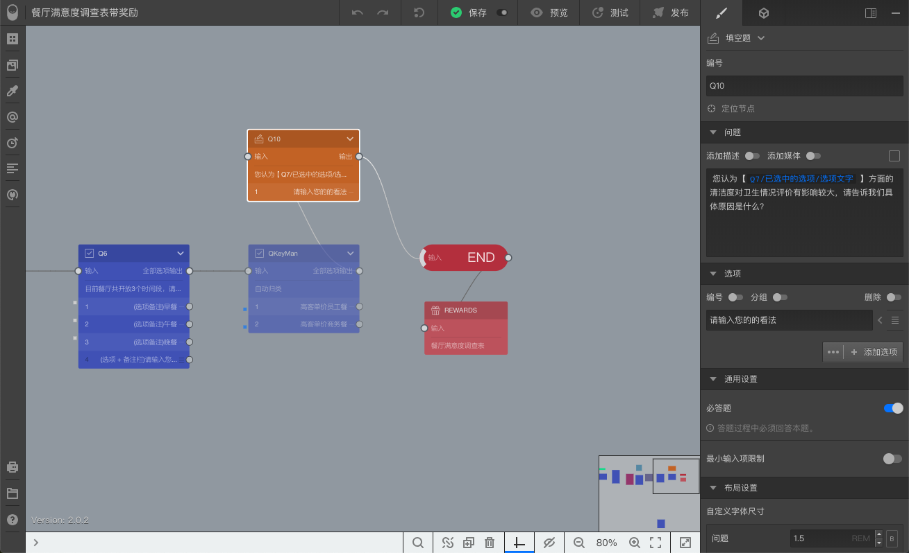
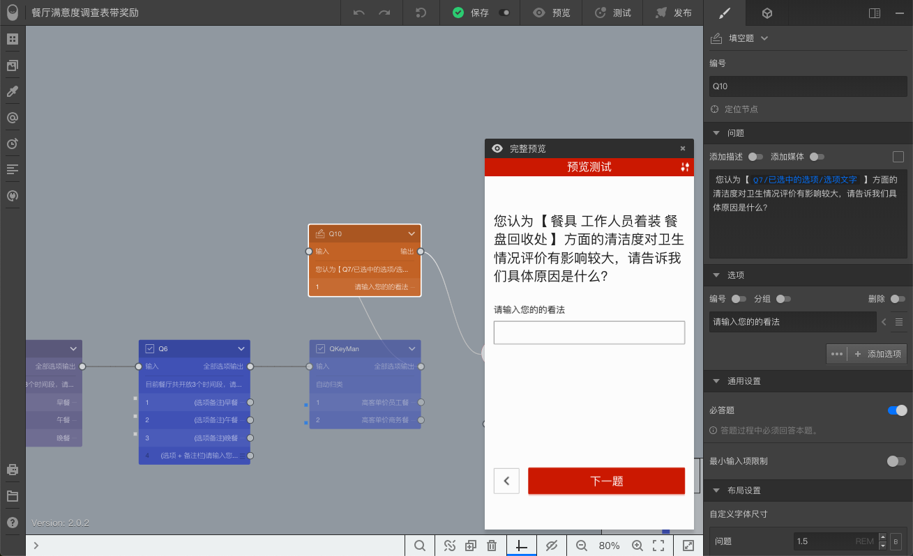

# Lesson7-在问卷题目内容中使用变量

通过本案例，将学习到：

+ 设定多选题的可选限制；

+ 在题目内容中使用变量；

## 1. 设定多选题的可选限制

### 题目7-设定多选题的可选限制

选中问卷的==选择题==Q7，开启Q7的==多选题==选项时，默认设定最多可选数量为2，现在调整为4；

## 2. 在题目内容中使用变量

在问卷中添加一道==填空题==，插入到==QkeyMan==和==结束节点==之间，按如下设定：

+ 编号：Q10
+ 问题： 您认为【 】方面的清洁度对卫生情况评价有影响较大，请告诉我们具体原因是什么？
+ 选项：请输入您的的看法

随后，在中括号间点击鼠标，随后输入==@==，按==Q7->已选中选项->选项文字==设定变量内容。

效果如下图所示：

此时，问卷题目的内容是动态的，当被访者在Q7完成选择后，他的选择内容会自动插入到Q10的题目文字当中。

最终效果如下图所示：

完整预览时，我们在Q7选择了餐具、工作人员着装、餐盘回收处，这些内容被自动插入到Q10中，进行进一步地提问。