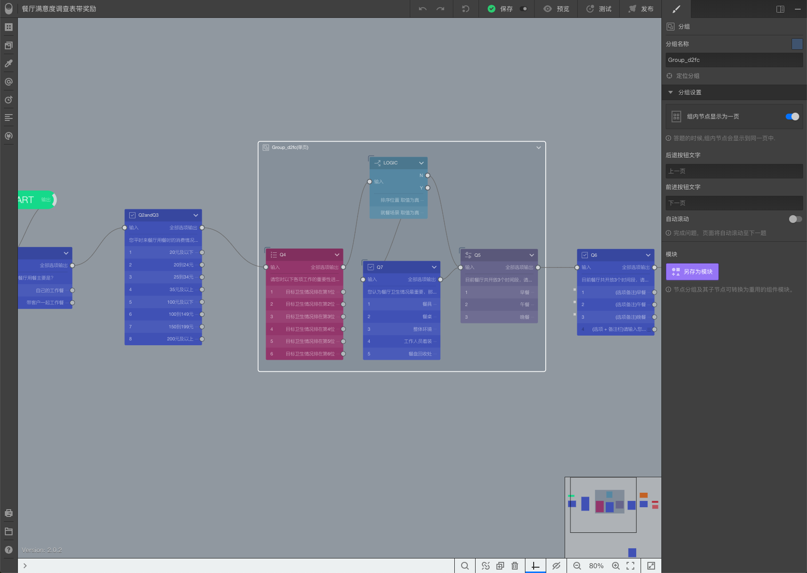
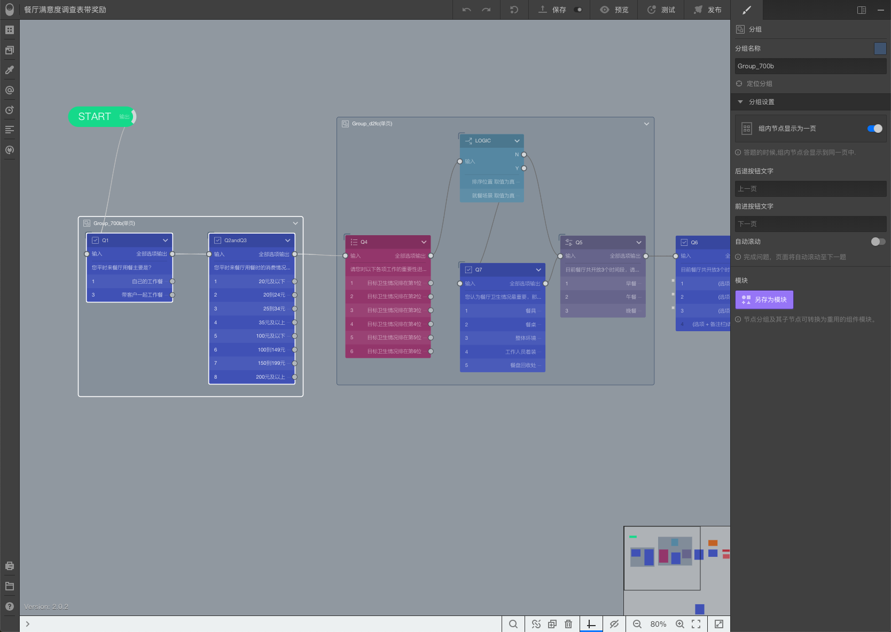
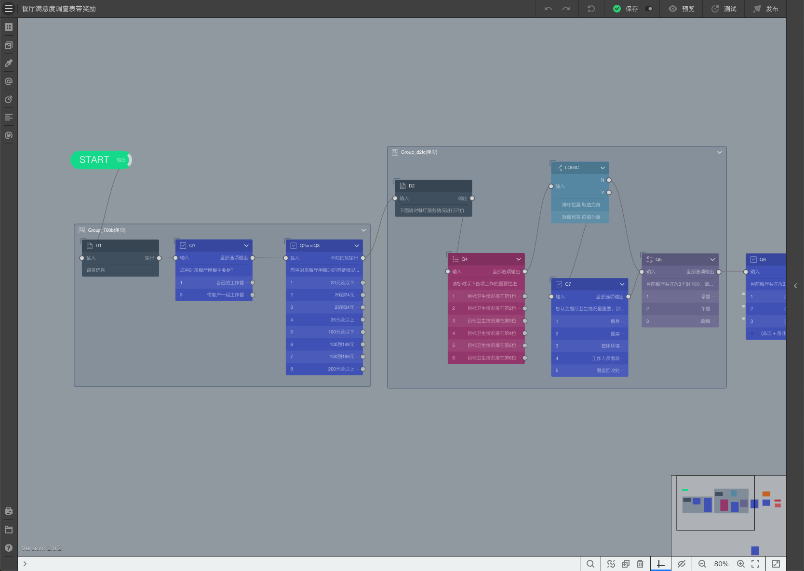

# Lesson8-单页显示问卷题目

通过本案例，将学习到：

+ 创建组合；
+ 设定单页显示；
+ 在组合中增减题目；

有时，问卷内容会分成几个部分，每个部分间题目关联比较强，这些关联性强的题目在同一页内显示会带来更好的体验。系统支持对题目进行分组，并且同一个分组里的题目可以设定为在同一页内显示。

## 1. 创建题目组合

### 选择同一个组合内的题目

打开之前的餐厅满意度调查表。

先选中Q4，然后按下==Ctrl==的同时依次选中选中LOGIC、Q7和Q6，这4个节点处于被选中状态下。

### 创建组合

按下快捷键==Ctrl G==，4个节点的外围会被一个半透明矩形包裹，代表他们是一个组合。

如下图所示：

> 在Mac系统快捷键为：⌘ G

## 2. 设定单页显示组合

选择组合，然后开启==组内节点显示为一页==。

完整预览后，可以看到问卷开始几道题目都是一题一页，到了Q4时，会自动变成Q4和Q5这2道题目，这是因为Q7需要在逻辑条件为真时才会显示。当我们按逻辑选择后，Q7会自动插入单页内的正确位置。

## 3. 增加更多单页

选择Q1和Q2andQ3，并把他们进行组合。如下图所示；

选择组合，然后开启==组内节点显示为一页==。

完整预览后，可以看到问卷开始2道题目更新为在同一页内显示，由于Q1和Q2andQ3不存在逻辑跳转和判断，因此都显示出来了，到了Q4时，会自动变成Q4和Q5这2道题目，这是因为Q7需要在逻辑条件为真时才会显示。当我们按逻辑选择后，Q7会自动插入单页内的正确位置。

## 4. 在组合中加入更多题目

创建组合后，组合内的题目和连线会被特殊处理，必须按下==Alt==键的同时将组外题目放到组合矩形外框内，实现在组合中加入更多题目。

>  按下==Alt==键的同时将组内题目放到组合矩形外框外，实现从组合中移出题目。

### 在组合内增加描述

在问卷上创建一个描述节点，按下==Alt==键的同时移动到Q1所在组合，按如下设定：

+ 编号；D1
+ 问题：背景信息

将==开始节点==连到D1，再将D1连到Q1。

随后，再创建一个描述节点，按下==Alt==键的同时移动到Q4所在组合，按如下设定：

+ 编号；D2
+ 问题：下面请对餐厅服务情况进行评价

随后，将Q2andQ3连到D2，再将D2连到Q4。如下图所示；

完整预览后，可以看到组合的最上方都会有一段说明文字，用于说明本页题目的背景。