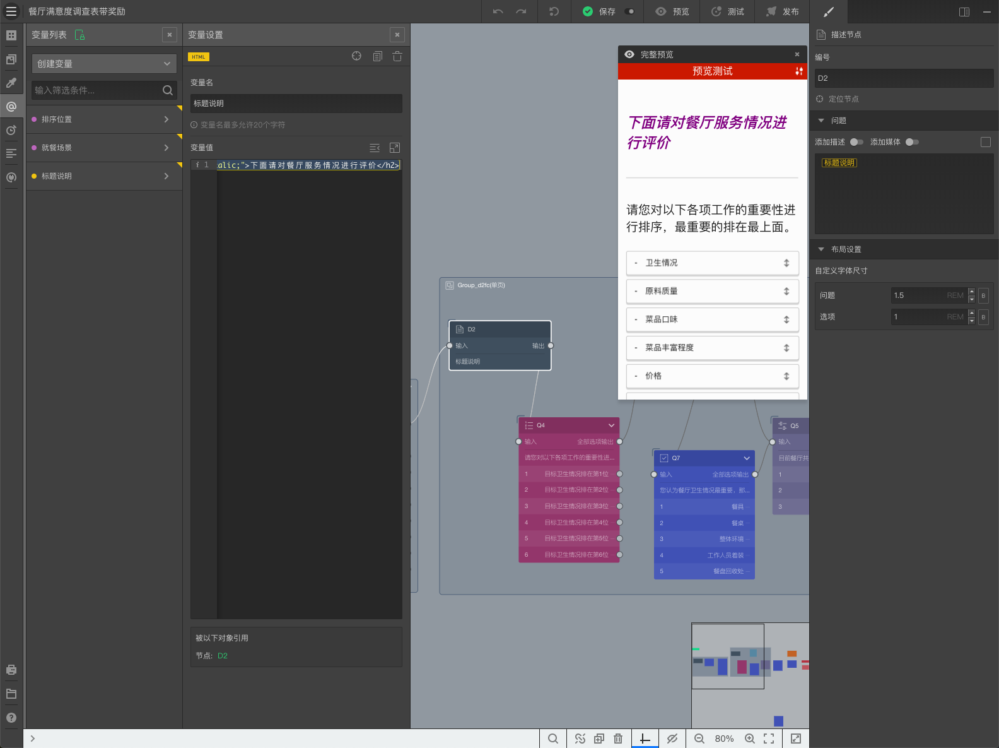

# Lesson9-使用HTML变量调整文字

通过本案例，将学习到：

+ 创建HTML变量；

+ 使用HTML变量调整文字；

## 1. 创建HTML变量

延续Lesson8的问卷，创建一个HTML变量，按如下设定：

+ 变量名：标题说明
+ 变量值：输入以下代码，效果是显示一段紫色、斜体文字，文字内容是“下面请对餐厅服务情况进行评价”。

`<h2 style="color:purple;font-style:italic;">下面请对餐厅服务情况进行评价</h2>`

## 2. 使用HTML变量调整文字

选择D2，删除D2的问题文字内容。随后输入==@==，按==HTML->标题说明==设定问题文字内容。

设定完后，我们看到D2的问题文字变成了个性化的指定样式。

