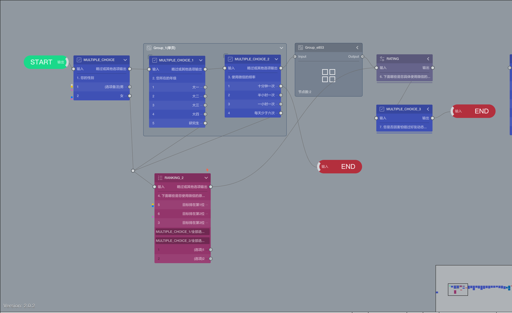

# 问卷编辑器画布区

画布区是问卷编辑器的主区域，在这里展示整个问卷流程，配合工具栏支撑起各种问卷编辑操作。画布中主要显示问卷的题目节点、跳转连线、题目组合等问卷核心部分，问卷核心编辑操作均在画布区完成。

> 使用分辨率高的显示器，会让画布有更多的显示空间，设计问卷时更方便。

问卷内容较多时画布中只能看到问卷的一部分，拖拽画布空白区域可以查看问卷的其他部分，也可以直接点击或拖拽画布区右下角的鹰眼缩略图上的线框，快速跳到问卷的其他部分。鹰眼区域用于展示整份问卷的缩略图，鹰眼里面的小方框代表当前画布所看到的区域，从鹰眼可以看到整份问卷的内容和当前画布在整份问卷中所处的位置。

## 基本概念

## 节点
节点是问卷的最基本构成元素，分为题目节点和工具节点。题目节点是一道问卷题目，工具节点是问卷的一个功能。从开始节点到结束节点，问卷流程动线遇到一个节点时，要么显示一道题目，要么完成一个功能，通过观察画布上的节点和它们之间的连线，问卷的基本架构依旧一目了然了。在我们的文档中，`题目`和`节点`一般代表相同的意思。

节点在画布上表现为各种颜色的小方块，每种颜色代表一种题型或功能。

一份问卷只能有一个开始节点，但可以有多个结束节点。

上图展示了部分节点，全部节点可参见[节点类型](../nodes/concept.md)中详细介绍

## 节点内容
节点方块中，最上面是节点图标、节点名称、和节点收展按钮。然后下面是节点输入口和快捷输出口，再下面是题目内容文字，再下面是选项列表。选项列表的左边数字是该选项的编号，右侧文字是该选项的名称。有时，每个选项的最右侧还会显示选项的输出口，可以为每个选项设定不同的输出。

> 上图中，`RANKING_2`节点包含[引用选项](../opt-reference/concept.md)和[其他选项](../node-setting/other-option.md)，他们和普通选项的展示方式不一样。

> `RANKING_2`节点的右上角外显示了红色闪电标记，代表这个节点的设置存在错误，把鼠标放到闪电上会出现红色的错误提示文字，就能知道哪里设置不对了。带有红色闪电的问卷意味着存在错误，所以无法发布。

## 节点收起与展开
点击节点左上角的小箭头可以收起或展开节点，当选项较多且不想经常看到选项时，观察上图中已收起节点和未收起节点，可以看到收起的节点会更使画布更简洁。
> 观察上图中已收起节点组和未收起节点组的区别。

## 输入口和输出口
节点上显示的小圆圈是该节点端口，端口分为输入口和输出口，它们各有不同的特性：
+ 输入口：
    + 只能作为连线的终点
    + 一个节点的输入口可以作为多条连线的终点
    + 一个节点只有一个输入口
    + 显示在节点左上方
+ 输出口：
    + 只能作为连线的起点
    + 一个节点的输出口只能作为一条连线的起点，也就是说从输出口只能往外连一条线
    + 一个节点可以有多个输出口
    + 显示在节点右侧

除了开始和结束节点，其他所有节点的输入口和输出口都必须有连线。

> 开始节点、结束节点、甄别节点的端口的表现为半弧形

## 快捷输出口
节点右侧的端口都是输出口，但是在右上方有一个特殊的快捷输出口，快捷输出口是输出口的特殊形式，有以下2种状态：
全部选项输出：无论如何选择，都会从此输出口输出；
其他选项输出：除了已经连线的选项输出口外，剩余的所有选项都会从此输出口输出；

快捷输出口主要用于提高工作效率，这样就不必为每个选项设置大量相同的输出了。

## 连线
连线代表问卷的进行流程动线，拖动一个节点的输出口，可以拉出一条弹性连线，把它连接到另外一个节点的输入口，连线会连接这2个节点，这样就形成了一个流程，代表两个节点构成了一个前后关联的关系。这个关系在答题的时候就体现为，答完一道题后按连线走到下一题。

问卷题目常常会包含各种选项，每个选项也有自己独立的输出口，从选项输出口连线到另一个节点，代表被访者在这道题中选中该选项时，则会跳到该选项的输出口连接的那个节点。

如上方图中，对于`MULTIPLE_CHOICE_1`而言，当被访者者选中了`研究生`时，下一题会是`RANKING_2`,否则下一题会是`MULTIPLE_CHOICE_2`

> 对于多选题或者非选择题的输出口设置略有不同，可参见[逻辑设置](../logic/concept.md)

## 中转点
在连线比较复杂的情况下，可以添加中转点来让连线的归集更加整洁。中转点既可以是输出口又可以是输入口。同样，可以接受多个输入，只能有一个输出。
> 上图中，`RANKING_2`前面就添加了一个中转点，起到连归集的作用，

## 节点组合
对节点可以进行组合，组合后节点组也可以展开和收缩，收缩后的节点组会收缩成一个小方块，组合内的节点都会藏起来。
> 参照[组合与模块](../groups/concept.md)了解更多组的信息。

## 快捷操作
各种操作参见[快捷键与操作技巧](../shortcut/concept.md)，当你基本了解这些操作后，再继续阅读下面的内容。

