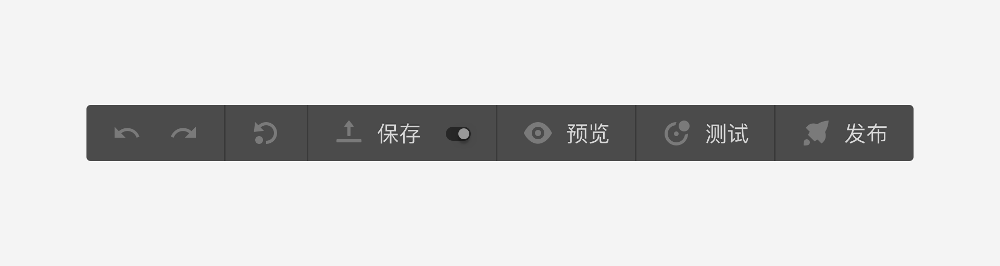
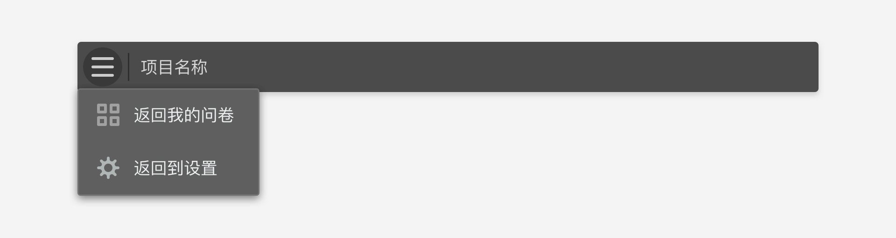

```index
3
```
```tag

```
```summary

```

# 问卷发布工具栏

`问卷发布工具栏`主要用于问卷保存、预览、测试和快速发布，同时集成了撤销和重做功能。


上图从左到右各按钮分别为：

## 撤销
撤销之前的操作（Undo）。

## 重做
重做之前的操作（Redo）。

## 保存版本
鼠标覆盖后弹出版本操作弹框，详情参见[问卷版本](../advance-topic/version.md)。

## 保存
保存问卷。

## 自动保存
开启/或关闭`自动保存`功能，开启后每隔三分钟会自动保存问卷。

## 预览
点击后打开预览弹框，详情参见[预览](../preview/concept.md)。

## 测试
点击后打开问卷测试弹框，详情参见[测试](../advance-topic/debug.md)。

## 发布
鼠标覆盖后弹出快速发布弹框，详情参见[快速发布](../advance-topic/quick-publish.md)。

## 返回
点击问卷发布工具栏最左边的巧思LOGO弹出返回选择列表，可选择返回到`我的问卷页面`或者跳转到`问卷设置页面`。



> 如果点击的同时按住`Alt`键，则会新窗打开目标页面，否则会在当前标签中打开目标页面。

> 以上操作大部分都能通过快捷键实现，如果你喜欢使用快捷键，参见[快捷键及操作技巧](../operation/concept.md)。

