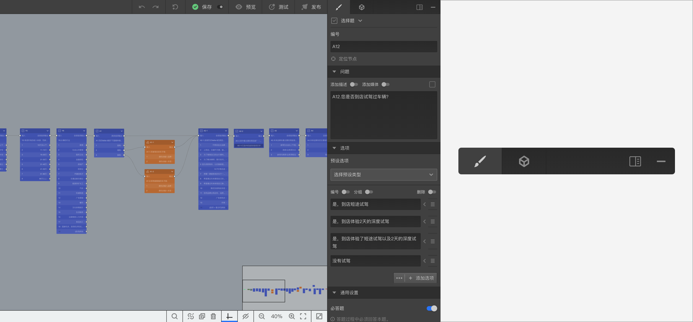
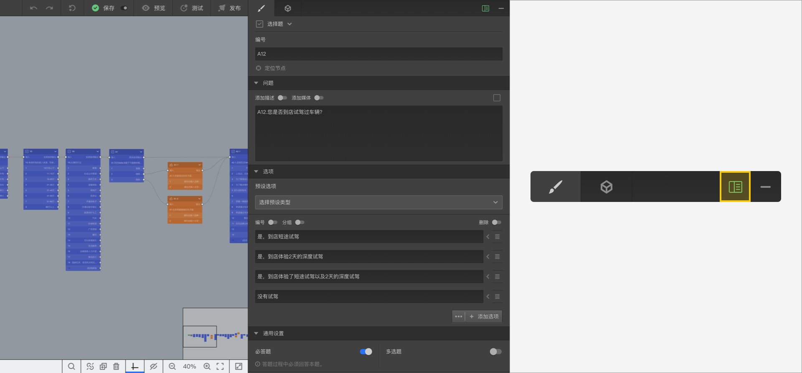
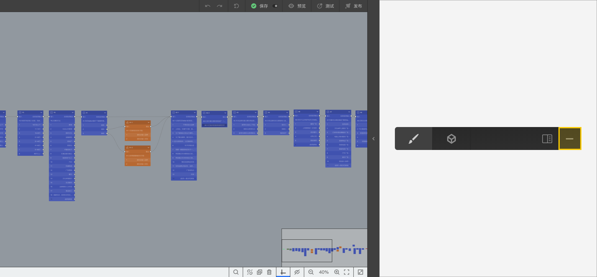

```index
6
```
```tag

```
```summary

```
# 属性编辑栏

`属性编辑栏`位于问卷编辑器界面右侧，用于显示、编辑问卷的内容和属性。属性编辑栏分为2块面板，分别为`编辑`和`设置`。



使用时，根据不同选择对象，属性编辑面板显示内容也会动态变化：
+ 当选中一个节点时：显示该节点的属性设置内容，不同节点展示的内容会有些差异，完整设置参见[节点设置](../node-setting/concept.md)文档。

+ 当画没有选中任何节点时：显示全局属性设置内容，可以更改问卷的全局设置，具体参见[全局设置](./global-setting.md)。

+ 当选中了一个节点组时：显示该组的属性设置内容，具体参见[节点组与模块](../groups/concept.md)。

属性编辑栏最右侧按钮用于控制属性编辑栏的大小。


也可以隐藏属性编辑栏，使画布占据更大的显示面积。



