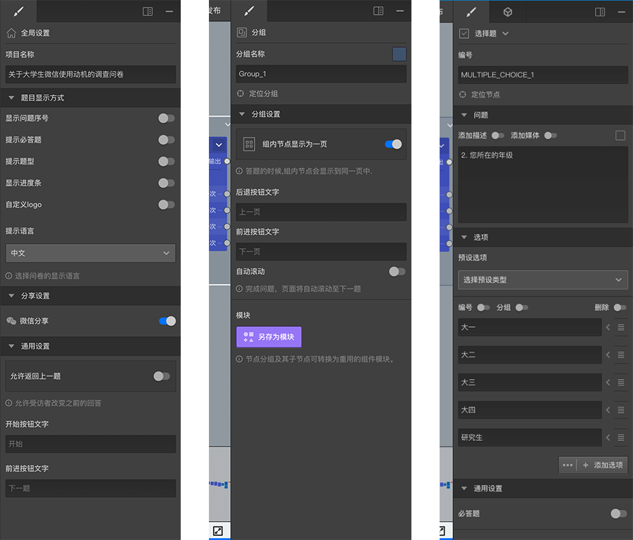

```index
6
```
```tag

```
```summary

```
# 属性编辑栏

属性编辑栏位于界面右侧，用于显示、编辑问卷内容和属性，不同的场合下会展示不同的可编辑内容。总体上来说包含顶部的tab栏和属性编辑面板，点击tab栏按钮可以切换显示不同的属性编辑面板。



+ 当选中一个节点时：属性编辑栏中会显示该节点的设置内容，不同类型的节点这边展示的内容会有些差异，完整的设置参见[节点设置](../node-setting/concept.md)文档。

+ 当画没有选中任何节点时：编辑栏中会显示全局设置内容，可以对问卷的一些全局设置进行更改，具体参照[全局设置](./global-setting.md)。

+ 当选中了一个节点组时：编辑栏中会显示该组的设置内容，具体参照[节点组与模块](../groups/concept.md)。

属性编辑栏最右侧按钮用于控制属性编辑栏的大小，也可以隐藏属性编辑栏，使问卷编辑画布区占据更大的显示面积。


