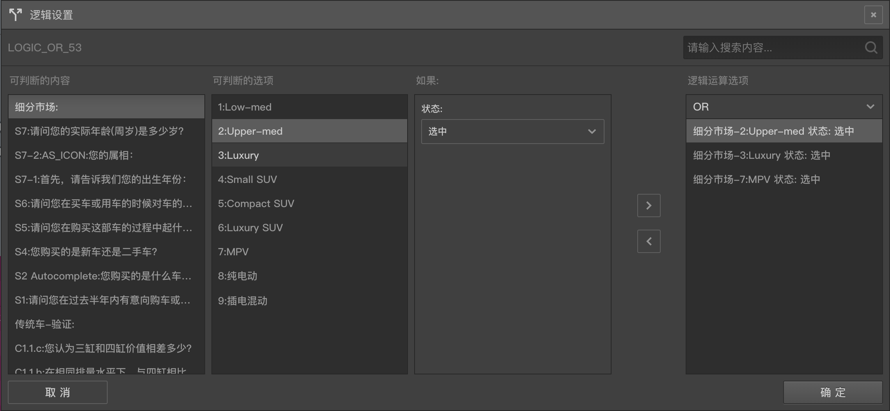

# 逻辑编辑器

使用逻辑编辑器用于编辑问卷逻辑运算条件，每个逻辑运算条件可以运算出一个`真`或者`假`的结果，在问卷回复过程中，程序会根据运算结果决定后续不同的行为，达到控制问卷逻辑的功能。

多个逻辑运算条件间可以通过`逻辑与(AND)`和`逻辑或(OR)`的组合运算来决定最后的运算结果。当使用`逻辑与`时，所有条件都为`真`，总结果才为`真`，当使用`逻辑或`时，只要有任意条件的结果为`真`，总结果就为`真`。

以下几个功能中会用到逻辑运算，在各自的功能区打开逻辑编辑器后完成逻辑编辑操作。
+ 针对节点：[逻辑节点](../nodes/logic.md)
+ 针对节点：自定义验证中的[内置逻辑验证](../node-setting/custom-validation.md#内置逻辑验证)
+ 针对选项：[选项显示控制](./opt-display.md)
+ 针对选项：[选项选中控制](./opt-auto-select.md)

下面分别对`针对节点`和`针对选项`两种情况来说明逻辑编辑器的使用，首先我们定义下`目标节点`，当从某个节点的属性编辑设置中打开逻辑编辑器，我们就把这个节点称为逻辑编辑器的`目标节点`，设定的逻辑关系将影响该`目标节点`。

## 针对节点
针对节点的逻辑控制编辑器如下图：

逻辑控编辑器包含4列：

1. `可判断的内容`列:表示顶级内容，顶级内容的来源可以是节点、变量，这里会列出所有针对`目标节点`可用的节点和变量类型组(包括系统内置变量组与按变量类型分的字符串，数值，布尔等自定义变量组)，点击某一项顶级内容后会在第二列中展示该项所包含的二级内容。

2. `可判断的选项`列:表示二级内容，在第一列`可判断的内容`中选中选项的二级内容。
  + 如果在顶级内容中选中的是节点，则这里会展示该节点下面的选项。选中该列中的某一项后，会触发第三列中显示条件控制规则。
  + 如果在顶级内容中选中的是变量，则这里会显示具体的变量，这些变量可能是系统内置变量或是在[变量面板](../layout/toolbar.md#自定义变量)中添加的变量。

3. ：`如果：`列:如果列用于添加逻辑判断计算的规则，会对`可判断的选项`施加计算规则。根据内容的性质不同，可用的计算规则也有所不同，具体如下：
  + 如果`可判断的选项`是选择类型题目的选项：则会出现一个包含`选中`和`未选中`的下拉列表。假设使用`选中`，则代表这个选择题的选项被选中时，这个逻辑条件的结果就为真，否则为假。
  + 如果`可判断的选项`是布尔变量或接口请求变量：会显示一个`结果为真`的条件，且无法更改，代表如果选中的布尔变量或接口请求变量计算结果为真，则这个逻辑条件的结果也为真，否则为假。
  + 如果`可判断的选项`是其他类型：会出现一个复杂`逻辑判断规则`，可以判断目标的`输入值`，`分值`，`排序号`，`取值`等是否满足指定的`逻辑判断规则`，如果满足，则这个逻辑条件结果为真，否则为假。
    > 详情参见[逻辑判断规则](./opr-rule.md)

第四列是已添加的`逻辑条件列表`，第三列和第四列中间有两个按钮：`左移按钮`和`右移按钮`，前三列都已经准备好后，点击`右移按钮`把左边已选好的`条件组合`添加到右边的`逻辑条件列表`成为一条`逻辑条件`。点击逻辑条件列表上方的下拉列表可以选择`AND`或`OR`，设定逻辑条件间的运算规则。可以添加多个逻辑条件，多个逻辑条件会根据`逻辑与(AND)`或`逻辑或(OR)`的运算来得出最后的运算结果。

> 当需要组合运用`逻辑与(AND)`或`逻辑或(OR)`运算时，需要通过多个逻辑设定来完成，每个逻辑设定内只能使用一种逻辑运算操作，要么`逻辑与(AND)`，要么`逻辑或(OR)`。通过组合，可以得出需要的复杂逻辑。

在`逻辑条件列表`中选中一条逻辑条件，再点击`左移按钮`可移除已选中的`逻辑条件`项。设置完成后点击确定按钮就能将这些逻辑控制应用到`目标节点`。点击取消按钮或直接关闭窗口会放弃之前的编辑内容。

对于逻辑节点，应用后的条件列表会在其右侧编辑栏的逻辑设置中罗列出来。回答问卷时，当逻辑运算结果真，会走逻辑节点的`Y`输出口，否则会走`N`输出口。

对于题目的自定义验证，应用后的条件列表会在其右侧编辑栏的自定义验证中的内置逻辑验证区域罗列出来，当答题时，如果逻辑运算结果为`真`，该题的自定义验证就会通过，否则不会通过。

> 上图中，要求题目`细分市场`下的三个选项`Upper-med`、`Luxury`、`MPV`中的任意一个选项选中（使用了`OR`），逻辑运算结果就会为真，否则为假。

## 针对选项
针对选项的逻辑编辑器如下图：

`针对选项`的逻辑编辑器会比`针对节点`的的逻辑编辑器左边多出一个选项列表栏，点中列表中的选项后，可以分别每个选项添加逻辑条件。

设置过逻辑条件的选项会变成黄色背景，选中多个选项，点击选项列表上面的清除按钮可以批量清除这些选项上的逻辑条件。

针对选项的逻辑编辑还有一个快速匹配的功能，在`可判断的内容`栏中选中一个题目，该题目的的选项会在`可判断的选项`栏中罗列出来，如果这个题目的选项数量和`目标节点`的选项数量一样多，则`可判断的选项`栏头部会出现一个快速匹配的按钮，会将选中题目的选项一一对应分配给`目标节点`的选项当逻辑条件。

逻辑判断结果应用到选项：
逻辑判断结果可直接应用到选项上：
+ 选项的选中控制：如果该选项逻辑条件计算结果为真，则这个选项在答题页中会自动被选中，否则不会被自动选中。
+ 选项的显示控制：如果该选项逻辑条件计算结果为真，则这个选项会被显示出来，否则该选项会被隐藏。
  > 对于没有设置过控制规则的选项，不会被自动选中，也不会被隐藏。

