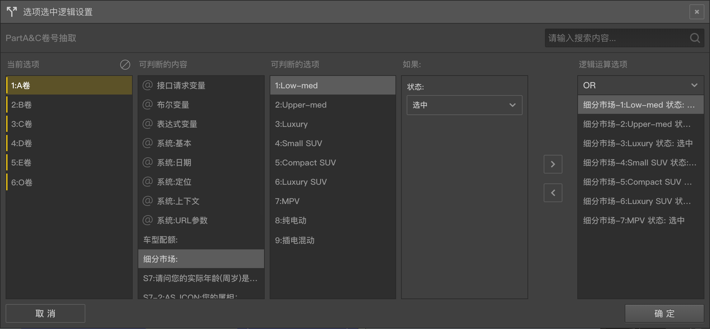

```index
6
```
```tag

```
```summary

```
# 选项自动选中控制逻辑

通常问卷都会由被访者完成选择与填充，不过也可以设置`自动选中`功能让某些选项默认被自动选中。



在选项的[高级控制](../node-setting/option.md#高级控制)按钮组中点击`选中控制`，打开`选项选中逻辑控制`的[逻辑编辑面板](./logic-editor.md)，按`逻辑编辑`面板的操作规则设置好逻辑条件就能控制选项的自动选中。

答题过程中如果选项被设置了自动选中的逻辑条件，且逻辑条件计算结果为`真`，则该选项会被自动选中。

> 和[选项自动赋值](./opt-auto-input.md)一样，该功能也常用来[数据埋点](./opt-auto-input.md#埋点)。

