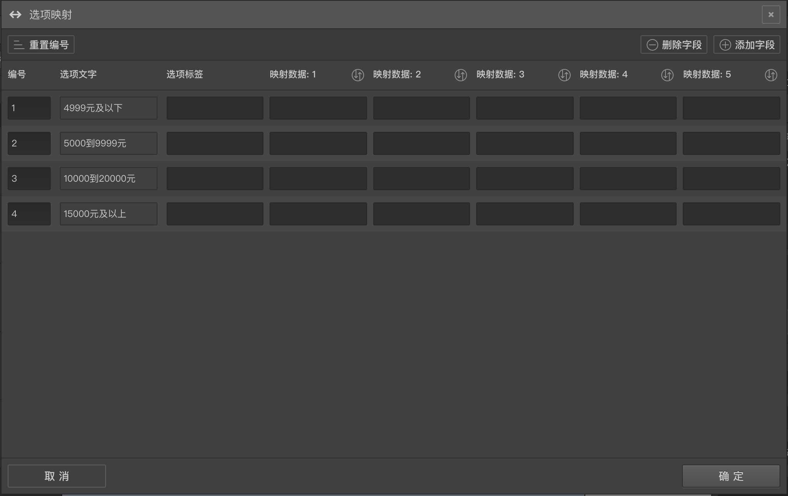

```index
6
```
```tag

```
```summary

```
# 选项映射

题目的每个选项可以设置映射数据作为扩充数据，在后面的题目中可以通过变量引用这些映射数据。



在选项的[高级控制](../node-setting/option.md#高级控制)按钮组中点击`映射属性`，打开`选项映射`编辑面板。

每个选项可以包含一个`选项标签`属性和最多6个附加`映射数据`，其中选项标签属性含有特殊的用途。点击右上角的`添加字段`或`删除字段`按钮可以增加过移除附加属性。

一个选项如果被设置过`选项标签`，则在问卷结果数据表格中会优先使用该标签代表选项，而不是用选项名，否则默认使用选项名。

`选项映射`编辑面板里还可以设置每个选项的编号，点击左上方的`重置编号`按钮，可以从1开始递增重新生成所有选项的编号。该功能会重置之前的设定的选项编号，使用时要小心，确保你之前没有为该题的某些选项设置具有特殊含义的编号。
