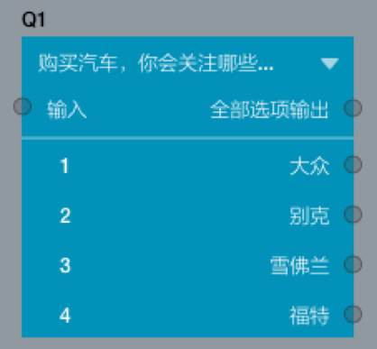

```index
1
```
```tag

```
```summary

```

# 循环节点

循环节点可以对根据受访者的选择，对一组问题进行循环问答操作。使用循环节点前，先要完成变量设定。随后，循环节点会根据变量设定的情况，对一组问题进行循环出题。循环的次数由设定变量的数量决定，设定了几个变量，即完成几次循环。

例如在问卷设计过程中，将循环节点前题目的选项A、选项B，选项C设定为变量。受访者在回答问卷时如果选择了选项B和选项C，就需要完成以变量B为条件的循环题和以变量C为条件的循环题。


## 循环设置

+ 自身循环变量
选择循环节点，在节点编辑区自身循环变量添加变量。在输入框内添加`自身循环变量`，`自身循环变量`是在循环节点内设置的需要循环的变量内容。

+ 外部循环变量
点击`外部循环变量`面板右上角的`+`按钮，循环节点前的任何题目中的选项都能作为循环节点的外部循环变量。

+ 循环圈节点
参与循环的题目节点汇总，便于快速检查循环题的内容。
参与循环的题目插入标签"@"，系统自动弹出变量列表，选择“Loop2-循环变量”，系统自动插入受访者选中的变量。

使用循环节点时需要注意，参与循环的节点`不能`与循环之外的节点相互连接，也就是循环节点使用到的题目节点不能连接到`循环开始`和`循环结束` 外的节点。

> 循环节点目前最多能支持2层循环。

## 如何使用循环节点

+ 首先，设定需要送入循环的变量，变量必须为循环节点前的节点的选项。
+ 随后，创建需要进行循环的问题，按变量设定规则在问题中嵌入设定的变量。
+ 完成以上工作后，将循环第一题输入端连接到循环节点的循环开始，循环最后一题输出端连接到循环节点的循环结束，形成闭环。

下面，我们来看几个比较典型的案例。

## 举例1：创建外部循环变量
1、设定循环变量

打开新增节点面板，点击或拖动基本节点栏中的选择题，进行填充。


+ 编号：Q1
+ 问题：购买汽车，你会关注哪些品牌？
+ 选项：大众/别克/雪佛兰/福特

2、创建循环节点

打开新增节点面板，点击或拖动工具节点栏中的循环节点，无需填充。


+ 编号：Loop1

3、创建循环问题

问题中插入标签"@"，系统自动弹出变量列表，选择“Loop1-循环变量”，系统自动插入受访者选中的变量。
打开新增节点面板，点击或拖动基本节点栏中的选择题、打分题，进行填充。


+ 编号：Q2
+ 问题：你关注Loop1:循环变量的原因是？
+ 选项：性价比高/款式新颖/种类多
+ 编号：Q3
+ 问题：购买Loop1:循环变量汽车，你价位是？
+ 分值：0——100
+ 选项：万
 
4、创建非循环题（正式题）

打开新增节点面板，点击或拖动基本节点栏中的选择题，进行填充。


+ 编号：Q4
+ 问题：你购买汽车最注重什么？
+ 选项：品牌/价格/样式
 
### 上述循环设定的内在逻辑是：
+ 若Q1为单选题：受访者回答Q1时选择大众或福特，则进入循环题，回答以大众或福特为变量的Q2、Q3题，最后再回答Q4。受访者回答Q1时选择别克或雪佛兰，则跳过循环题，直接回答Q4。
+ 若Q1为多选题：受访者回答Q1时选择大众和福特，则进入循环题，分别回答以大众为变量的Q2、Q3题和以福特为变量的Q2、Q3题，最后再回答Q4。受访者回答Q1时选择大众和别克，则进入循环题，回答以大众为变量的Q2、Q3题，最后再回答Q4。受访者回答Q1时选择别克和雪佛兰，则跳过循环题，直接回答Q4。

## 举例2：创建自身循环变量
1、创建非循环题（正式题）

打开新增节点面板，点击或拖动基本节点栏中的选择题，进行填充。


+ 编号：Q1
+ 问题：购买汽车，你会关注哪些品牌？
+ 选项：大众/别克/雪佛兰/福特

2、创建循环节点

打开新增节点面板，点击或拖动工具节点栏中的循环节点，进行填充。


+ 编号：Loop2
+ 自身循环变量：奔驰、宝马、奥迪

3、创建循环问题

问题中插入标签"@"，系统自动弹出变量列表，选择“Loop2-循环变量”，系统自动插入受访者选中的变量。
打开新增节点面板，点击或拖动基本节点栏中的选择题、打分题，进行填充。


+ 编号：Q2
+ 问题：你关注Loop2:循环变量的原因是？
+ 选项：性价比高/款式新颖/种类多
+ 编号：Q3
+ 问题：购买Loop2:循环变量汽车，你价位是？
+ 分值：0——100
+ 选项：万

4、创建非循环题（正式题）

打开新增节点面板，点击或拖动基本节点栏中的选择题，进行填充。


+ 编号：Q4
+ 问题：你购买汽车最注重什么？
+ 选项：品牌/价格/样式

### 上述循环设定的内在逻辑是：
受访者回答Q1时无论选择哪一选项，都要分别回答以奔驰为变量的Q2、Q3题、以宝马为变量的Q2、Q3题和以奥迪为变量的Q2、Q3题，最后再回答Q4。

## 举例3：创建嵌套循环题（2层）
在循环圈中再接入1个循环节点，在循环中增加1层循环，从而实现嵌套循环。并且，第2层循环中，题目和选项可以应用到第1层和第2层的所有循环变量。


1、创建非循环题（正式题）

打开新增节点面板，点击或拖动基本节点栏中的选择题，进行填充。
+ 编号：Q1
+ 问题：购买汽车，你会关注哪些品牌？
+ 选项：大众/别克/雪佛兰/福特

2、创建循环节点

打开新增节点面板，点击或拖动工具节点栏中的循环节点，无需填充。


+ 编号：Loop2

3、创建循环问题

问题中插入标签"@"，系统自动弹出变量列表，选择“Loop2-循环变量”，系统自动插入受访者选中的变量。
打开新增节点面板，点击或拖动基本节点栏中的选择题，进行填充。


+ 编号：Q2
+ 问题：你购买Loop2:循环变量的汽车，会考虑哪些方面？
+ 选项：性价比/款式/价格/动力

4、创建嵌套循环节点

打开新增节点面板，点击或拖动工具节点栏中的循环节点，无需填充。
+ 编号：Loop3

5、创建嵌套循环问题

打开新增节点面板，点击或拖动基本节点栏中的打分题，进行填充。


+ 编号：Q3
+ 问题：你认为Loop2:循环变量的 Loop3:循环变量怎么样？
+ 图形数量：5
+ 选项：满意度

6、创建非循环题（正式题）

打开新增节点面板，点击或拖动基本节点栏中的填空题，进行填充。
编号：Q4
问题：你购买汽车最注重什么？
选项：请具体说明

### 上述循环设定的内在逻辑是：
受访者回答Q1时无论选择哪一选项都要分别回答以所选项为变量的Q2题，并且回答Q2时无论选择哪一选项都要分别回答以Q1、Q2所选项为变量的Q3题，最后再回答Q4。
例如：受访者Q1选择了大众、别克，系统会以大众为变量提问Q2，选择性价比、价格，系统会以大众、性价比为变量提问Q3，系统会以大众、价格为变量提问Q3。系统接着以别克为变量提问Q2，选择款式、动力，系统会以别克、款式为变量提问Q3，系统会以别克、动力为变量提问Q3。最后，系统提问Q4，问卷结束。

## 举例4：循环节点引用选项图片
当循环节点前连接的是图片选择题时，在循环节点中打开该选项后，可以在循环节点中引用前题中的图片。


1、创建图片选择题

打开新增节点面板，点击或拖动图片选择题节点，进行填充。


+ 编号：Q1
+ 问题：购买汽车，你会关注哪些品牌？
+ 选项：大众/别克/雪佛兰/福特

2、创建循环节点

打开新增节点面板，点击或拖动工具节点栏中的循环节点，无需填充。


+ 编号：Loop4

3、创建循环问题

问题中插入标签"@"，系统自动弹出变量列表，选择“Loop4-循环变量”，系统自动插入受访者选中的变量。
打开新增节点面板，点击或拖动基本节点栏中的选择题，进行填充。
+ 编号：Q2
+ 问题：你购买Loop4:循环变量的汽车，会考虑哪些方面？
+ 选项：性价比/款式/价格/动力
+ 添加图片：使用循环来源图片

4、创建非循环题（正式题）

打开新增节点面板，点击或拖动基本节点栏中的填空题，进行填充。


+ 编号：Q3
+ 问题：你购买汽车最注重什么？
+ 选项：请具体说明

### 上述循环设定的内在逻辑是：
受访者回答Q1时无论选择哪一选项都要分别回答以所选项为变量，并可将前面图片选择题中的图片引用到Q2里。
例如，受访者回答Q1时选择别克、福特，分别回答以别克为变量并配有所选择的别克的图片的Q2，以福特为变量并配有所选择的福特的图片的Q2。
