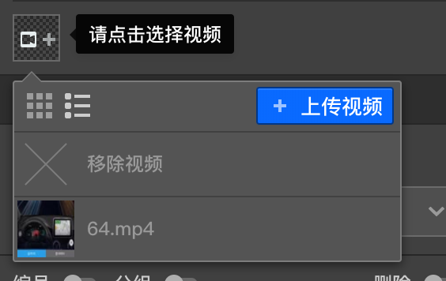

```index
3
```
```tag

```
```summary

```
# 视频资源



视频资源只能在节点的[问题设置](../node-setting/question.md)中使用.属性编辑面板中会放置一个视频选择器，与图片选择器相同，点击这个视频选择器就会出现一个视频资源列表，显了当前媒体库中的所有视频资源，点击某列表中的视频资源选择该视频。

点击第一个`X`按钮可移除当前被选中的视频。如果媒体库中还没有你想要的视频，点击右上角的`上传视频`按钮上传一个视频并直接使用，同时这个视频也会添加到媒体库中。
