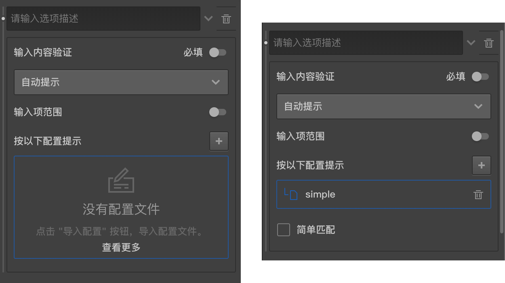
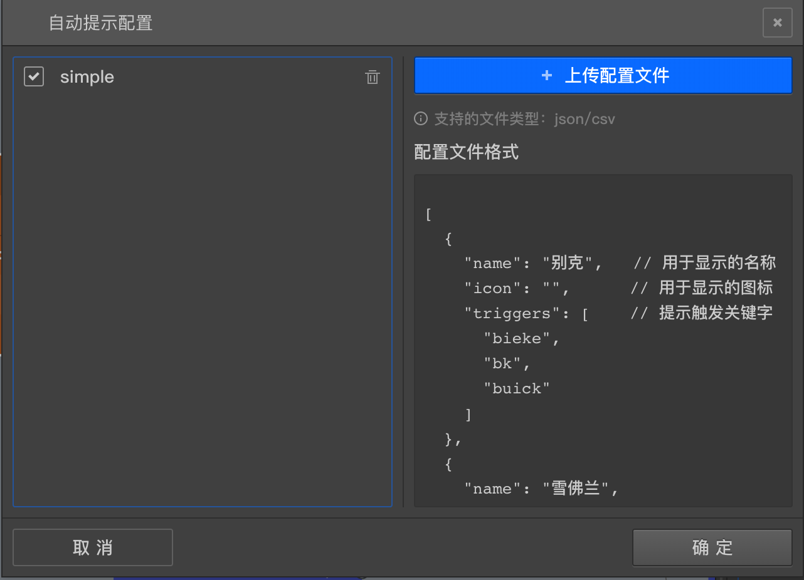

```index
6
```
```tag

```
```summary

```

# 选项输入自动提示模式

选项输入自动提示是指当受访者输入一些内容时，会根据输入的内容通过自动联想，提示出可填的内容列表，然后受访者选择列表中的某一项作为答案。下面通过一个小案例来说明。



假设有一个填空题，希望被访者输入某个汽车品牌，但我们为了节约数据清理的实际，我们希望：
+ 被访者用户输入正确的品牌名称；
+ 某些品牌可能有有多个耳熟能详的称谓，如宝马、BMW，这时我们希望被访者只输入标准的名称；

具体一些的话，就是：当被访者输入bm，bmw，baoma，宝马等关键字时，我们希望弹出一个`宝马`的标签；当被访者输入benz，bc，benchi，奔驰等关键字时，我们希望弹出一个`奔驰`的标签，提示被访者点选弹出的标签作为答案，这样就可以数据进行规范化。
> 选项输入自动提示开启后，即使被访者自己输入了正确的'宝马'也必须要选择提示标签上的`宝马`才会正确记录数据，否则会报错。
    
为了实现这种效果，先需要准备一个json格式的配置文件，内容如下：

```json
        [
            {
                "name": "宝马",
                "icon": "https://media.cform.io/atcp/BMW.png",
                "triggers": ["BMW","baoma","bm","德国宝马"]
            },
            {
                "name": "雪佛兰",
                "icon": "https://media.cform.io/atcp/CHEVROLET.png",
                "triggers": ["CHEVROLET","雪弗兰","雪佛莱","雪弗莱","xuefolan","xfl"]
            },
            {
                "name": "奔驰",
                "icon": "https://media.cform.io/atcp/MERCEDES_BENZ.png",
                "triggers": ["MERCEDES_BENZ","梅赛德斯奔驰","梅赛德斯-奔驰","梅赛德斯","benchi","bc","BENZ","平治"]
            }
        ]
```
配置问卷内容是一个数组，数组的每一项代表一个提示项，提示项具有以下3个属性：

+ name：是提示标签上会显示的文字；
+ icon：是一个指向图片的url地址，如果设置了该属性，则会使用图片作为提示文字的补充，即提示标签上既会显示文字，也会显示图标（该案例中是汽车品牌的图标），如果不设置该属性，则只会显示文字。该属性可省略。
+ triggers: 触发提示标签的内容列表，比如对宝马来说，当被访者输入'BMW'，'baoma', 'bm', '德国宝马'，都会弹出`宝马`的提示标签，那么这些文字就要配置到内容列表里.
    > 当受访者输入‘宝马’时，也会弹出`宝马`标签，name默认也会作为triggers.

准备好这个文件后，可以在自动提示配置界面中点击‘+’号按钮，打开[自动提示配置文件管理面板](#自动提示配置文件管理面板)，上传该配置文件，并在上传完后勾选使用该文件。点击确定,回到自动提示配置界面，这是已经应用了刚才选中的配置项，同时后面出现了一个`简单匹配`的勾选项。默认没有开启。

如果开启`简单匹配`，匹配程序会严格按照配置文件提供的triggers来触发提示，占用系统资源较少。
如果没有开启`简单匹配`，匹配程序会在triggers的基础上自己分析汉语拼音，针对上面的宝马项，当受访者输入‘宝妈’，‘报目’等拼音相近的都会提示出`宝马`标签，简单匹配更智能地触发提示，但会消耗很多系统资源，被访者硬件配置较低时，会明显影响用户体验。

> 汉语拼音分析只对常用字效果比较好，对于不常用字可能出现偏差，如果要求比较严格的情况下，建议使用简单匹配，同时将triggers配置得详细一点。


## 自动提示配置文件管理面板

自动提示可能在很多题目中都会用到，不同的题目只能看到自己使用过的配置项，而自动提示配置文件管理面板中能看到当前问卷所有上传的自动提示配置文件，用于管理各种用到的自动提示配置文件，



自动提示配置文件管理面板只能从某个题目的自动提示配置界面中点击'`+`'号按钮打开，打开后前面被勾选中的项目即是被当前题目所使用的配置文件，取消选中则让当前题目不再使用该项。点击配置项目右侧的删除按钮，可以彻底移除该项配置文件，从而可以减少问卷文件大小，提升加载速度。

如果配置文件已经被使用过，则该项右上角会显示一个黄色的小三角形。如果小三角是半透明的的，则说明使用它的那道题目并没有被问卷真正使用到。

> 多个题目可以同时使用一个配置。


