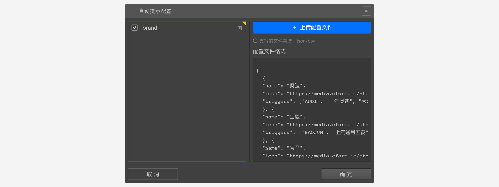

```index
6
```
```tag

```
```summary

```

# 选项输入自动提示

`选项输入自动提示`是指当被访者输入一些内容时，会根据输入的内容通过自动联想，对照预设的规则，弹出匹配文字标签，提示被访者`点选标签作为答案`，这样就可以对数据进行规范化。

下面通过一个小案例来说明。


假设，希望被访者在填空题里输入某个汽车品牌，但为了节约数据清理的时间，我们希望：
+ 被访者用户输入正确的品牌名称；
+ 某些品牌可能有多个耳熟能详的称谓，如宝马、BMW，这时我们希望被访者输入标准的名称；
+ 尽可能地匹配被访者的输入，如输入了"宝妈"很可能是想输入“宝马”；

以宝马为例具体来说，就是：当被访者输入bm、bmw、baoma、宝马、德国宝马等关键字时，我们希望都匹配到“宝马”，并弹出“宝马’标签。
> 开启选项输入`自动提示`后，即使被访者输入了正确的`宝马`，也必须要点击选择提示标签上的`宝马`才会正确记录数据，否则会报错。

同样，当被访者输入benz，bc，benchi，奔驰等关键字时，我们希望都匹配到“奔驰”，并弹出“奔驰’标签。

## 选项自动提示的配置文件

确定规则后，需要先准备一个JSON格式的配置文件，配置文件内容是一个数组，数组的每一项代表一个提示项，提示项具有以下3个属性：
+ name：提示标签上会显示的文字；
+ icon：指向一张图片的URL地址，如果设置了该属性，则会使用图片作为提示文字的补充，提示标签上既会显示文字，也会显示图片（该案例中是汽车品牌的图标），如果不设置该属性，则只会显示文字。该属性可省略。
+ triggers: 触发提示标签的`内容列表`，比如对宝马来说，当被访者输入'bm', 'BMW'，'baoma', '宝马'，'德国宝马'，都会弹出`宝马`的提示标签，那么这些文字就要配置到内容列表里。

具体配置文件内容如下：
```json
        [
            {
                "name": "宝马",
                "icon": "https://media.cform.io/atcp/BMW.png",
                "triggers": ["bm"，"BMW","baoma","宝马","德国宝马"]
            },
            {
                "name": "雪佛兰",
                "icon": "https://media.cform.io/atcp/CHEVROLET.png",
                "triggers": ["CHEVROLET","雪弗兰","雪佛莱","雪弗莱","xuefolan","xfl"]
            },
            {
                "name": "奔驰",
                "icon": "https://media.cform.io/atcp/MERCEDES_BENZ.png",
                "triggers": ["MERCEDES_BENZ","梅赛德斯奔驰","梅赛德斯-奔驰","梅赛德斯","benchi","bc","BENZ","平治"]
            }
        ]
```
> name默认也会作为triggers，当被访者输入‘宝马’时，也会弹出`宝马`标签。

## 精准匹配
准备好这个文件后，点击自动提示配置界面中‘+’号按钮，打开[自动提示配置文件管理面板](#自动提示配置文件管理面板)，上传配置文件，上传完毕后勾选使用该文件。点击确定，应用刚才选中的配置项。

设置配置文件后，会出现`精准匹配`勾选项。

+ 勾选`精准匹配`，匹配程序会严格按照配置文件提供的triggers来触发提示，占用系统资源较少。


+ 取消`精准匹配`，匹配程序会在triggers的基础上进行包括汉语拼音在内的多种分析，针对上面的宝马项，当被访者输入“宝妈”等拼音相近的都会提示出`宝马`标签。


简单匹配更智能地触发提示，但会消耗很多系统资源，被访者硬件配置较低时，会影响用户体验。

> 建议使用简单匹配，同时将triggers配置得详细一点。

## 自动提示配置文件管理

+ 查看问卷的自动提示配置文件
一份问卷可能会用到多个不同的自动提示配置，`自动提示配置文件管理`面板中能看到当前问卷所有的自动提示配置文件，可对配置文件进行管理。



+ 增加问卷的自动提示配置文件
`自动提示配置文件管理`面板只能从题目的`自动提示配置`界面中点击'`+`'号按钮打开。

+ 使用和取消自动提示配置文件
勾选`自动提示配置文件管理`面板中的配置项使用该配置，取消勾选则取消使用该配置。

+ 删除自动提示配置文件
点击配置项目右侧的`删除`按钮，彻底移除该项配置文件。

> 删除无用的配置文件可以提升问卷加载速度。

如果配置文件已经被使用过，则该配置项右上角会显示一个黄色的小三角形。如果小三角是半透明的的，则说明使用该配置文件的题目并没有被问卷真正使用。

> 多个题目可以同时使用一个配置。


