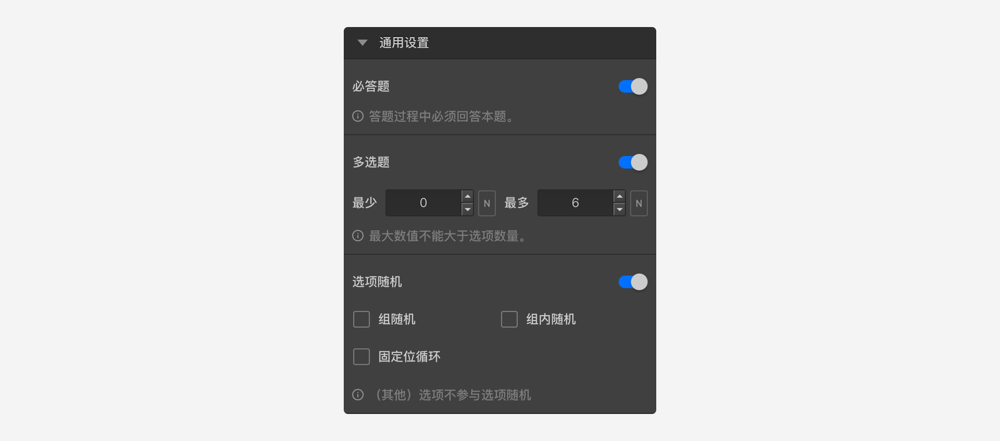
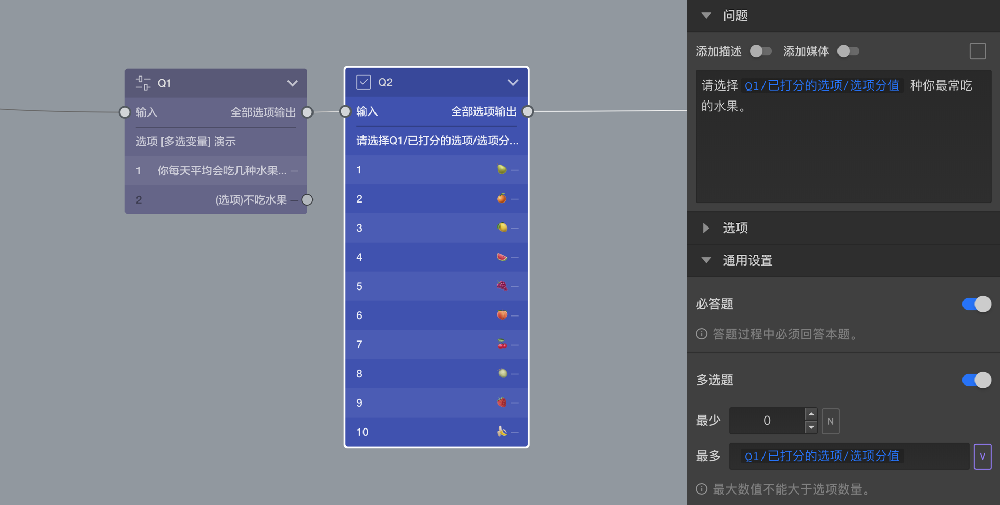
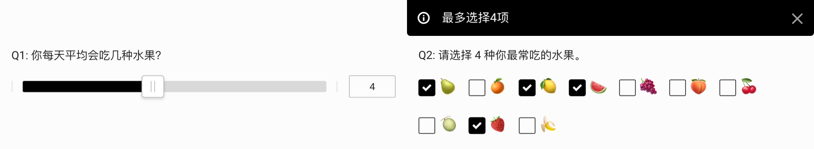

```index
8
```
```tag

```
```summary

```

# 问题通用设置

通用设置用于设置问卷题型的基本属性。


## 必答题

控制该题是否必须回答，必答题则只有输入了答案才能进入下一题，非必答的题目可以被跳过，即不输入任何答案就进入下一题。


## 多选题

对于选择类型的题目，默认为单选题。开启`多选题`后，将该题设定为多选题。可以控制必须选中的数量范围，如果被访者选中的数量不在设定范围值内，无法进入下一题。


例：从下图中，可以看到选择题Q2被设定为多选题，同时设定了多选题的数量范围最多为Q1打分的分值，意味着受到Q1打分分值的控制。


被访者答题时，在Q1打4分的分值，随后可以看到Q2最多只能选择4个选项。


## 选项随机


控制选项在答题时打乱顺序随机展示，详细规则参见[选项随机](./option-random.md)。


## 最小输入项限制


对于输入、打分类型的题目，会有该项控制，默认为关闭，即所有的选项都要被输入。开启后，可以设置数量，当被访者输入的项目数量达到该数量即可，如未达到，则不允许进入下一题。

